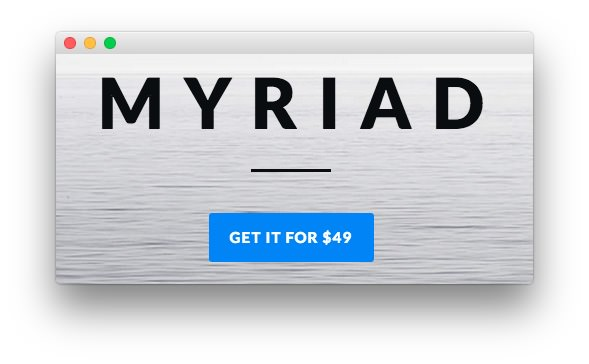

Extension Section
-----

Here is the widget breakdown for the Extension section:

#### Text

This section of the page is a standard text widget. You will need to enter the following in the main text field.

~~~ .html

    Myriad

<a href="http://www.rockettheme.com/wordpress/theme/myriad" class="readon wow zoomInUp" data-wow-delay="0.5s">Get it for $49</a>
~~~

Here is a breakdown of options changes you will want to make to match the demo.

* Enter `fp-extension` in the **Custom Variations** field.
* Leaving everything else at its default setting, select **Save**.
