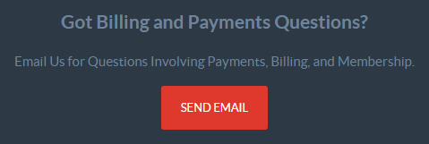

Introduction
-----

The **Contact Us** example page demonstrates how you can create a beautiful contact page with the Vermilion theme. Here is some information to help you replicate this page as it appears in the demo.

Mainbody
-----

The **Contact Us** page is a common WordPress page. The page's content is blank. The contact form is loaded as the result of setting the **Template** in the **Page Attributes** section of the sidebar to **Contact Form**. This form is loaded from the `theme-contact.php` file located in the theme's directory.

Widgets
-----

Below is a brief rundown of the widgets used to make up the demo page. Widgets in the [**Header**](demo_header.md) and [**Copyright**](demo_copyright.md) positions are outlined in the main demo replication area of this guide.

:   1. **Showcase - Text** [9%, 25%, se]
    2. **Mainbody** [18%, 5%, se]
    3. **Sidebar - Text** [18%, 66%, se]
    4. **Extension - Text** [68%, 35%, se]

1. [Showcase - Text](#showcase-section)
2. [Mainbody](#sidebar-section)
3. [Sidebar - Text](#sidebar-section)
4. [Extension - Text](#extension_section)

Showcase Section
-----

Here is the widget breakdown for the Showcase section:

#### Text

This section of the page is a standard text widget. You will need to enter the following in the main text field.

~~~ .html
&nbsp;
~~~

Here is a breakdown of options changes you will want to make to match the demo.

| Option            | Setting                                                                      |
| :---------------- | :-----------------------------------------------------------                 |
| Title             | `Contact Us[span class="rt-title-tag"]We Would Love to Hear From You[/span]` |
| Widget Variations | RT-Center, No Margin All                                                     |
| Custom Variations | `rt-title-large rt-nomodulecontent rt-top-large-padding`                     |

Leaving everything else at its default setting, select **Save**.

Sidebar Section
-----

Here is the widget breakdown for the Breadcrumbs section:

#### Text

This section of the page is a standard text widget. You will need to enter the following in the main text field.

~~~ .html

Vermilion is only available as part of the Club Subscription. Please use the RocketLauncher to install an equivalent of the demo onto your site.

<h4>Address</h4>

    Vermilion Theme, LLC 
    123 WordPress Boulevard 
    Seattle, WA 00000, USA

<h4>Email</h4>

    noreply@vermilion-theme.com 
    noperson@vermilion-theme.com

<h4>Phone</h4>

    +1(123)456-5555-555 
    +1(123)456-6666-666

<h4>Online Support</h4>

    Skype ID: vermilion.theme 
    BBM PIN: 12ABC345

~~~

Here is a breakdown of options changes you will want to make to match the demo.

| Option            | Setting        |
| :---------------- | :---------     |
| Widget Variations | Box 1, Title 3 |

Leaving everything else at its default setting, select **Save**.

Extension Section
-----

Here is a breakdown of the widgets in the **Extension** section:

#### Text

This section of the page is a standard text widget. You will need to enter the following in the main text field.

~~~ .html

Email Us for Questions Involving Payments, Billing, and Membership.

<a href="http://www.rockettheme.com/forum/wordpress-theme-vermilion" class="readon">Send Email</a>

~~~

Here is a breakdown of options changes you will want to make to match the demo.

| Option            | Setting                               |
| :---------------- | :--------------------                 |
| Title             | `Got Billing and Payments Questions?` |
| Widget Variations | RT-Center                             |

Leaving everything else at its default setting, select **Save**.