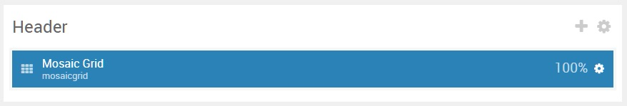
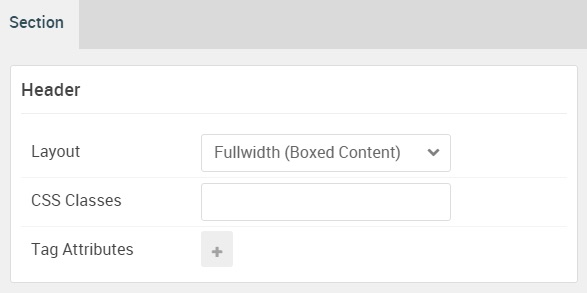

## Introduction

The **Header** section includes a single **Mosaic Grid** particle.

Here is a breakdown of the widget(s) and particle(s) that appear in this section:

* [Mosaic Grid (particle)](#mosaic-grid-(particle))

## Section Settings

| Option           | Setting                   |
| :--------------- | :----------               |
| Layout           | Fullwidth (Boxed Content) |
| CSS Classes      | Blank                     |
| Tag Attributes   | Blank                     |

## Mosaic Grid (Particle)

#### Particle Settings

| Option                    | Setting                                                                            |
| :-----                    | :-----                                                                             |
| Particle Name             | `Mosaic Grid`                                                                      |
| CSS Classes               | Blank                                                                              |
| Title                     | Blank                                                                              |
| Grid Columns              | 3 Columns                                                                          |
| Item 1 Name               | `Item 1`                                                                           |
| Item 1 Style              | Style 1                                                                            |
| Item 1 Image              | Custom                                                                             |
| Item 1 Title Label        | `Portfolio`                                                                        |
| Item 1 Title Link         | `#`                                                                                |
| Item 1 Title Link Target  | Self                                                                               |
| Item 1 Description        | `A beautiful single-page design showcasing your work and professional background.` |
| Item 1 Animations         | `g-mosaicgrid-zoom`                                                                |
| Item 1 Button Label       | Blank                                                                              |
| Item 1 Button Link        | Blank                                                                              |
| Item 1 Button Link Target | Self                                                                               |
| Item 1 Button Classes     | Blank                                                                              |
| Tag                       | `Layout`                                                                           |
| Tag Icons 1 Name          | `Tag 1`                                                                            |
| Tag Icons 1 Icon          | `fa fa-heart-o-fa-fw`                                                              |
| Tag Icons 1 Icon Text     | `Stylish`                                                                          |

#### Block Settings

| Option         | Setting   |
| :-----         | :-----    |
| CSS ID         | Blank     |
| CSS Classes    | Blank     |
| Variations     | Blank     |
| Tag Attributes | Blank     |
| Fixed Size     | Unchecked |
| Block Size     | `100%`    |
