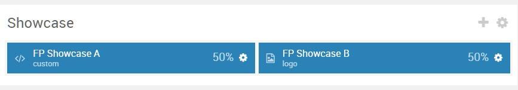
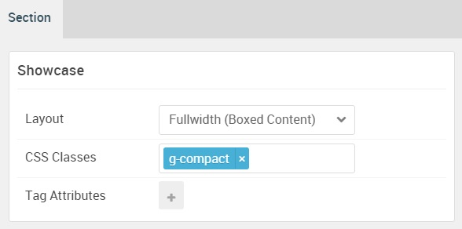

## Introduction

:   1. **Custom HTML** [10%, 5%, se]
    2. **Logo / Image** [10%, 55%, se]

The **Showcase** section includes a **Custom HTML** and a **Logo / Image** particle.

Here is a breakdown of the widget(s) and particle(s) that appear in this section:

* [Custom HTML (particle)](#custom-html-(particle))
* [Logo / Image (Particle)](#logo-image-(particle))

## Section Settings

| Option           | Setting                   |
| :--------------- | :----------               |
| Layout           | Fullwidth (Boxed Content) |
| CSS Classes      | `g-compact`               |
| Tag Attributes   | Blank                     |

## Custom HTML (Particle)

### Particle Settings

| Option             | Setting       |
| :-----             | :-----        |
| Particle Name      | `Custom HTML` |
| Process Shortcodes | Unchecked     |

**Custom HTML**

~~~ .html
<h2 class="g-title">Gantry is a cross-platform framework with a vast library of standardized features and functions, to make powerful, flexible themes.</h2>

<a href="http://www.gantry.org" class="readon">Read more about Gantry</a>

~~~

### Block Settings

| Option         | Setting                                           |
| :-----         | :-----                                            |
| CSS ID         | Blank                                             |
| CSS Classes    | `g-title-large` `g-title-300` `g-center-vertical` |
| Variations     | Blank                                             |
| Tag Attributes | Blank                                             |
| Fixed Size     | Unchecked                                         |
| Block Size     | `50%`                                             |

## Logo Image (Particle)

### Particle Settings

| Option        | Setting        |
| :-----        | :-----         |
| Particle Name | `Logo / Image` |
| URL           | Blank          |
| Image         | Custom         |
| Text          | Blank          |
| CSS Classes   | Blank          |

#### Block Settings

| Option         | Setting                            |
| :-----         | :-----                             |
| CSS ID         | Blank                              |
| CSS Classes    | `nomarginbottom` `nopaddingbottom` |
| Variations     | Blank                              |
| Tag Attributes | Blank                              |
| Fixed Size     | Unchecked                          |
| Block Size     | `50%`                              |

