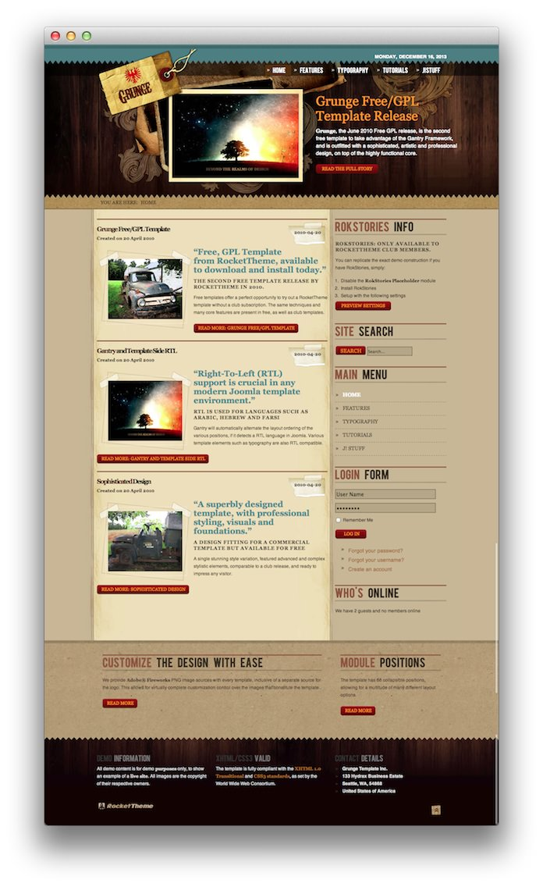

Introduction
-----

![][Grunge]

Recreating features of the demo site used to show off some of the more interesting aspects of Grunge can be done fairly easily. All you need is the right plugins and settings, and you should be able to reproduce most (if not all) of the elements found in our demo site. 

Below, we will break down some of these elements and give you the information you need to know to recreate them on your own site using the Grunge theme.

Keep in mind that a lot of the detail that makes our demos look so good are the result of many hours of hard work by our team, and some of them will require a moderate level of experience working with the WordPress back end. We have added most of these elements into the theme's core files in order to make them easily accessible without having to edit any code.

Theme Settings
-----

The first thing you will need to do in order to set your front page apart as it appears in the demo is to create a setting override. This can be done by navigating to **Administrative Dashboard -> Grunge Theme** and selecting the **+** icon located just above the **Style** settings tab. 

It would be a good idea for organization to name this layout override something like **Front Page** as it would be used only for the front page of your site.

#### Assignments

The next step you will need to take in creating your Theme Settings override is to assign the Front Page override to the site's home page. Under the **Template Page Types** list, you will want to select both **Home Page** and **Front Page**. These settings can be found by navigating to **Assignments > Template Page Types** in the theme settings.

Doing this will assign the override to these two page types. This will allow the override to cover all access scenarios that would lead a user to your site's main home page.

>> Under the administrative area, you can check you site's home page settings by navigating to **Settings -> Reading** and making sure that **Your latest posts** is selected. This is the setting we use for the demo content's home page as it does not require the creation of a static page.

You can find more information about the entire override breakdown for both the front page and our default settings in the demo by visiting the [override portion][demooverride] of this tutorial.

Widget Settings
-----

Below, you will find the widget placement and settings for the various widget positions as they appear on the front page of our demo. Not all of these position assignments are unique to the front page.

:   1. **FP Showcase A**  [11%, 33%, se]
    2. **RokStories Info**  [25%, 62%, se]
    3. **Site Search**  [37%, 62%, se]
    4. **Main Menu** [42%, 62%, se]
    5. **Login** [66%, 62%, se]
    6. **Customize the Design** [73%, 18%, se]
    7. **Demo Information** [85%, 18%, se] 
    8. **Grunge Free/GPL Theme** [25%, 18%, se]

We have detailed how to recreate the individual widgets and features pictured above in the links below.

1. [FP Showcase A][widget1]
2. [RokStories Info][widget2]
3. [Site Search][widget3]
4. [Main Menu][widget4]
5. [Who's Online][widget5]
6. [Customize the Design][widget6]
7. [Demo Information][widget7]
8. [Grunge Free/GPL Theme][widget8]

Like any Gantry theme, Grunge utilizes widget overrides to allow different widget placements for various areas of your WordPress site. This makes it possible to not only utilize the full power of the Gantry framework, but to make each area of your site uniquely suited to meet your user's needs.

Below, you will find the widget placement and settings for the various widget positions as they appear in the Front Page widget override. Not all of these positions were overwritten. Some positions (such as the Header section) are often set in the primary default widget setting.

One important thing to note here is that many of the widget sections included in our demo are split up using a **Gantry Divider** widget. This widget tells WordPress to start a new widget column beginning with the widget placed directly below the divider in the section. You will see the Gantry Divider in any widget section breakdowns as they are included in the demo.

Recommended Extensions
-----

Here is a list of RocketTheme extensions used to create the demo version of Grunge:

* [Gantry Theme Framework][gantry]
* [RokCommon Library](https://rockettheme.com/wordpress/plugins/rokutilities)
* [RokNavMenu][roknavmenu]
* [RokCandy][rokcandy]

Many of these extensions are included with the Grunge RocketLauncher, and can be downloaded and installed individually by going to the RocketTheme website.

[gantry]: http://gantry.org/downloads
[Grunge]: assets/grunge2.jpeg
[Grunge2]: assets/grunge.jpg
[demooverride]: demo_override.md
[roknavmenu]: http://www.rockettheme.com/wordpress/extensions/roknavmenu
[rokbooster]: http://www.rockettheme.com/wordpress/extensions/rokbooster
[rokcandy]: http://www.rockettheme.com/wordpress/extensions/rokcandy
[widget1]: demo_module_1.md
[widget2]: demo_module_2.md
[widget3]: demo_module_3.md
[widget4]: demo_module_4.md
[widget5]: demo_module_5.md
[widget6]: demo_module_6.md
[widget7]: demo_module_7.md
[widget8]: demo_module_8.md
[widget9]: demo_module_9.md
[widget10]: demo_module_10.md
[widget11]: demo_module_11.md
[widget12]: demo_module_12.md
[widget13]: demo_module_13.md
[widget14]: demo_module_14.md
[widget15]: demo_module_15.md
[mainmenu]: assets/menu_1.jpeg
[icons]: http://fortawesome.github.io/Font-Awesome/icons/
[scroll]: assets/demo_2.jpeg
