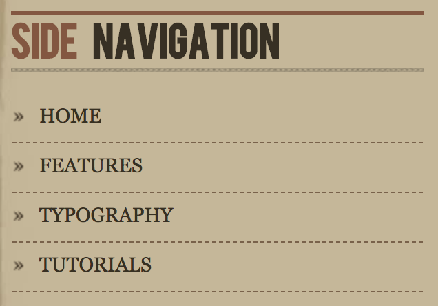
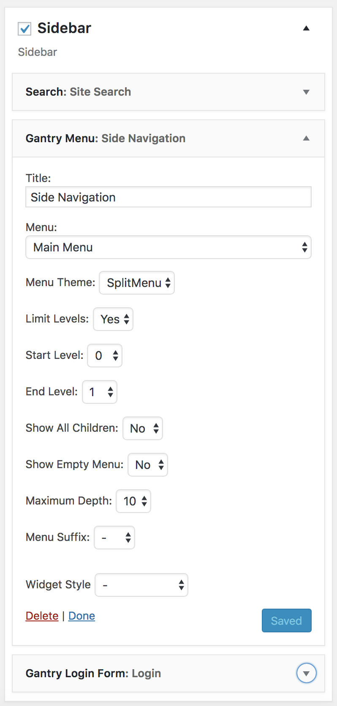

Main Menu
-----

The menu area of the sidebar is a standard **Gantry Menu** widget. Here is a breakdown of the options selected to make it appear as it does on the front page of our demo.

### Details

| Option            | Setting           |
| :---------        | :----------       |
| Title             | `Side Navigation` |
| Menu              | Main Menu         |
| Menu Theme        | Split Menu        |
| Limit Levels      | Yes               |
| Start Level       | 0                 |
| End Level         | 1                 |
| Show All Children | No                |
| Show Empty Menu   | No                |
| Maximum Depth     | 10                |
| Menu Suffix       | Blank             |
| Widget Style      | Blank             |