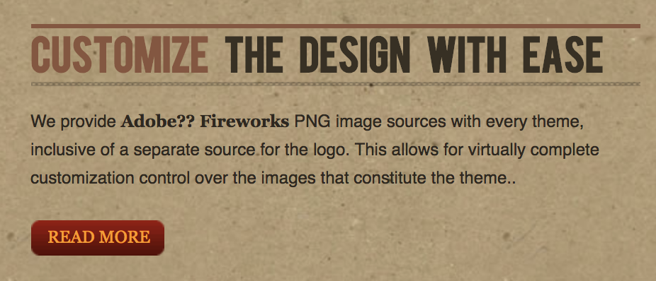
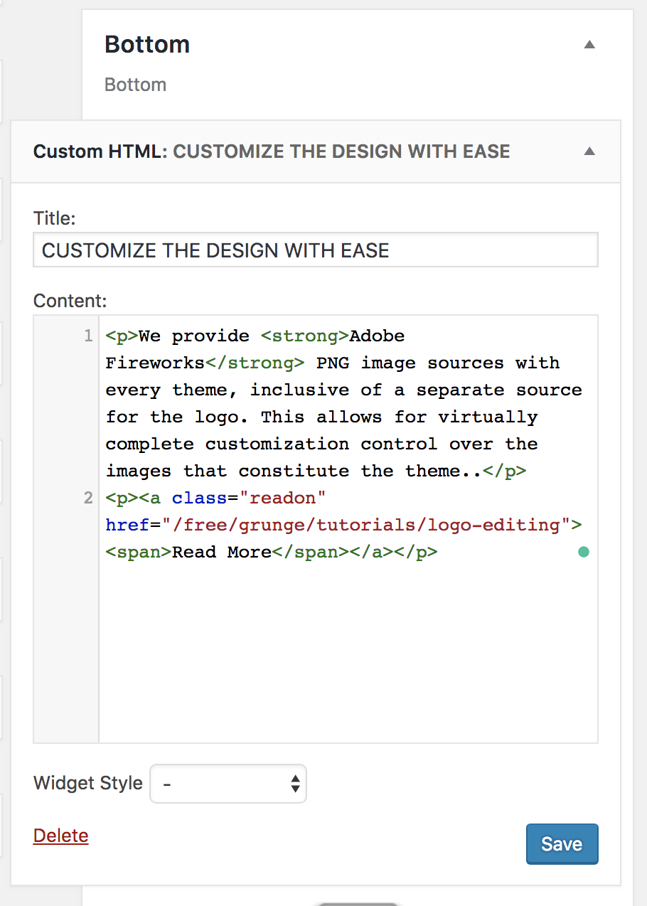

Customize the Design with Ease
-----

This area of the front page is a **Custom HTML** widget. You will find the settings used in our demo below.

### Details

| Option       | Setting                          |
| :---------   | :------------------------------- |
| Title        | `Customize the Design with Ease` |
| Widget Style | Blank                            |

### Custom Output

Enter the following in the **Custom Output** text editor.

~~~.html

We provide <strong>Adobe Fireworks</strong> PNG image sources with every theme, inclusive of a separate source for the logo. This allows for virtually complete customization control over the images that constitute the theme..

<a class="readon" href="/free/grunge/tutorials/logo-editing">Read More</a>

~~~