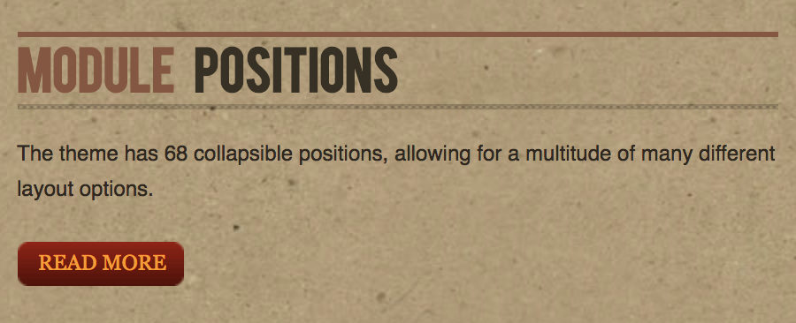
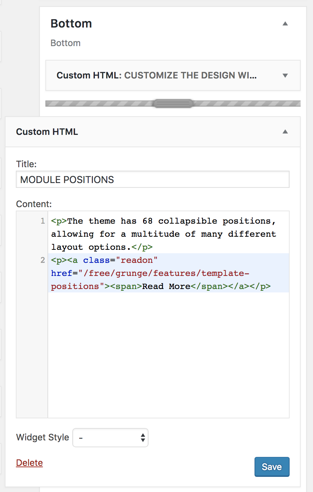

Demo Information
-----

This area of the front page is a **Custom HTML** widget. You will find the settings used in our demo below.

### Details

| Option     | Setting             |  
| :--------- | :------------------ |  
| Title      | `Demo Information`  |  
| Show Title | Show                |  
| Position   | footer-a            |  
| Status     | Published           |  
| Access     | Public              |  
| Language   | All                 |  
| Note       | Blank               |  

### Custom Output

Enter the following in the **Custom Output** text editor.

~~~ .html

The theme has 68 collapsible positions, allowing for a multitude of many different layout options.

<a class="readon" href="/free/grunge/features/theme-positions">Read More</a>

~~~