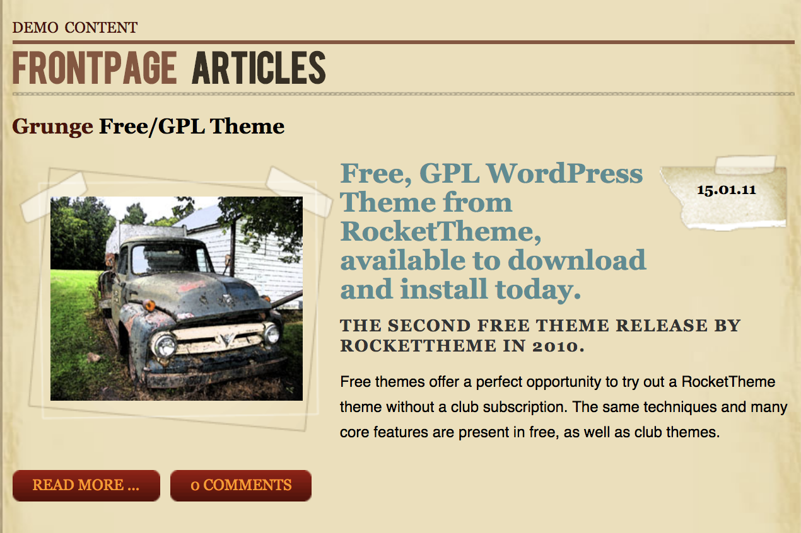

Grunge Free/GPL Theme
-----

This part of the front page is pulled from demo content. In this case, posts. All posts are given the **Frontpage Articles** category.

Here is the **Post Text** we used:

~~~ .html
Free, GPL WordPress Theme from RocketTheme, available to download and install today.The second free theme release by RocketTheme in 2010.Free themes offer a perfect opportunity to try out a RocketTheme theme without a club subscription. The same techniques and many core features are present in free, as well as club themes.

<!--more-->

In erat. Pellentesque erat. Mauris vehicula vestibulum justo. Cum sociis natoque penatibus et magnis dis parturient montes, nascetur ridiculus mus. Nulla pulvinar est. Integer urna. Pellentesque pulvinar dui a magna. Nulla facilisi. Proin imperdiet. Aliquam ornare, metus vitae gravida dignissim, nisi nisl ultricies felis, ac tristique enim pede eget elit. Integer non erat nec turpis sollicitudin malesuada. Vestibulum dapibus. Nulla facilisi. Nulla iaculis, leo sit amet mollis luctus, sapien eros consectetur dolor, eu faucibus elit nibh eu nibh. Maecenas lacus pede, lobortis non, rhoncus id, tristique a, mi. Cras auctor libero vitae sem vestibulum euismod. Nunc fermentum.

Mauris lobortis. Aliquam lacinia purus. Pellentesque magna. Mauris euismod metus nec tortor. Phasellus elementum, quam a euismod imperdiet, ligula felis faucibus enim, eu malesuada nunc felis sed turpis. Morbi convallis luctus tortor. Integer bibendum lacinia velit. Suspendisse mi lorem, porttitor ut, interdum et, lobortis a, lectus. Phasellus vitae est at massa luctus iaculis. In tincidunt.

Integer fermentum elit in tellus. Integer ligula ipsum, gravida aliquet, fringilla non, interdum eget, ipsum. Praesent id dolor non erat viverra volutpat. Fusce tellus libero, luctus adipiscing, tincidunt vel, egestas vitae, eros. Vestibulum mollis, est id rhoncus volutpat, dolor velit tincidunt neque, vitae pellentesque ante sem eu nisl. Donec facilisis, magna eget elementum pellentesque, augue arcu aliquet eros, eget convallis mauris ante quis magna. Pellentesque habitant morbi tristique senectus et netus et malesuada fames ac turpis egestas. Aenean et libero. Nam aliquam. Quisque vitae tortor id neque dignissim laoreet. Duis eu ante. Integer at sapien. Praesent sed nisl tempor est pulvinar tristique. Maecenas non lorem quis mi laoreet adipiscing. Sed ac arcu. Sed tincidunt libero eu dolor. Cras pharetra posuere eros. Donec ac eros id diam tempor faucibus. Fusce feugiat consequat nulla. Vestibulum tincidunt vulputate ipsum.

Nullam eget neque. Nullam imperdiet venenatis ligula. Integer a leo. Nunc consectetur. Maecenas sem. Proin vulputate, massa vel volutpat laoreet, purus erat pretium ligula, eget varius arcu nibh sed libero. Fusce ante. Nullam interdum aliquet metus. Ut ultrices vestibulum tellus. Praesent quis erat. Nam id turpis sit amet neque cursus luctus. Cum sociis natoque penatibus et magnis dis parturient montes, nascetur ridiculus mus. Quisque id tortor. In vitae sapien. Nunc quis tellus.
~~~