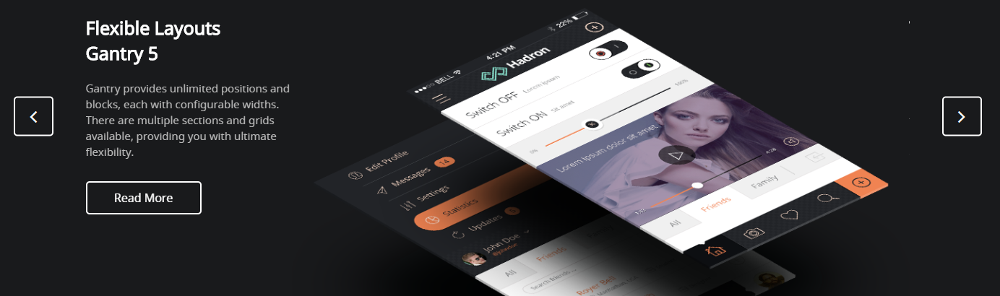

## Introduction

The **Slider** particle makes it easy to create smooth, modern sliders for your website. We use it in Hadron's home page demo to call attention to the most important information on the site.

Here are the topics covered in this guide:

* [Configuration](#configuration)
    - [Main Options](#main-options)
    - [Item Options](#item-options)

## Configuration

### Main Options

These options affect the main area of the particle, and not the individual items within.

| Option          | Setting                                                               |
| :-----          | :-----                                                                |
| Particle Name   | The name of the particle for organizational use in the backend.       |
| CSS Classes     | CSS Class(es) you would like to have apply to the particle's content. |
| Title           | Title of the particle as it will appear on the front end.             |
| Description     | A text description to appear on the front end for the particle.       |
| In Animation    | Set the animation type for incoming items.                            |
| Out Animation   | Set the animation type for outgoing items.                            |
| Prev Next       | Enable or Disable the Prev/Next Buttons.                              |
| Loop            | Enable or Disable looping of slides.                                  |
| Autoplay        | **Enable** or **Disable** autoplay for the particle.                  |
| Autoplay Speed  | Set the speed (in milliseconds) of the particle's animation.          |
| Pause on Hover  | **Enable** or **Disable** the pause-on-hover effect for the particle. |

### Item Options

These items make up the individual featured items in the particle.

| Option             | Description                                                       |
| :-----             | :-----                                                            |
| Name               | Enter a name for your item. This only appears on the back end.    |
| Image              | Set an image for the item.                                        |
| Title              | Enter a title for the item.                                       |
| Description        | Enter a description for the item.                                 |
| Link               | Enter a link for the item.                                        |
| Link Text          | Enter text that appears as the link for the item.                 |
| Target             | Select between **Self** and **New Window** for the link's target. |
| Button             | Enter any CSS class(es) you want to have apply to the button.     |
