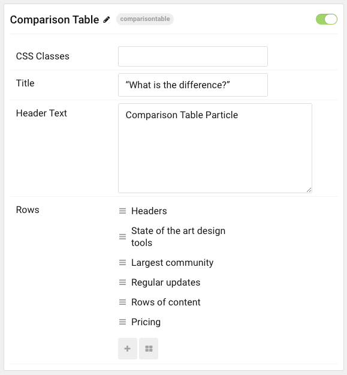
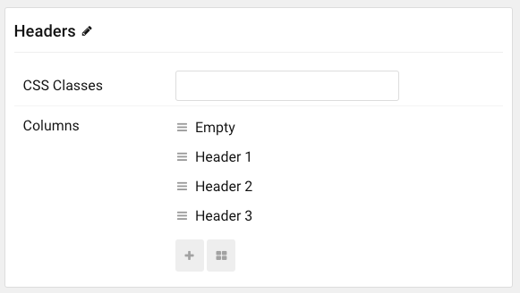

## Introduction

The **Comparison Table** particle makes it easy to create a table that compares features between multiple options.

Here are the topics covered in this guide:

- [Introduction](#introduction)
- [Configuration](#configuration)
  - [Main Options](#main-options)
  - [Rows](#rows)
  - [Columns](#columns)

## Configuration

### Main Options

These options affect the main area of the particle, and not the individual items within.

| Option        | Description                                                                                 |
| :------------ | :------------------------------------------------------------------------------------------ |
| Particle Name | Enter the name you would like to assign to the particle. This only appears in the back end. |
| CSS Classes   | Enter the CSS class(es) you want to use in the content of the particle.                     |
| Title         | Enter a title for the particle.                                                             |
| Header Text   | Enter text to appear as the header for the particle.                                        |

### Rows

You can create named rows by building items at the bottom of the main options. Each row has the ability to customize CSS and columns.

| Option      | Description                                                |
| :-----      | :-----                                                     |
| Item Name   | This is the name of the row that appears on the front end. |
| CSS Classes | Enter any CSS class(es) that you want to apply to the row. |

### Columns

Here you can enter information that appears in each column.

| Option       | Description                                                                            |
| :----------  | :------------------------------------------------------------------                    |
| Item Name    | This text field is used for backend organization and does not appear on the front end. |
| Text         | Enter text to appear in the column.                                                    |
| Item Classes | Enter any CSS class(es) that you want to apply to the item.                            |
| Icon         | Select an icon to appear in the column.                                                |
