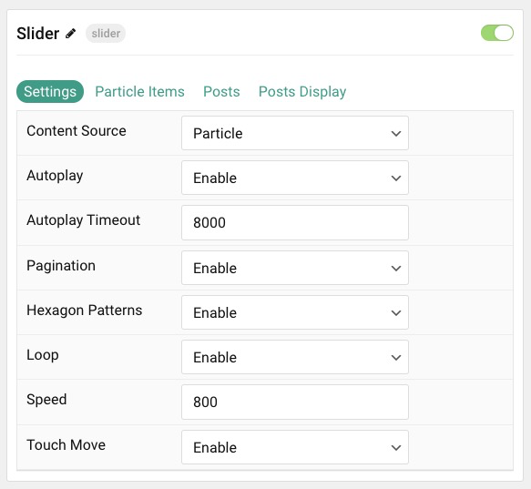
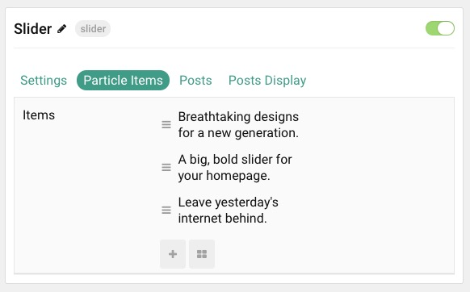
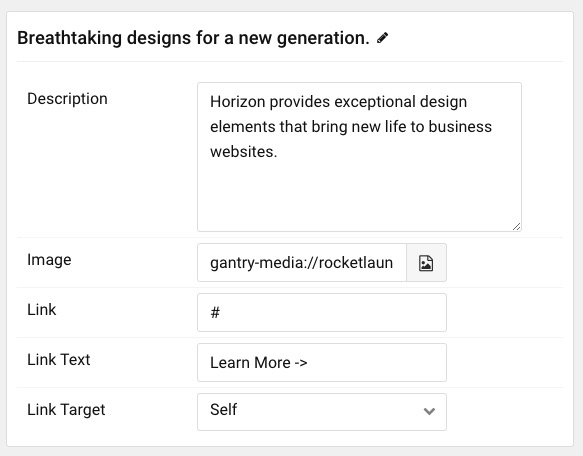
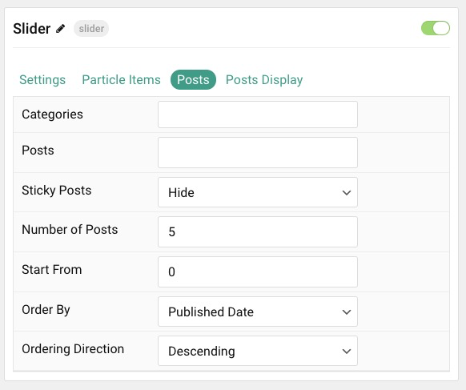
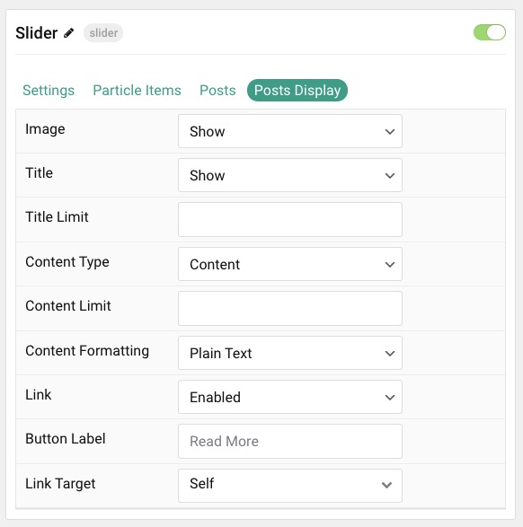

## Introduction

The **Slider** particle is a great way to display images in your website.

Here are the topics covered in this guide:

- [Configuration](#configuration)
  - [Settings](#settings)
  - [Particle Item Options](#particle-item-options)
  - [Posts](#posts)
  - [Display](#display)

## Configuration

### Settings 

These options affect the main area of the particle, and not the individual items within.

| Option           | Description                                                                                         |
| :-----           | :-----                                                                                              |
| Particle Name         | This is the name of the particle used for back end management. It does not appear on the front end.             |
| Content Source        | Choose between **Particle** and **WordPress** as the content source for the particle.                              |
| Autoplay              | **Enable** or **Disable** autoplay for the particle.                                                            |
| Autoplay Timeout      | Set the time (in milliseconds) between slides in autoplay mode.                                                 |
| Hexagon Patterns               | **Enable** or **Disable** the pattern feature of the particle.                                         |
| Pagination                  | **Enable** or **Disable** dot navigation.                                                                 |
| Loop                  | **Enable** or **Disable** looping slides.                                                                       |
| Speed                 | Set the transition speed (in milliseconds).                                                                     |
| Touch Move            | **Enable** or **Disable** touch movements.                                                                      |

### Particle Item Options

These items make up the individual featured items in the particle. Items in this section will only appear if **Particle** is selected as the **Content Source**.

| Option                 | Description                                                      |
| :-----                 | :-----                                                           |
| Title             	 | This is the name of the item. This will appear on the frontend |
| Image                  | Select an image to appear in the slide.                          |
| Link                   | Enter a URL you would like the item to link to.                  |
| Link Text              | Set a link text.                  |
| Link Target            | Choose the target tab you would like the URL to open to.         |

### Posts

| Option             | Description                                                                            |
| :----------------- | :------------------------------------------------------------------------------------- |
| Categories         | Select the categories of posts this particle will display.                             |
| Posts              | Select the number of posts you would like the particle to fetch.                       |
| Sticky Posts       | Choose to **Show** or **Hide** sticky posts.                                           |
| Number of Posts    | Enter the maximum number of posts to display.                                          |
| Start From         | Enter offset specifying the first post to return. The default is '0' (the first post). |
| Order By           | Choose the type of factor to order by.                                                 |
| Ordering Direction | Choose between **Ascending** and **Descending** as the post ordering method.           |

### Display

This section configures how posts are displayed.

| Option        | Description                                                                                                                                              |
| :------------ | :------------------------------------------------------------------------------------------------------------------------------------------------------- |
| Image         | Choose to **Show** or **Hide** the image.                                                                                                                |
| Title         | Choose whether or not the title of an post should be shown.                                                                                              |
| Title Limit   | Set a character limit for titles.                                                                                                                        |
| Content Type  | Choose between showing the **Content** or **Exerpt** text to display. You can also **Hide** text completely.                                             |
| Content Limit | Set a limit (in characters) of the post's text to appear.                                                                                                |
| Content Formatting | Select between **Plain Text** and **HTML** text formatting. 																						   |
| Link          | **Enable** or **Disable** the link to the post.																										   |
| Button Label  | Enter the text you would like to have appear as the button link.                                                                                         |
| Link Target   | Set the target for the button. You can choose between **Self** which opens the link in the current tab or **New Window** which opens links in a new tab. |