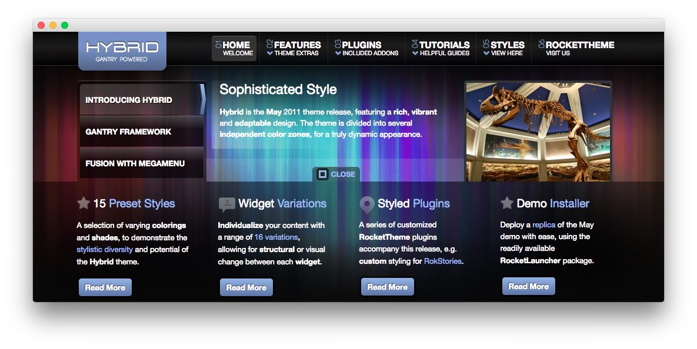
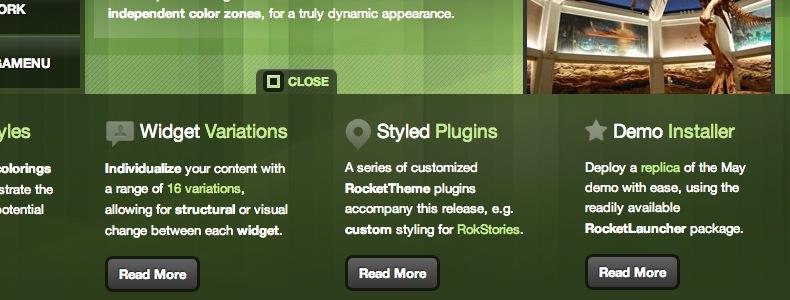
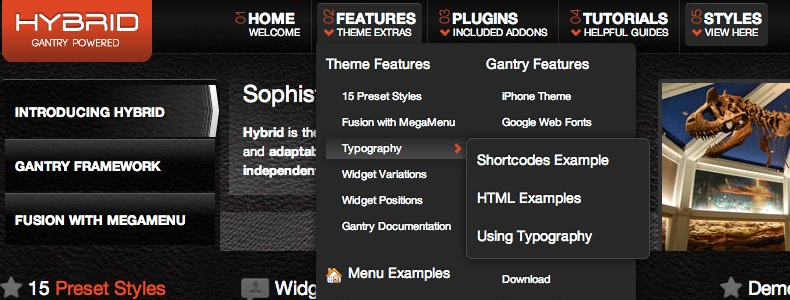

Introduction
------------

Hybrid features a rich, vibrant and adaptable design. The theme is divided into several independent color zones, for a truly dynamic appearance. The design has 12 header styles, 12 footer styles, and 5 body color & accent styles, allowing for great diversity.

Requirements
------------

* Gantry 4 Framework
* FF, Safari, Chrome, Opera, IE8+
* PHP 5.4+
* WordPress 3.2+, 4.0+

> > NOTE: An updated version of RokCommon is required for Hybrid to work properly. For more details on the Gantry Framework, please visit its [Dedicated Website](http://www.gantry.org/).

Key Features
------------

* 960 Fixed Layout
* 15 Preset Styles  
* 75 Widget Positions  
* 16 Widget Variations  
* Fusion-Menu and Split-Menu  
* Custom Typography  
* iPhone Theme  
* iPhone Menu

### Sliding Panel

Two sliding panels are available with Hybrid. An entire widget row can appear and collapse via an Open/Close tab mechanism. You can configure whether the start state is open or close, as well as the delay. The panels are in the features and lowerpanel position rows.

### Fusion Menu

The Fusion Menu is an advanced, CSS based menu system, which offers a wide range of per menu options, such as: inline subtext, icons, and custom column widths, as well as control over how menu items are distributed between columns.
