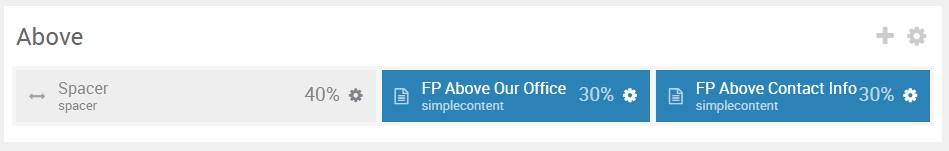
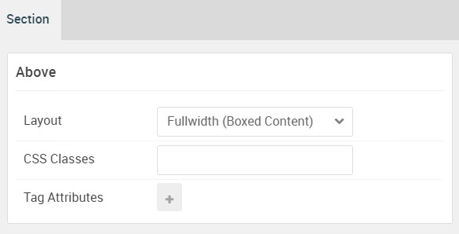

## Introduction

:   1. **Spacer** [40%, 5%, se]
    2. **Simple Content** [40%, 40%, se]
    3. **Simple Content** [40%, 70%, se]

The **Above** section includes three particles: **Spacer**, **Simple Content**, and **Simple Content**.

Here is a breakdown of the widget(s) and particle(s) that appear in this section:

* [Spacer (particle)](#spacer-(particle))
* [Simple Content (particle)](#simple-content-(particle))
* [Simple Content (Particle)](#simple-content-(particle)-2)

## Section Settings

| Option           | Setting                   |
| :--------------- | :----------               |
| Layout           | Fullwidth (Boxed Content) |
| CSS Classes      | Blank                     |
| Tag Attributes   | Blank                     |

# Spacer (Particle)

## Particle Settings

## Block Settings

| Option         | Setting   |
| :-----         | :-----    |
| CSS ID         | Blank     |
| CSS Classes    | Blank     |
| Variations     | Blank     |
| Tag Attributes | Blank     |
| Fixed Size     | Unchecked |
| Block Size     | `40%`     |

# Simple Content (Particle)

## Particle Settings

| Option                   | Setting                                                                                                                                                                     |
| :-----                   | :-----                                                                                                                                                                      |
| Particle Name            | `Simple Content`                                                                                                                                                            |
| CSS Classes              | Blank                                                                                                                                                                       |
| Title                    | Blank                                                                                                                                                                       |
| Item 1 Name              | `Our Office`                                                                                                                                                                |
| Item 1 Layout Style      | Standard                                                                                                                                                                    |
| Item 1 Created Date      | Blank                                                                                                                                                                       |
| Item 1 Content Title     | `Our Office`                                                                                                                                                                |
| Item 1 Author            | Blank                                                                                                                                                                       |
| Item 1 Leading Content   | `Interstellar was handcrafted by the talented RocketTheme team on the incredible Gantry 5 framework. It was designed to be a perfect match for a wide variety of websites.` |
| Item 1 Main Content      | Blank                                                                                                                                                                       |
| Item 1 Read More Label   | Blank                                                                                                                                                                       |
| Item 1 Read More Link    | Blank                                                                                                                                                                       |
| Item 1 Read More Classes | Blank                                                                                                                                                                       |
| Item 1 Target            | Self                                                                                                                                                                        |

## Block Settings

| Option         | Setting   |
| :-----         | :-----    |
| CSS ID         | Blank     |
| CSS Classes    | Blank     |
| Variations     | Blank     |
| Tag Attributes | Blank     |
| Fixed Size     | Unchecked |
| Block Size     | `30%`     |

# Simple Content (Particle) 2

## Particle Settings

| Option                   | Setting          |
| :-----                   | :-----           |
| Particle Name            | `Simple Content` |
| CSS Classes              | Blank            |
| Title                    | Blank            |
| Item 1 Name              | `Contact Info`   |
| Item 1 Layout Style      | Standard         |
| Item 1 Created Date      | Blank            |
| Item 1 Content Title     | `Contact Info`   |
| Item 1 Author            | Blank            |
| Item 1 Main Content      | Blank            |
| Item 1 Read More Label   | Blank            |
| Item 1 Read More Link    | Blank            |
| Item 1 Read More Classes | Blank            |
| Item 1 Target            | Self             |

**Item 1 Leading Content**
~~~ .html
  

<strong><i class="fa fa-map-marker"></i> Interstellar  LTD.</strong>  
ul. Szarych Szeregów 10/28  
15-666 Białystok  
Poland  
<i class="fa fa-phone"></i> 555 555 555  
<i class="fa fa-envelope-o"></i> office@interstellar.co  

~~~

## Block Settings

| Option         | Setting   |
| :-----         | :-----    |
| CSS ID         | Blank     |
| CSS Classes    | Blank     |
| Variations     | Blank     |
| Tag Attributes | Blank     |
| Fixed Size     | Unchecked |
| Block Size     | `30%`     |
