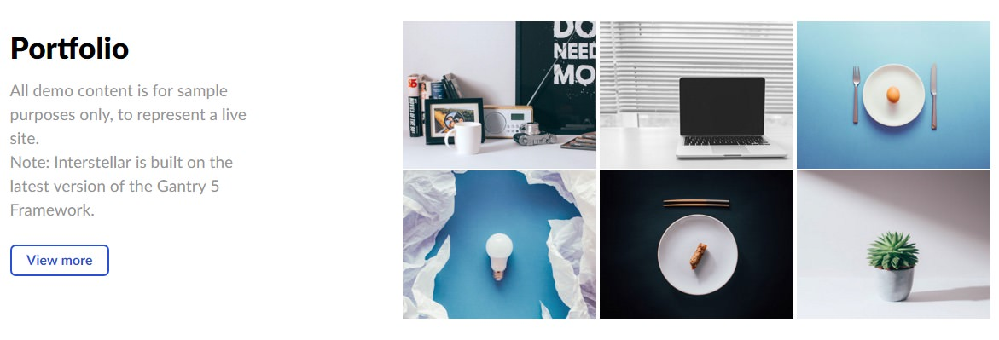
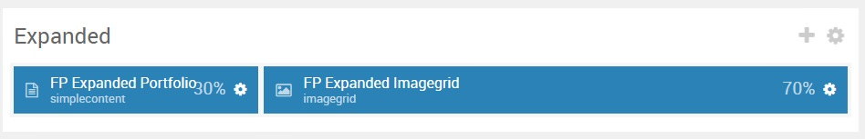
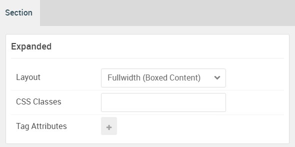

## Introduction

:   1. **Simple Content** [5%, 3%, se]
    2. **Image Grid** [5%, 40%, se]

The **Showcase** section includes two particles: **Simple Content** and **Simple Content**.

Here is a breakdown of the widget(s) and particle(s) that appear in this section:

* [Simple Content (particle)](#content-tabs-(particle))
* [Image Grid (particle)](#pricing-grid-(particle))

## Section Settings

| Option           | Setting                   |
| :--------------- | :----------               |
| Layout           | Fullwidth (Boxed Content) |
| CSS Classes      | Blank                     |
| Tag Attributes   | Blank                     |

## Simple Content (Particle)

### Particle Settings

| Option                   | Setting          |
| :-----                   | :-----           |
| Particle Name            | `Simple Content` |
| CSS Classes              | Blank            |
| Title                    | Blank            |
| Item 1 Name              | `Portfolio`      |
| Item 1 Layout Style      | Standard         |
| Item 1 Created Date      | Blank            |
| Item 1 Content Title     | `Portfolio`      |
| Item 1 Author            | Blank            |
| Item 1 Main Content      | Blank            |
| Item 1 Read More Label   | `View more`      |
| Item 1 Read More Link    | Blank            |
| Item 1 Read More Classes | `button`         |
| Item 1 Target            | Self             |

**Leading Content**

~~~ .html
All demo content is for sample purposes only, to represent a live site.
 
Note: Interstellar is built on the latest version of the Gantry 5 Framework.
~~~

#### Block Settings

| Option         | Setting   |
| :-----         | :-----    |
| CSS ID         | Blank     |
| CSS Classes    | Blank     |
| Variations     | Blank     |
| Tag Attributes | Blank     |
| Fixed Size     | Unchecked |
| Block Size     | `30%`     |

## Image Grid (Particle)

### Particle Settings

| Option             | Setting      |
| :-----             | :-----       |
| Particle Name      | `Image Grid` |
| CSS Classes        | Blank        |
| Title              | Blank        |
| Description        | Blank        |
| Grid Column        | 3 Columns    |
| Album Name         | Blank        |
| Item 1 Name        | `New Item`   |
| Item 1 Promo Image | Custom       |
| Item 1 Caption     | Blank        |

### Block Settings

| Option         | Setting   |
| :-----         | :-----    |
| CSS ID         | Blank     |
| CSS Classes    | Blank     |
| Variations     | Blank     |
| Tag Attributes | Blank     |
| Fixed Size     | Unchecked |
| Block Size     | `70%`     |

