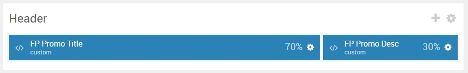
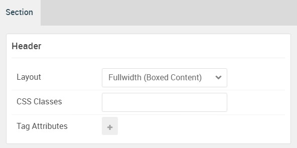

## Introduction

:   1. **Custom HTML** [10%, 3%, se]
    2. **Custom HTML** [10%, 70%, se]

The **Header** section includes two **Custom HTML** particles.

Here is a breakdown of the widget(s) and particle(s) that appear in this section:

* [Custom HTML (particle)](#custom-html-(particle))
* [Custom HTML (particle)](#custom-html-(particle)-2)

## Section Settings

| Option           | Setting                   |
| :--------------- | :----------               |
| Layout           | Fullwidth (Boxed Content) |
| CSS Classes      | Blank                     |
| Tag Attributes   | Blank                     |

## Custom HTML (Particle)

### Particle Settings

| Option             | Setting       |
| :-----             | :-----        |
| Particle Name      | `Custom HTML` |
| Process Twig       | Blank         |
| Process Shortcodes | Blank         |

**Custom HTML**

~~~ .html
<h2 class="g-title">Interstellar is a modern mobile-friendly responsive design.</h2>
~~~

### Block Settings

| Option         | Setting   |
| :-----         | :-----    |
| CSS ID         | Blank     |
| CSS Classes    | Blank     |
| Variations     | Blank     |
| Tag Attributes | Blank     |
| Fixed Size     | Unchecked |
| Block Size     | `70%`     |

## Custom HTML (Particle) 2

### Particle Settings

| Option             | Setting       |
| :-----             | :-----        |
| Particle Name      | `Custom HTML` |
| Process Twig       | Blank         |
| Process Shortcodes | Blank         |

**Custom HTML**

~~~ .html

Not only that, but thanks to the powerful Gantry 5 framework, you can easily assign individual elements to specific screen types.

<a href="http://www.gantry.org" class="button">Learn More</a>
~~~

### Block Settings

| Option         | Setting   |
| :-----         | :-----    |
| CSS ID         | Blank     |
| CSS Classes    | Blank     |
| Variations     | Blank     |
| Tag Attributes | Blank     |
| Fixed Size     | Unchecked |
| Block Size     | `30%`     |

