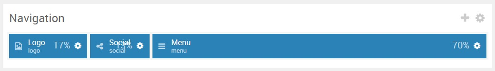

## Introduction

:   1. **Logo / Image (Particle)** [30%, 2%, se]
    2. **Social (Particle)** [30%, 16%, se]
    3. **Menu (Particle)** [30%, 55%, se]

The **Navigation** section includes three particles, **Logo**, **Social**, and **Menu**.

Here is a breakdown of the widget(s) and particle(s) that appear in this section:

* [Logo / Image (particle)](#logo-(particle))
* [Social (Particle)](#social-(particle))
* [Menu (Particle)](#menu-(particle))

## Section Settings

| Option           | Setting                   |
| :--------------- | :----------               |
| Layout           | Fullwidth (Boxed Content) |
| CSS Classes      | `nav-large-offset`        |
| Tag Attributes   | Blank                     |

## Logo (Particle)

### Particle Settings

| Option      | Setting                        |
| :-----      | :-----                         |
| URL         | Blank                          |
| Image       | `gantry-media://logo/logo.svg` |
| Text        | `Interstellar`                       |
| CSS Classes | `g-logo`                       |

### Block Settings

| Option         | Setting   |
| :-----         | :-----    |
| CSS ID         | Blank     |
| CSS Classes    | Blank     |
| Variations     | Blank     |
| Tag Attributes | Blank     |
| Fixed Size     | Unchecked |
| Block Size     | `17%`     |

## Social (Particle)

### Particle Settings

| Option      | Setting                               |
| :-----      | :-----                                |
| CSS Classes | Blank                                 |
| Title       | Blank                                 |
| Target      | New Window                            |
| Item 1 Name | `Facebook`                            |
| Item 1 Icon | `fa fa-facebook fa-fw`                |
| Item 1 Text | Blank                                 |
| Item 1 Link | `http://www.facebook.com/RocketTheme` |

### Block Settings

| Option         | Setting    |
| :-----         | :-----     |
| CSS ID         | Blank      |
| CSS Classes    | Blank      |
| Variations     | Align Left |
| Tag Attributes | Blank      |
| Fixed Size     | Unchecked  |
| Block Size     | `13%`      |

## Menu (Particle)

### Particle Settings

| Option        | Setting          |
| :-----        | :-----           |
| Menu          | Use Default Menu |
| Base Item     | Active           |
| Start Level   | `1`              |
| Max Levels    | `0`              |
| Renter Titles | Unchecked        |
| Mobile Target | Unchecked        |

### Block Settings

| Option         | Setting     |
| :-----         | :-----      |
| CSS ID         | Blank       |
| CSS Classes    | Blank       |
| Variations     | Align Right |
| Tag Attributes | Blank       |
| Fixed Size     | Unchecked   |
| Block Size     | `70%`       |