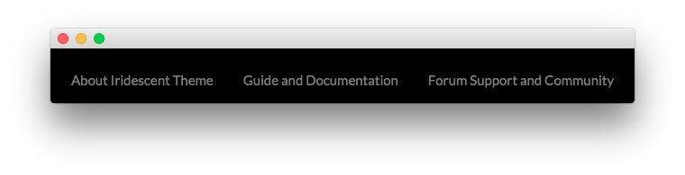

Footer Section
-----

Here is the widget breakdown for the Footer section:

#### Custom Menu

The **Custom Menu** widget allows us to add an extra menu somewhere on the page. This menu was created separately from the main menu linked in the header, and can be configured by going to **Administration -> Appearance -> Menus**.

Here is a breakdown of what you will need to change in the widget options to match the demo.

|       Option      |                         Setting                         |
| :---------------- | :------------------------------------------------------ |
| Select Menu       | (Choose the menu you wish to have appear in the widget) |
| Custom Variations | `rt-horizmenu hidden-phone wow fadeInUp animated`       |

Leaving all other options at their default settings, click **Save**. 
