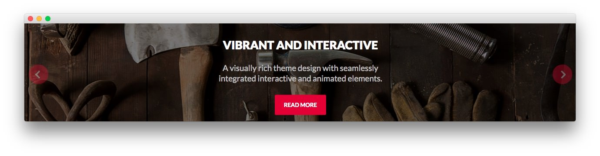

Slideshow Section
-----

Here is the widget breakdown for the Slideshow section:

#### RokSprocket (Features)

This area of the demo is a RokSprocket widget. You will need to do two things to prepare this widget so that it looks similar to the one in the demo.

First, you will need to create the RokSprocket Widget. You can do this by navigating to **Administration -> RokSprocket Admin** and creating a new **Features** widget.

You can find out more about RokSprocket and how to set up and modify widgets by visiting our [RokSprocket documentation](../../plugins/roksprocket).

>> NOTE: If you are using the the RocketLauncher, there are some special instructions concerning the handling of the preset images for this module. If you notice your images aren't changing as expected, or if you would like more information on how this was set up, you can find it [here](demo.md#roksprocket-and-rocketlauncher-settings).

##### Simple Provider

We used the **Simple Provider** to enable us to create custom RokSprocket content without having to create separate articles or pages to do so. Here are the details of one of the **Simple Items** in the **Featured Article List**.

| Option |                            Setting                            |
| :----- | :------------------------------------------------------------ |
| Title  | `Vibrant and Interactive` |
| Image  | Custom                                                        |
| Link   | Custom                                                        |

**Description**

~~~ .html
A visually rich theme design with seamlessly integrated interactive and animated elements.
~~~

Here is a look at the **Features Layout Options** for this widget.

|      Option      |    Setting     |
| :--------------- | :------------- |
| Display Limit    | ∞              |
| Theme            | Full Slideshow |
| Article Titles   | Show           |
| Article Text     | Show           |
| Preview Length   | ∞              |
| Strip HTML Tags  | No             |
| Arrow Navigation | Show           |
| Pagination       | Hide           |
| Animation        | Crossfade      |
| Autoplay         | Disable        |
| Autoplay Delay   | 5              |
| Image Resize     | Disable        |

>> The **Full Slideshow** theme is unique to Iridescent and was created to give the RokSprocket mode a certain set of attributes that enables it to look the way it does in this template. You can find more information about overriding themes [here](../../plugins/roksprocket/layout_modes.md#custom-layout-theme-overrides).

You can set the RokSprocket filters to include any category, specific articles, or otherwise you would like to have featured in this widget.

Once you have created this widget, you can add it via the Widgets menu by clicking **RokSprocket** and dragging it to the appropriate section. When you have done this, you will need to return to the Widgets settings and fill them out as noted below:

|       Option      |                     Setting                      |
| :---------------- | :----------------------------------------------- |
| Choose Widget     | (Select the RokSprocket Widget You Just Created) |
| Custom Variations | `fp-slideshow fp-preset-images`                  |

Leaving everything else at its default setting, select **Save**.

The widget should now be created and ready for use on the front page of your WordPress site.

>> NOTE: If you are using the RocketLauncher package, and are not wanting to display more than one preset to display your website with Iridescent, please remove the 'fp-preset-images' variation in the RokSprocket Widget - Custom Variations field so you can simply use RokSprocket's Image field to display your image.
