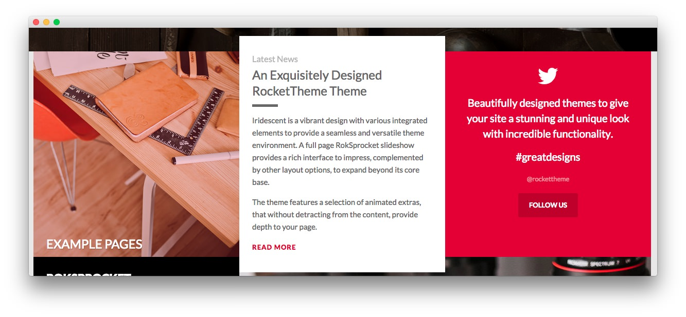

Top Section
-----

:   1. **Text 1** [20%, 6%, se]
    2. **Text 2** [20%, 36%, se]
    3. **Text 3** [20%, 66%, se]

Here is the widget breakdown for the Top section:

* Text
* Gantry Divider
* Text
* Gantry Divider
* Text

#### Text 1

This section of the page is a standard text widget. You will need to enter the following in the main text field.

~~~ .html

    
    

        <h2 class="rt-uppercase"><a href="http://ryanmpierson.no-ip.biz/wordpress/iridescent/features-overview/" class="fp-demo-url">Example Pages</a></h2>
        
<a href="http://ryanmpierson.no-ip.biz/wordpress/iridescent/features-overview/" class="fp-demo-url">Sample layouts available for replication</a>

    
          

~~~

Here is a breakdown of options changes you will want to make to match the demo.

|       Option      |  Setting   |
| :---------------- | :--------- |
| Custom Variations | `fp-top-a` |

Leaving everything else at its default setting, select **Save**.

#### Gantry Divider

This widget tells WordPress to start a new widget column beginning with the widget placed directly below the divider in the section.

#### Text 2

This section of the page is a standard text widget. You will need to enter the following in the main text field.

~~~ .html

Iridescent is a vibrant design with various integrated elements to provide a
seamless and versatile theme environment. A full
page RokSprocket slideshow provides a rich interface to impress, complemented
by other layout options, to expand beyond its core base.

The theme features a selection of animated extras,
that without detracting from the content, provide depth to your
page.
<a class="readon3" href=
"http://ryanmpierson.no-ip.biz/wordpress/iridescent/features-overview/">Read
More</a>
~~~

Here is a breakdown of options changes you will want to make to match the demo.

|       Option      |                                         Setting                                          |
| :---------------- | :--------------------------------------------------------------------------------------- |
| Title             | `[span class="rt-title-tag"]Latest News[/span]An Exquisitely Designed RocketTheme Theme` |
| Custom Variations | `title5 fp-top-b`                                                                        |

Leaving everything else at its default setting, select **Save**.

#### Text 3

This section of the page is a standard text widget. You will need to enter the following in the main text field.

~~~ .html

<i class="fa fa-twitter fa-3x"></i>

Beautifully designed themes to give your site a stunning and unique look with incredible functionality.

#greatdesigns#greatdesigns

<small>@rockettheme</small>

<a class="readon" href="https://twitter.com/rockettheme">Follow Us</a>  
~~~

Here is a breakdown of options changes you will want to make to match the demo.

|       Option      |     Setting      |
| :---------------- | :--------------- |
| Widget Variations | Box 1, RT-Center |
| Custom Variations | `fp-top-c`       |

Leaving everything else at its default setting, select **Save**.
