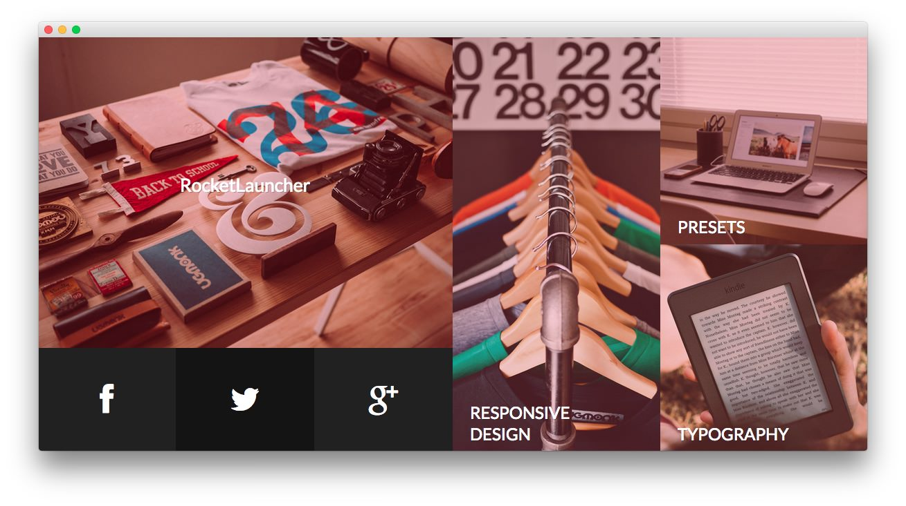

Utility Section
-----

:   1. **Text 1** [8%, 5%, se]
    2. **Text 2** [8%, 50%, se]

Here is the widget breakdown for the Utility section:

* Text
* Gantry Divider
* Text

#### Text 1

This section of the page is a standard text widget. You will need to enter the following in the main text field.

~~~ .html

    
    

        <h2><a href="http://(Your Site URL)/features-overview/" class="fp-demo-url">RocketLauncher</a></h2>
        
<a href="http://(Your Site URL)/features-overview/" class="fp-demo-url">Install Iridescent demo on your website or localhost</a>

    
          

    

        <a href="https://www.facebook.com/RocketTheme">
            

                <i class="fa fa-facebook fa-3x"></i>
            

        </a>
    

    

        <a href="https://twitter.com/rockettheme">
            

                <i class="fa fa-twitter fa-3x"></i>
            

        </a>
    

    

        <a href="https://plus.google.com/+rockettheme/posts">
            

                <i class="fa fa-google-plus fa-3x"></i>
            

        </a>
    
      

~~~

Here is a breakdown of options changes you will want to make to match the demo.

|       Option      |    Setting     |
| :---------------- | :------------- |
| Custom Variations | `fp-utility-a` |

Leaving everything else at its default setting, select **Save**.

#### Gantry Divider

This widget tells WordPress to start a new widget column beginning with the widget placed directly below the divider in the section.

#### Text 2

This section of the page is a standard text widget. You will need to enter the following in the main text field.

~~~ .html

    

        

            
            

                <h2 class="rt-uppercase"><a href="http://(Your Site URL)/features-overview/" class="fp-demo-url">Responsive  Design</a></h2>
                
<a href="http://(Your Site URL)/features-overview/" class="fp-demo-url">Adapts to any device</a>

            
          
        

    

    

        

            
            

                <h2 class="rt-uppercase"><a href="http://(Your Site URL)/features-overview/" class="fp-demo-url">Presets</a></h2>
                
<a href="http://(Your Site URL)/features-overview/" class="fp-demo-url">Six elegant styles</a>

            
          
        

        

            
            

                <h2 class="rt-uppercase"><a href="http://(Your Site URL)/typography/" class="fp-demo-url">Typography</a></h2>
                
<a href="http://(Your Site URL)/typography/" class="fp-demo-url">Individualize your content</a>

            
          
        
      
    
      

~~~

Here is a breakdown of options changes you will want to make to match the demo.

|       Option      |    Setting     |
| :---------------- | :------------- |
| Custom Variations | `fp-utility-b` |

Leaving everything else at its default setting, select **Save**.
