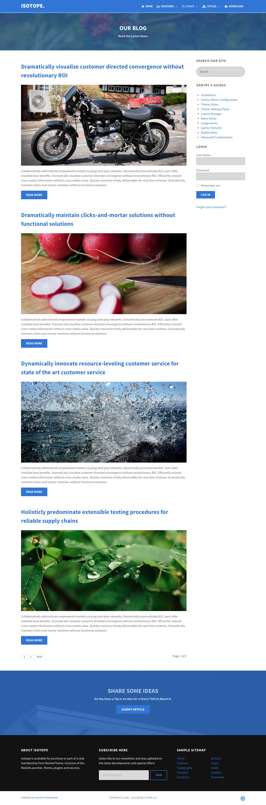
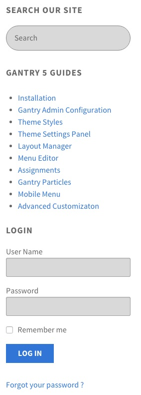

# Introduction

The **Blog** example page demonstrates how you can create a beautiful page with the Isotope theme. Here is some information to help you replicate this page as it appears in the demo.

# Widgets and Particles

Below is a brief rundown of the widgets and particles used to make up the demo page.

:   1. **Showcase - Custom HTML (Particle)** [3%, 45%, se]
    2. **Mainbar - Page Content** [6%, 20%, se]
    3. **Aside - RokAjaxSearch (Widget)** [6%, 75%, se]
    4. **Aside - Custom HTML (Widget)** [11%, 75%, se]
    5. **Aside - Login Form (Particle)** [19%, 75%, se]
    6. **Bottom - Custom HTML (Particle)** [87%, 35%, se]
    7. **Footer - Logo (Particle)** [90%, 20%, se]
    8. **Footer - Horizontal Menu (Particle)** [90%, 45%, se]
    9. **Footer - Social (Particle)** [90%, 70%, se]

1. [Showcase](#showcase-section)
2. [Mainbar](#mainbar-section)
3. [Aside](#aside-section)
4. [Bottom](#bottom-section)
5. [Footer](#footer-section)

# Showcase Section

This area of the page is a **Custom HTML** particle. You will find the settings used in our demo below.

### Custom HTML (Particle)

### Particle Settings

| Field              | Setting       |
| :-----             | :-----        |
| Particle Name      | `Custom HTML` |
| Process Shortcodes | Unchecked     |

### Custom HTML

~~~ .html

  <h2 class="g-layercontent-title">Our Blog</h2>
  
Read the Latest News

~~~

### Block Settings

| Option         | Setting          |
| :----------    | :----------      |
| CSS ID         | Blank            |
| CSS Classes    | `flush` `center` |
| Variations     | Blank            |
| Tag Attributes | Blank            |
| Fixed Size     | Unchecked        |
| Block Size     | `100%`           |

# Mainbar Section

The **Mainbar** section includes several articles assigned to the **WordPress Blog** category, displayed through the **Page Content** particle. Here are the settings found in the **Dramatically visualize customer directed convergence without revolutionary ROI** article.

| Option   | Setting                                                                          |
| :-----   | :-----                                                                           |
| Title    | `Dramatically visualize customer directed convergence without revolutionary ROI` |
| Alias    | `dramatically-visualize-customer-directed-convergence-without-revolutionary-roi` |
| Status   | Published                                                                        |
| Featured | No                                                                               |
| Category | `WordPress Blog`                                                                    |

**Content Body**

~~~ .html

Collaboratively administrate empowered markets via plug-and-play networks. Dynamically procrastinate B2C users after installed base benefits. Dramatically visualize customer directed convergence without revolutionary ROI. Efficiently unleash cross-media information without cross-media value. Quickly maximize timely deliverables for real-time schemas. Dramatically maintain clicks-and-mortar solutions without functional solutions.

<a class="button" href="#">Read More</a>
~~~

# Aside Section

:   1. **RokAjaxSearch (Widget)** [7%, 15%, se]
    2. **Custom HTML (Widget)** [20%, 15%, se]
    3. **Login (Widget)** [60%, 15%, se]

This area of the page consists of the **Aside** section, which sits to the right of the **Mainbar** section in the **Layout Manager**.

Here is a breakdown of the widgets used in the `aside` widget position assigned to the **Aside** section in the **Layout Manager** for the **Blog** sample page:

* RokAjaxSearch (Widget)
* Text (Widget)
* Login Form (Particle)

## RokAjaxSearch (Widget)

The Site Search area of the front page is a **RokAjaxSearch** widget that allows visitors to search your site using the powerful RokAjaxSearch tool.

### Details

| Option      | Setting           |
| :---------- | :----------       |
| Title       | `Search Our Site` |

## Custom HTML (Widget)

### Details

| Field                        | Setting           |
| :-----                       | :-----            |
| Title                        | `Gantry 5 Guides` |
| Automatically Add Paragraphs | Unchecked         |
| Custom Class(es)             | Blank             |

### Custom Output

Enter the following in the **Custom Output** text editor.

~~~ .html
<ul>
  <li><a href="http://docs.gantry.org/gantry5/basics/installation">Installation</a></li>
  <li><a href="http://docs.gantry.org/gantry5/configure/gantry-admin">Gantry Admin Configuration</a></li>
  <li><a href="http://docs.gantry.org/gantry5/configure/styles">Theme Styles</a></li>
  <li><a href="http://docs.gantry.org/gantry5/configure/settings">Theme Settings Panel</a></li>
  <li><a href="http://docs.gantry.org/gantry5/configure/layout-manager">Layout Manager</a></li>
  <li><a href="http://docs.gantry.org/gantry5/configure/menu-editor">Menu Editor</a></li>
  <li><a href="http://docs.gantry.org/gantry5/configure/assignments">Assignments</a></li>
  <li><a href="http://docs.gantry.org/gantry5/particles/particles">Gantry Particles</a></li>
  <li><a href="http://docs.gantry.org/gantry5/particles/mobile-menu">Mobile Menu</a></li>
  <li><a href="http://docs.gantry.org/gantry5/advanced">Advanced Customizaton</a></li>
</ul>
~~~

## Gantry 5 Particle (Login Form) (Widget)

### Details

| Field       | Setting  |
| :-----      | :-----   |
| CSS Classes | Blank    |
| Title       | `Login`  |
| Greeting    | `Hi, %s` |
| Pre Text    | Blank    |
| Post Text   | Blank    |

## Bottom Section

This area of the page is a **Custom HTML** particle. You will find the settings used in our demo below.

### Custom HTML (Particle)

### Particle Settings

| Field              | Setting       |
| :-----             | :-----        |
| Particle Name      | `Custom HTML` |
| Process Shortcodes | Unchecked     |

### Custom HTML

~~~ .html

  <h2 class="g-layercontent-title">Share Some Ideas</h2>
  
Do You Have a Tip or an Idea for a Story? Tell Us About It.

  <a href="http://www.rockettheme.com/wordpress/themes/isotope" class="button button-2">Submit Article</a>

~~~

### Block Settings

| Option         | Setting          |
| :----------    | :----------      |
| CSS ID         | Blank            |
| CSS Classes    | `flush` `center` |
| Variations     | Blank            |
| Tag Attributes | Blank            |
| Fixed Size     | Unchecked        |
| Block Size     | `100%`           |

## Footer Section

:   1. **Logo (Particle)** [20%, 2%, se]
    2. **Horizontal Menu (Particle)** [20%, 35%, se]
    3. **Social (Particle)** [20%, 67%, se]

This area of the page is made up of three particles.

### Logo (Particle)

### Particle Settings

| Field         | Setting               |
| :-----        | :-----                |
| Particle Name | `Logo`                |
| URL           | Blank                 |
| Rel           | Blank                 |
| Image         | Custom                |
| Alt           | `Isotope`              |
| Text          | `Isotope`              |
| CSS Classes   | `g-loto` `g-logo-alt` |

### Block Settings

| Option         | Setting     |
| :----------    | :---------- |
| CSS ID         | Blank       |
| CSS Classes    | Blank       |
| Variations     | Blank       |
| Tag Attributes | Blank       |
| Fixed Size     | Unchecked   |
| Block Size     | `25%`       |

### Horizontal Menu (Particle)

### Particle Settings

| Field            | Setting               |
| :-----           | :-----                |
| Particle Name    | `Horizontal Menu`     |
| CSS Classes      | Blank                 |
| Target           | New Window            |
| Menu Item 1 Name | `Gantry`              |
| Menu Item 1 Text | `Gantry`              |
| Menu ITem 1 Link | `http://gantry.org`   |

### Block Settings

| Option         | Setting                  |
| :----------    | :----------              |
| CSS ID         | Blank                    |
| CSS Classes    | `g-horizontalmenu-block` |
| Variations     | Center                   |
| Tag Attributes | Blank                    |
| Fixed Size     | Unchecked                |
| Block Size     | `50%`                    |

### Social (Particle)

### Particle Settings

| Field                | Setting                               |
| :-----               | :-----                                |
| Particle Name        | `Social`                              |
| CSS Classes          | `social`                              |
| Title                | Blank                                 |
| Social Item 1 Name   | `Facebook`                            |
| Social Item 1 Text   | Blank                                 |
| Social Item 1 Link   | `http://www.facebook.com/RocketTheme` |
| Social Item 1 Target | New Window                            |

### Block Settings

| Option         | Setting     |
| :----------    | :---------- |
| CSS ID         | Blank       |
| CSS Classes    | Blank       |
| Variations     | Blank       |
| Tag Attributes | Blank       |
| Fixed Size     | Unchecked   |
| Block Size     | `25%`       |