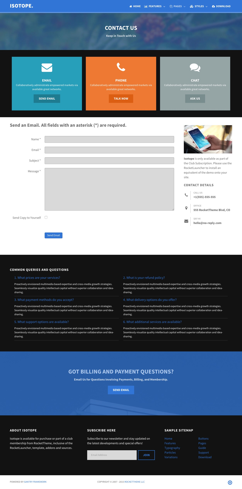
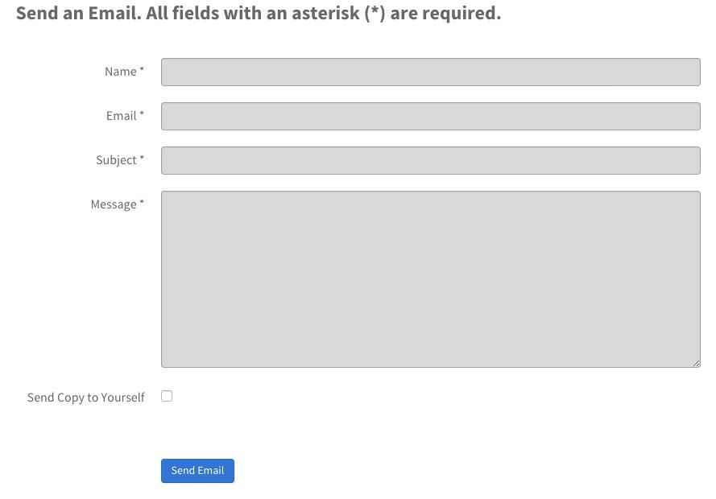
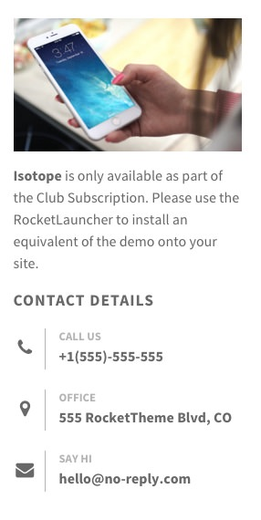

## Introduction

The **Contact** example page demonstrates how you can create a beautiful page with the Isotope theme. Here is some information to help you replicate this page as it appears in the demo.

## Widgets and Particles

Below is a brief rundown of the widgets and particles used to make up the demo page.

:   1. **Showcase - Custom HTML (Particle)** [5%, 40%, se]
    2. **Above - Custom HTML (Particle)** [12%, 5%, se]
    3. **Mainbar - Page Content** [26%, 5%, se]
    4. **Aside - Custom HTML (Particle)** [26%, 75%, se]
    5. **Aside - Contact (Particle)** [39%, 75%, se]
    6. **Expanded - Custom HTML (Particle)** [55%, 5%, se]
    7. **Extension - Custom HTML (Particle)** [75%, 30%, se]
    8. **Footer - Custom HTML (Particle)** [87%, 5%, se]
    9. **Footer - Custom HTML (Particle)** [87%, 35%, se]
    10. **Footer - Custom HTML (Particle)** [87%, 70%, se]

1. [Showcase](#showcase-section)
2. [Above](#above-section)
3. [Mainbar](#mainbar-section)
4. [Aside](#sidebar-section)
5. [Extension](#extension-section)
6. [Bottom](#bottom-section)
7. [Footer](#footer-section)

## Showcase Section

This area of the page is a **Custom HTML** particle. You will find the settings used in our demo below.

### Custom HTML (Particle)

### Particle Settings

| Field              | Setting       |
| :-----             | :-----        |
| Particle Name      | `Custom HTML` |
| Process Shortcodes | Unchecked     |

### Custom HTML

~~~ .html

  <h2 class="g-layercontent-title">Contact</h2>
  
Keep in Touch with Us

~~~

### Block Settings

| Option         | Setting          |
| :----------    | :----------      |
| CSS ID         | Blank            |
| CSS Classes    | `flush` `center` |
| Variations     | Blank            |
| Tag Attributes | Blank            |
| Fixed Size     | Unchecked        |
| Block Size     | `100%`           |

## Showcase Section

This area of the page is a **Custom HTML** particle. You will find the settings used in our demo below.

### Custom HTML (Particle)

### Particle Settings

| Field              | Setting       |
| :-----             | :-----        |
| Particle Name      | `Email - Phone - Chat` |
| Process Shortcodes | Unchecked     |

### Custom HTML

~~~ .html

  

    

      
      <h2 class="g-title">Email</h2>
      
Collaboratively administrate empowered markets via available great networks.

      <a class="button button-4" href="">Send Email</a>
    

  

  

    

      
      <h2 class="g-title">Phone</h2>
      
Collaboratively administrate empowered markets via available great networks.

      <a class="button button-4" href="">Talk Now</a>
    

  

  

    

      
      <h2 class="g-title">Chat</h2>
      
Collaboratively administrate empowered markets via available great networks.

      <a class="button button-4" href="">Ask Us</a>
    

  

~~~

### Block Settings

| Option         | Setting     |
| :----------    | :---------- |
| CSS ID         | Blank       |
| CSS Classes    | Blank       |
| Variations     | Blank       |
| Tag Attributes | Blank       |
| Fixed Size     | Unchecked   |
| Block Size     | `100%`      |

## Mainbar Section

The **Mainbar** section is set to `60`% width and both the **Sidebar** and **Aside** sections are set to `20`%.

The page's contact form is a **Contact Form** particle.

Settings used in our demo for each of these particles can be found below.

### Contact Form

#### Particle Settings

| Field            | Setting        |
| :-----           | :-----         |
| Particle Name    | `Contact Form` |
| CSS Classes      | Blank          |
| Header           | Blank          |
| Email Address    | Custom         |
| Enable reCAPTCHA | Unchecked      |
| Site Key         | Blank          |
| Secret Key       | Blank          |

#### Block Settings

| Field          | Setting |
| :-----         | :-----  |
| CSS ID         | Blank   |
| CSS Classes    | Blank   |
| Variations     | Blank   |
| Tag Attributes | Blank   |
| Block Size     | `100%`  |

## Aside Section

The **Aside** section is set to `20`% width.

This area of the page is made up of two particles, a **Custom HTML** particle and a **Contact** particle.

### Custom HTML (Particle)

#### Particle Settings

| Field              | Setting       |
| :-----             | :-----        |
| Particle Name      | `Isotope Info` |
| Process Shortcodes | Unchecked     |

##### Custom Output

Enter the following in the **Custom Output** text editor.

~~~ .html

<strong>Isotope</strong> is only available as part of the Club Subscription. Please use the RocketLauncher to install an equivalent of the demo onto your site.

~~~

#### Block Settings

| Field          | Setting   |
| :-----         | :-----    |
| CSS ID         | Blank     |
| CSS Classes    | Blank     |
| Variations     | Blank     |
| Tag Attributes | Blank     |
| Fixed Size     | Unchecked |
| Block Size     | `100%`    |

### Contact (Particle)

#### Particle Settings

| Field                | Setting             |
| :-----               | :-----              |
| Particle Name        | `Contact Details`   |
| CSS Classes          | Blank               |
| Title                | `Contact Details`   |
| Contact Item 1 Name  | `Call Us`           |
| Contact Item 1 Icon  | `fa fa-phone fa-fw` |
| Contact Item 1 Value | `+1(555)-555-555`   |

#### Block Settings

| Field          | Setting   |
| :-----         | :-----    |
| CSS ID         | Blank     |
| CSS Classes    | Blank     |
| Variations     | Blank     |
| Tag Attributes | Blank     |
| Fixed Size     | Unchecked |
| Block Size     | `100%`    |

## Expanded Section

This area of the page is an **Infolist** particle. You will find the settings used in our demo below.

### Info List (Particle)

### Particle Settings

| Field                           | Setting                                                                                                                                                                                   |
| :-----                          | :-----                                                                                                                                                                                    |
| Particle Name                   | `Common Queries and Questions`                                                                                                                                                            |
| CSS Classes                     | Blank                                                                                                                                                                                     |
| Title                           | `Common Queries and Questions`                                                                                                                                                            |
| Intro                           | Blank                                                                                                                                                                                     |
| Grid Column                     | 2 Columns                                                                                                                                                                                 |
| Info List Item 1 Name           | `What prices are your services ?`                                                                                                                                                         |
| Info List Item 1 Image          | Blank                                                                                                                                                                                     |
| Info List Item 1 Image Location | Left                                                                                                                                                                                      |
| Info List Item 1 Text Style     | Compact                                                                                                                                                                                   |
| Info List Item 1 Image Style    | Compact                                                                                                                                                                                   |
| Info List Item 1 Description    | `Proactively envisioned multimedia based expertise and cross-media growth strategies. Seamlessly visualize quality intellectual capital without superior collaboration and idea-sharing.` |
| Info List Item 1 Tag            | Blank                                                                                                                                                                                     |
| Info List Item 1 Sub Tag        | Blank                                                                                                                                                                                     |
| Info List Item 1 Label          | Blank                                                                                                                                                                                     |
| Info List Item 1 Link           | `#`                                                                                                                                                                                       |
| Info List Item 1 Icon           | Blank                                                                                                                                                                                     |
| Info List Item 1 CSS Classes    | Blank                                                                                                                                                                                     |

## Extension Section

This area of the page is a **Custom HTML** particle. You will find the settings used in our demo below.

### Custom HTML (Particle)

### Particle Settings

| Field              | Setting       |
| :-----             | :-----        |
| Particle Name      | `Custom HTML` |
| Process Shortcodes | Unchecked     |

### Custom HTML

~~~ .html

  <h2 class="g-layercontent-title">Got Billing and Payments Questions?</h2>
  
Email Us for Questions Involving Payments, Billing, and Membership.

  <a href="http://www.rockettheme.com/wordpress/themes/isotope" class="button button-2">Send Email</a>

~~~

### Block Settings

| Option         | Setting          |
| :----------    | :----------      |
| CSS ID         | Blank            |
| CSS Classes    | `flush` `center` |
| Variations     | Blank            |
| Tag Attributes | Blank            |
| Fixed Size     | Unchecked        |
| Block Size     | `100%`           |

## Footer Section

:   1. **Logo (Particle)** [20%, 2%, se]
    2. **Horizontal Menu (Particle)** [20%, 35%, se]
    3. **Social (Particle)** [20%, 67%, se]

This area of the page is made up of three particles.

### Logo (Particle)

### Particle Settings

| Field         | Setting               |
| :-----        | :-----                |
| Particle Name | `Logo`                |
| URL           | Blank                 |
| Rel           | Blank                 |
| Image         | Custom                |
| Alt           | `Isotope`              |
| Text          | `Isotope`              |
| CSS Classes   | `g-loto` `g-logo-alt` |

### Block Settings

| Option         | Setting     |
| :----------    | :---------- |
| CSS ID         | Blank       |
| CSS Classes    | Blank       |
| Variations     | Blank       |
| Tag Attributes | Blank       |
| Fixed Size     | Unchecked   |
| Block Size     | `25%`       |

### Horizontal Menu (Particle)

### Particle Settings

| Field            | Setting               |
| :-----           | :-----                |
| Particle Name    | `Horizontal Menu`     |
| CSS Classes      | Blank                 |
| Target           | New Window            |
| Menu Item 1 Name | `Gantry`              |
| Menu Item 1 Text | `Gantry`              |
| Menu ITem 1 Link | `http://gantry.org`   |

### Block Settings

| Option         | Setting                  |
| :----------    | :----------              |
| CSS ID         | Blank                    |
| CSS Classes    | `g-horizontalmenu-block` |
| Variations     | Center                   |
| Tag Attributes | Blank                    |
| Fixed Size     | Unchecked                |
| Block Size     | `50%`                    |

### Social (Particle)

### Particle Settings

| Field                | Setting                               |
| :-----               | :-----                                |
| Particle Name        | `Social`                              |
| CSS Classes          | `social`                              |
| Title                | Blank                                 |
| Social Item 1 Name   | `Facebook`                            |
| Social Item 1 Text   | Blank                                 |
| Social Item 1 Link   | `http://www.facebook.com/RocketTheme` |
| Social Item 1 Target | New Window                            |

### Block Settings

| Option         | Setting     |
| :----------    | :---------- |
| CSS ID         | Blank       |
| CSS Classes    | Blank       |
| Variations     | Blank       |
| Tag Attributes | Blank       |
| Fixed Size     | Unchecked   |
| Block Size     | `25%`       |