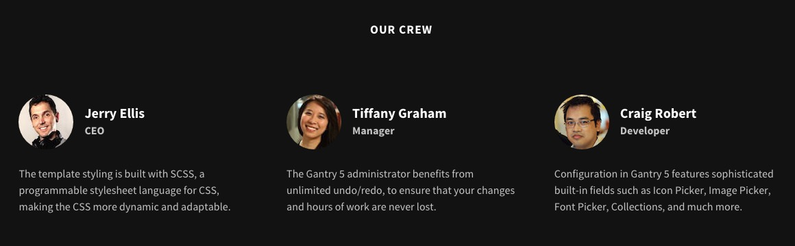
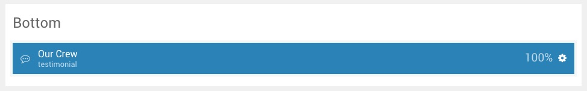
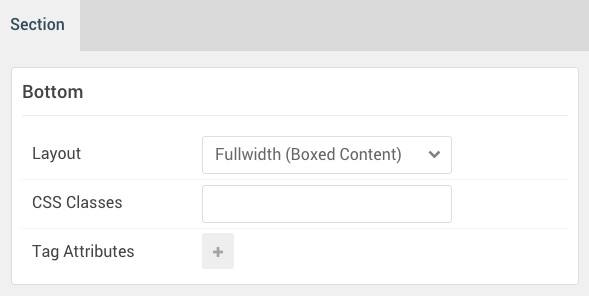

## Introduction

The **Bottom** section includes one **Testimonials** particle.

Here is a breakdown of the widget(s) and particle(s) that appear in this section:

* [Testimonials (particle)](#testimonials-(particle))

## Section Settings

| Option                | Setting                            |
| :---------------      | :----------                        |
| Layout                | Fullwidth (Boxed Content)          |
| CSS Classes           | Blank                              |
| Tag Attributes Item 1 | `data-enllax-ratio` -> `0.3`       |
| Tag Attributes Item 2 | `data-enllax-type` -> `background` |

## Testimonials (Particle)

### Particle Settings

| Option                   | Setting                                                                                                                           |
| :-----                   | :-----                                                                                                                            |
| Particle Name            | `Testimonials`                                                                                                                    |
| CSS Classes              | `title-center`                                                                                                                    |
| Title                    | `Our Crew`                                                                                                                        |
| Intro                    | Blank                                                                                                                             |
| Grid Column              | 3 Columns                                                                                                                         |
| Item 1 Title             | `Jerry Ellis`                                                                                                                     |
| Item 1 Testimonial Style | Standard                                                                                                                          |
| Item 1 Image             | Custom                                                                                                                            |
| Item 1 Content           | `The theme styling is built with SCSS, a programmable stylesheet language for CSS, making the CSS more dynamic and adaptable.` |
| Item 1 Author            | `Jerry Ellis`                                                                                                                     |
| Item 1 Company           | `CEO`                                                                                                                             |
| Item 1 Link              | `#`                                                                                                                               |

### Block Settings

| Option         | Setting        |
| :-----         | :-----         |
| CSS ID         | Blank          |
| CSS Classes    | Blank          |
| Variations     | Centered Title |
| Tag Attributes | Blank          |
| Fixed Size     | Unchecked      |
| Block Size     | `100%`         |
