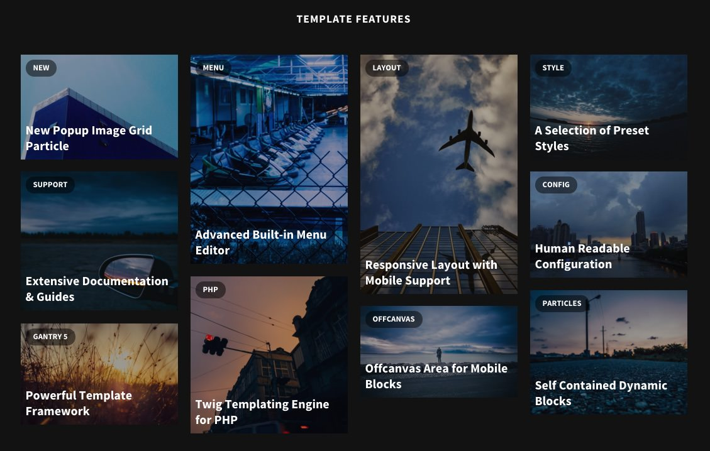
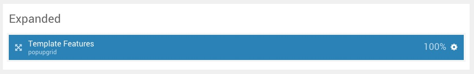

## Introduction

The **Expanded** section includes one **Popup Image Grid** particle.

Here is a breakdown of the widget(s) and particle(s) that appear in this section:

* [Popup Image Grid (particle)](#popup-image-grid-(particle))

## Section Settings

| Option           | Setting                   |
| :--------------- | :----------               |
| Layout           | Fullwidth (Boxed Content) |
| CSS Classes      | Blank                     |
| Tag Attributes   | Blank                     |

## Widget Position (Expanded)

### Particle Settings

| Option                 | Setting                                                                                                                                                        |
| :-----                 | :-----                                                                                                                                                         |
| Particle Name          | `Popup Image Grid`                                                                                                                                             |
| CSS Classes            | `title-center`                                                                                                                                                 |
| Title                  | `Theme Features`                                                                                                                                            |
| Item 1 Name            | `New Popup Image Grid Particle`                                                                                                                                |
| Item 1 Image           | Custom                                                                                                                                                         |
| Item 1 Image Size      | `960x640`                                                                                                                                                      |
| Item 1 Preview Overlay | Enabled                                                                                                                                                        |
| Item 1 Preview Icon    | `fa fa-search-plus`                                                                                                                                            |
| Item 1 Tag             | `New`                                                                                                                                                          |
| Item 1 Description     | `Popup Image Grid is a rich element for display images and content, with a mosaic type grid, which loads a full page overlay with a larger image and content.` |
| Item 1 Animations      | `g-zoom`                                                                                                                                                       |
| Item 1 Button Label    | `Learn More`                                                                                                                                                   |
| Item 1 Button Link     | `#`                                                                                                                                                            |
| Item 1 Target          | Self                                                                                                                                                           |
| Item 1 Button Classes  | `button-3`                                                                                                                                                     |

### Block Settings

| Option         | Setting        |
| :-----         | :-----         |
| CSS ID         | Blank          |
| CSS Classes    | Blank          |
| Variations     | Centered Title |
| Tag Attributes | Blank          |
| Fixed Size     | Unchecked      |
| Block Size     | `100%`         |
