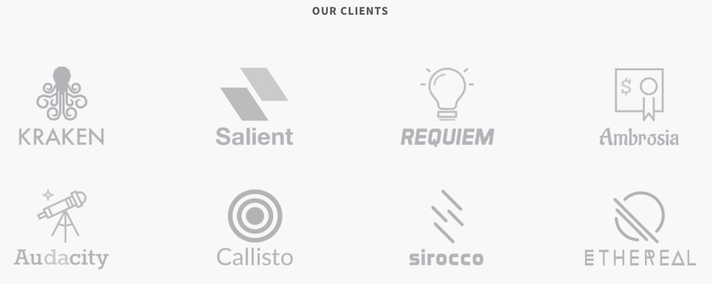
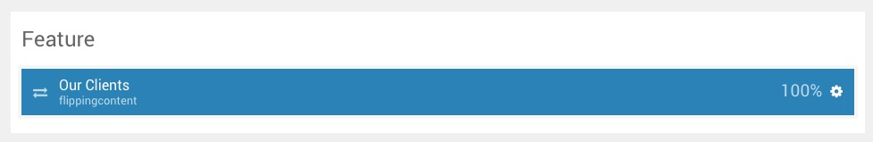
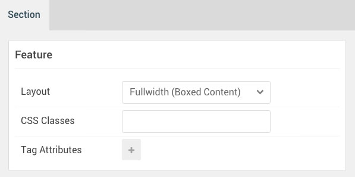

## Introduction

The **Feature** section includes one widget position, **Feature**. In that widget position we placed a **Gantry 5 Particle** widget with the **Flipping Content** particle assigned.

Here is a breakdown of the widget(s) and particle(s) that appear in this section:

* [Widget Position (Feature)](#widget-position-(feature))
	* [Flipping Content (particle)](#flipping-content-(particle))

## Section Settings

| Option           | Setting                   |
| :--------------- | :----------               |
| Layout           | Fullwidth (Boxed Content) |
| CSS Classes      | Blank                     |
| Tag Attributes   | Blank                     |

## Widget Position (Feature)

### Particle Settings

| Option        | Setting     |
| :-----        | :-----      |
| Particle Name | `Feature A` |
| Key           | `feature-a` |
| Chrome        | `gantry`    |

### Block Settings

| Option         | Setting      |
| :-----         | :-----       |
| CSS ID         | Blank        |
| CSS Classes    | `fp-feature` |
| Variations     | Blank        |
| Tag Attributes | Blank        |
| Fixed Size     | Unchecked    |
| Block Size     | `100%`       |

### Assigned Particle(s)

Using the **Gantry 5 Particle** widget, we assigned a **Flipping Content** particle to this position. You will find the settings used in this particle, below.

#### Flipping Content (Particle)

##### Particle Settings

| Option                                 | Setting                                              |
| :-----                                 | :-----                                               |
| Particle Name                          | `Flipping Content`                                   |
| CSS Classes                            | `title-center`                                       |
| Title                                  | `Our Clients`                                        |
| Grid Column                            | 4 Columns                                            |
| Flipping Content Item 1 Name           | `Layouts`                                            |
| Flipping Content Item 1 Image          | Custom                                               |
| Flipping Content Item 1 Image Alt Text | Blank                                                |
| Flipping Content Item 1 Title          | `Layouts`                                            |
| Flipping Content Item 1 SubTitle       | Blank                                                |
| Flipping Content Item 1 Description    | `Infinite layout possibilities with unlimited rows.` |
| Flipping Content Item 1 Link Text      | `Read More`                                          |
| Flipping Content Item 1 Target         | Self                                                 |
| Flipping Content Item 1 Link           | `#`                                                  |
