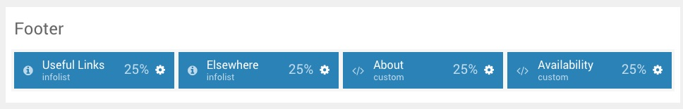
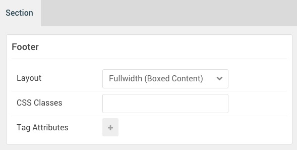

## Introduction

The **Footer** section includes four widget positions, **Footer A**, **Footer B**, **Footer C**, and **Footer D**. In these positions, we placed different particles, outlined in this guide.

Here is a breakdown of the widget(s) and particle(s) that appear in this section:

* [Widget Position (Footer A)](#widget-position-(footer-a))
	* [Info List (particle)](#info-list-(particle))
* [Widget Position (Footer B)](#widget-position-(footer-b))
	* [Info List (particle)](#info-list-(particle)-2)
* [Widget Position (Footer C)](#widget-position-(footer-c))
	* [Custom HTML (particle)](#custom-html-(particle))
* [Widget Position (Footer D)](#widget-position-(footer-d))
	* [Custom HTML (particle)](#custom-html-(particle)-2)

## Section Settings

| Option           | Setting                   |
| :--------------- | :----------               |
| Layout           | Fullwidth (Boxed Content) |
| CSS Classes      | Blank                     |
| Tag Attributes   | Blank                     |

## Widget Position (Footer A)

### Particle Settings

| Option        | Setting    |
| :-----        | :-----     |
| Particle Name | `Footer A` |
| Key           | `footer-a` |
| Chrome        | `gantry`   |

### Block Settings

| Option         | Setting   |
| :-----         | :-----    |
| CSS ID         | Blank     |
| CSS Classes    | Blank     |
| Variations     | Blank     |
| Tag Attributes | Blank     |
| Fixed Size     | Unchecked |
| Block Size     | `25%`     |

### Assigned Particle(s)

Using the **Gantry 5 Particle** widget, we assigned a **Info List** particle to this position. You will find the settings used in this particle, below.

#### Info List (Particle)

##### Particle Settings

| Option                   | Setting                                               |
| :-----                   | :-----                                                |
| Particle Name            | `Info List`                                           |
| CSS Classes              | `g-gridmenu`                                          |
| Title                    | `Useful Links`                                        |
| Intro                    | Blank                                                 |
| Grid Column              | 1 Column                                              |
| Item 1 Name              | `About Isotope`                                       |
| Item 1 Image             | Blank                                                 |
| Item 1 Image Location    | Left                                                  |
| Item 1 Text Style        | Compact                                               |
| Item 1 Image Style       | Compact                                               |
| Item 1 Description       | Blank                                                 |
| Item 1 Tag               | Blank                                                 |
| Item 1 Sub Tag           | Blank                                                 |
| Item 1 Label             | Blank                                                 |
| Item 1 Link              | `http://www.rockettheme.com/wordpress/themes/isotope` |
| Item 1 Icon              | Blank                                                 |
| Item 1 Read More Classes | Blank                                                 |

## Widget Position (Footer B)

### Particle Settings

| Option        | Setting    |
| :-----        | :-----     |
| Particle Name | `Footer B` |
| Key           | `footer-b` |
| Chrome        | `gantry`   |

### Block Settings

| Option         | Setting   |
| :-----         | :-----    |
| CSS ID         | Blank     |
| CSS Classes    | Blank     |
| Variations     | Blank     |
| Tag Attributes | Blank     |
| Fixed Size     | Unchecked |
| Block Size     | `25%`     |

### Assigned Particle(s)

Using the **Gantry 5 Particle** widget, we assigned a **Info List** particle to this position. You will find the settings used in this particle, below.

#### Info List (Particle) 2

##### Particle Settings

| Option                   | Setting                                 |
| :-----                   | :-----                                  |
| Particle Name            | `Info List`                             |
| CSS Classes              | `g-gridmenu`                            |
| Title                    | `Elsewhere`                             |
| Intro                    | Blank                                   |
| Grid Column              | 2 Columns                               |
| Item 1 Name              | `Facebook`                              |
| Item 1 Image             | Blank                                   |
| Item 1 Image Location    | Left                                    |
| Item 1 Text Style        | Compact                                 |
| Item 1 Image Style       | Compact                                 |
| Item 1 Description       | Blank                                   |
| Item 1 Tag               | Blank                                   |
| Item 1 Sub Tag           | Blank                                   |
| Item 1 Label             | Blank                                   |
| Item 1 Link              | `https://www.facebook.com/RocketTheme/` |
| Item 1 Icon              | Blank                                   |
| Item 1 Read More Classes | Blank                                   |

## Widget Position (Footer C)

### Particle Settings

| Option        | Setting    |
| :-----        | :-----     |
| Particle Name | `Footer C` |
| Key           | `footer-c` |
| Chrome        | `gantry`   |

### Block Settings

| Option         | Setting   |
| :-----         | :-----    |
| CSS ID         | Blank     |
| CSS Classes    | Blank     |
| Variations     | Blank     |
| Tag Attributes | Blank     |
| Fixed Size     | Unchecked |
| Block Size     | `25%`     |

### Assigned Particle(s)

Using the **Gantry 5 Particle** widget, we assigned a **Custom HTML** particle to this position. You will find the settings used in this particle, below.

#### Custom HTML (Particle)

##### Particle Settings

| Option             | Setting       |
| :-----             | :-----        |
| Particle Name      | `Custom HTML` |
| Process Shortcodes | Unchecked     |

~~~ .html

All demo content is for sample purposes only, to represent a live site.

Note: Isotope is built on the latest version of the Gantry 5 Framework.

~~~

## Widget Position (Footer D)

### Particle Settings

| Option        | Setting    |
| :-----        | :-----     |
| Particle Name | `Footer D` |
| Key           | `footer-d` |
| Chrome        | `gantry`   |

### Block Settings

| Option         | Setting   |
| :-----         | :-----    |
| CSS ID         | Blank     |
| CSS Classes    | Blank     |
| Variations     | Blank     |
| Tag Attributes | Blank     |
| Fixed Size     | Unchecked |
| Block Size     | `25%`     |

### Assigned Particle(s)

Using the **Gantry 5 Particle** widget, we assigned a **Custom HTML** particle to this position. You will find the settings used in this particle, below.

#### Custom HTML (Particle) 2

##### Particle Settings

| Option             | Setting       |
| :-----             | :-----        |
| Particle Name      | `Custom HTML` |
| Process Shortcodes | Unchecked     |

~~~ .html

<a href="http://www.rockettheme.com/wordpress/themes/isotope">Isotope</a> can be individually purchased with lifetime download / forum access.

Alternatively, Isotope is available as part of a subscription.

~~~