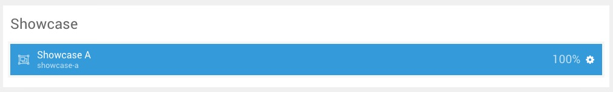
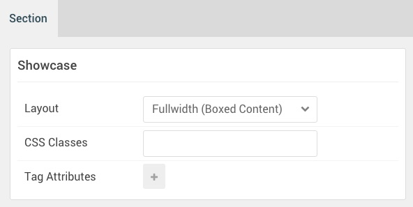

## Introduction

:	1. **FlexSlider** [10%, 20%, se]
	2. **Custom HTML** [90%, 40%, se]

The **Showcase** section includes **FlexSlider** particle, and one **Custom HTML** particle.

Here is a breakdown of the widget(s) and particle(s) that appear in this section:

* [FlexSlider (particle)](#flexslider-(particle))
* [Custom HTML (particle)](#custom-html-(particle))

## Section Settings

| Option           | Setting                   |
| :--------------- | :----------               |
| Layout           | Fullwidth (Boxed Content) |
| CSS Classes      | Blank                     |
| Tag Attributes   | Blank                     |

## FlexSlider (Particle)

### Particle Settings

| Option                                 | Setting                                                                                                                            |
| :-----                                 | :-----                                                                                                                             |
| Particle Name                          | `FlexSlider`                                                                                                                       |
| CSS Classes                            | Blank                                                                                                                              |
| Title                                  | Blank                                                                                                                              |
| Layout                                 | `Testimonial`                                                                                                                      |
| Thumbnail Width                        | `150`                                                                                                                              |
| Autoplay                               | Disable                                                                                                                            |
| Autoplay Speed                         | `5000`                                                                                                                             |
| Pause on Hover                         | `Enable`                                                                                                                           |
| RTL Mode                               | `Disable`                                                                                                                          |
| FlexSlider Item 1 Name                 | `Testimonial 1`                                                                                                                    |
| FlexSlider Item 1 Background Image     | Blank                                                                                                                              |
| FlexSlider Item 1 Overlay Image        | Blank                                                                                                                              |
| FlexSlider Item 1 Overlay Parallax     | Enabled                                                                                                                            |
| FlexSlider Item 1 Parallax Ratio       | `0.3`                                                                                                                              |
| FlexSlider Item 1 Title                | Blank                                                                                                                              |
| FlexSlider Item 1 Description          | `Headroom allows for select sections to scroll with the page, and hide dynamically. Just apply the g-headroom class to a section.` |
| FlexSlider Item 1 Testimonial Image    | Custom                                                                                                                             |
| FlexSlider Item 1 Testimonial Name     | `Taylor Jackson`                                                                                                                   |
| FlexSlider Item 1 Testimonial Position | `CEO of Kuceeng, Inc.`                                                                                                             |
| FlexSlider Item 1 Link                 | Blank                                                                                                                              |
| FlexSlider Item 1 Link Text            | Blank                                                                                                                              |
| FlexSlider Item 1 Target               | Self                                                                                                                               |
| FlexSlider Item 1 Button Class         | Blank                                                                                                                              |

### Block Settings

| Option         | Setting                            |
| :-----         | :-----                             |
| CSS ID         | Blank                              |
| CSS Classes    | `nomarginbottom` `nopaddingbottom` |
| Variations     | Blank                              |
| Tag Attributes | Blank                              |
| Fixed Size     | Unchecked                          |
| Block Size     | `100%`                             |

## Custom HTML (Particle)

### Particle Settings

| Option             | Setting       |
| :-----             | :-----        |
| Particle Name      | `Custom HTML` |
| Process Shortcodes | Unchecked     |

**Custom HTML**
~~~ .html
<h2 class="g-title largetopspace">What We Made Recently</h2>
~~~

### Block Settings

| Option         | Setting                      |
| :-----         | :-----                       |
| CSS ID         | Blank                        |
| CSS Classes    | `nomargintop` `nopaddingtop` |
| Variations     | Centered Title               |
| Tag Attributes | Blank                        |
| Fixed Size     | Unchecked                    |
| Block Size     | `100%`                       |