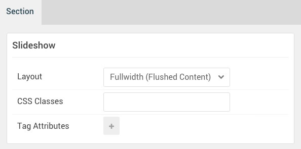

## Introduction

The **Slideshow** section includes one widget position, **Slideshow**. In that widget position we placed a **Gantry 5 Particle** widget with the **FlexSlider** particle assigned.

Here is a breakdown of the widget(s) and particle(s) that appear in this section:

* [Widget Position (Slideshow)](#widget-position-(slideshow))
	* [FlexSlider (particle)](#flexslider-(particle))

## Section Settings

| Option           | Setting                   |
| :--------------- | :----------               |
| Layout           | Fullwidth (Boxed Content) |
| CSS Classes      | Blank                     |
| Tag Attributes   | Blank                     |

## Widget Position (Slideshow)

### Particle Settings

| Option        | Setting     |
| :-----        | :-----      |
| Particle Name | `Slideshow` |
| Key           | `slideshow` |
| Chrome        | `gantry`    |

### Block Settings

| Option         | Setting   |
| :-----         | :-----    |
| CSS ID         | Blank     |
| CSS Classes    | Blank     |
| Variations     | Blank     |
| Tag Attributes | Blank     |
| Fixed Size     | Unchecked |
| Block Size     | `100%`    |

### Assigned Particle(s)

Using the **Gantry 5 Particle** widget, we assigned a **FlexSlider** particle to this position. You will find the settings used in this particle, below.

#### FlexSlider (Particle)

##### Particle Settings

| Option                                 | Setting                                            |
| :-----                                 | :-----                                             |
| Particle Name                          | `FlexSlider`                                       |
| CSS Classes                            | `fp-slideshow-demo`                                |
| Title                                  | Blank                                              |
| Layout                                 | `Slideshow`                                        |
| Thumbnail Width                        | `150`                                              |
| Autoplay                               | `Enable`                                           |
| Autoplay Speed                         | `5000`                                             |
| Pause on Hover                         | `Enable`                                           |
| RTL Mode                               | `Disable`                                          |
| FlexSlider Item 1 Name                 | `Design & Code`                                    |
| FlexSlider Item 1 Background Image     | Custom                                             |
| FlexSlider Item 1 Overlay Image        | Custom                                             |
| FlexSlider Item 1 Overlay Parallax     | Enabled                                            |
| FlexSlider Item 1 Parallax Ratio       | `0.3`                                              |
| FlexSlider Item 1 Title                | `Design & Code`   |
| FlexSlider Item 1 Description          | `An elegant, interactive and animated experience.` |
| FlexSlider Item 1 Testimonial Image    | Blank                                              |
| FlexSlider Item 1 Testimonial Name     | Blank                                              |
| FlexSlider Item 1 Testimonial Position | Blank                                              |
| FlexSlider Item 1 Link                 | `#`                                                |
| FlexSlider Item 1 Link Text            | `View More`                                        |
| FlexSlider Item 1 Target               | Self                                               |
| FlexSlider Item 1 Button Class         | `button-3`                                         |
