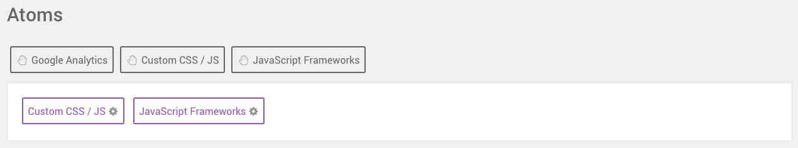
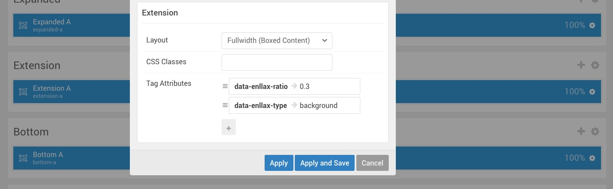

Is Isotope compatible for WordPress 1.5 or 2.5?
-----

No, Isotope is only compatible with WordPress 3.4+.

What is RokSprocket?
-----

[RokSprocket][roksprocket] is a powerful content display plugin for WordPress 2.5 and above. It was designed as the successor to our legacy content plugins: RokStories, RokTabs, RokNewsPager, RokNewsflash, RokMicronews, and basically any widget in the RT arsenal that manipulates and displays posts.

What is Gantry?
-----

[Gantry][gantry] is, as a basic definition, a framework used for assembling, building and maintaining a RocketTheme theme. It is an advanced platform for dramatically extending the capabilities of the entire theming system of WordPress.

Can I install RocketLauncher onto an existing WordPress! website?
-----

No. RocketLauncher will install both WordPress and the demo sample content and images, so you will need a fresh WordPress! installation.

I installed Isotope RocketLauncher but the images are different with the demo site.
-----

To avoid image license copyright issues, all sample content images shown in our demo site will be replaced with blank versions in the RocketLauncher version.

## Changes I make to the slider images in the FlexSlider particle aren't appearing on the front end. What's going on?

This is a very simple fix caused by a conflict between your style settings and the `demo.css` file which is loaded through the **Custom CSS/JS** atom found in the **Page Settings** tab within the Gantry 5 Administrator. This demo file is intended to make the RocketLauncher match the demo as much as possible, giving it its unique styling. However, removing this file enables you to replace these elements.

Simply navigate to this tab, scroll down to the **Atoms** section, and select the **Custom CSS / JS** atom. From here, you can locate and remove the **Demo CSS** item. Once this is done, save your page settings and refresh. Your changes should now appear on the front end.

## How can I adjust parallax settings?

There are two opportunities for you to adjust parallax settings. The **FlexSlider** particle has parallax built in, allowing you to see a virtual depth effect as you scroll past the particle. Additionally, sections with background images such as **Header** and **Extension** can have this effect applied via the section's **Tag Attributes**.

To adjust the parallax settings in the **FlexSlider** particle, simply access the particle's settings and adjust the **Parallax Ratio**. A ratio of `0.3` is standard and typically set as default, however you can increase or decrease the effect by changing the number to any one between 0 and 1.0.

Adjusting the parallax effect in a section is also pretty straightforward. To do so, access the section's settings and create tag attributes `data-enllax-ratio` and `data-enllax-type`. The ratio can be assigned a numeric value just as the FlexSlider's can. The type, however, should be `background` as the background is what the effect is applied to.

[gantry]: http://gantry.org/
[forum]: http://www.rockettheme.com/forum/wordpress-theme-isotope
[roksprocket]: http://www.rockettheme.com/wordpress/plugins/roksprocket