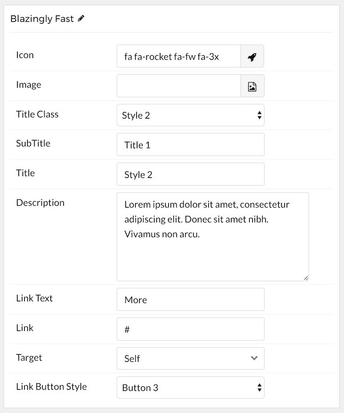

## Introduction

The **Grid Content** particle enables you quickly and easily add one or more simple blocks of content to your page.

Here are the topics covered in this guide:

* [Configuration](#configuration)
    - [Main Options](#main-options)
    - [Item Options](#item-options)

## Configuration

### Main Options 

These options affect the main area of the particle, and not the individual items within.

| Option         | Description                                                                                 |
| :-----         | :-----                                                                                      |
| Particle Name  | Enter the name you would like to assign to the particle. This only appears in the back end. |
| CSS Classes    | Enter the CSS class(es) you want to use in the content of the particle.                     |
| Title          | Enter a title for the particle.                                                             |
| Description    | Enter a short description to appear in the particle.                                        |
| Readmore Text  | Enter text to appear as the readmore link.                                                  |
| Readmore Link  | Enter a link you would like the readmore text to link to.                                   |
| Readmore Style | Choose between **Button 2**, **Button 3**, and **Button 4** button styles for the readmore. |
| Grid Column    | Select the number of columns you want to have displayed.                                    |

### Item Options

These items make up the individual featured items in the particle.

| Option            | Description                                                                             |
| :-----            | :-----                                                                                  |
| Item Name         | Enter the name you would like to assign to the item. This only appears in the back end. |
| Icon              | Select an icon you want to appear in the item.                                          |
| Image             | Select the image.                                                                       |
| Title Class       | Select a Title class from the four available presets.                                   |
| Subtitle          | Enter a subtitle.                                                                       |
| Title             | Enter a title.                                                                          |
| Description       | Enter a text description you want displayed with the item.                              |
| Link Text         | Enter text that will become the link for the item.                                      |
| Link              | Enter a link you want the item to go to.                                                |
| Target            | Select between **Self** and **New Window** as the link's target.                        |
| Link Button Style | Choose between four preset link button styles.                                          |

