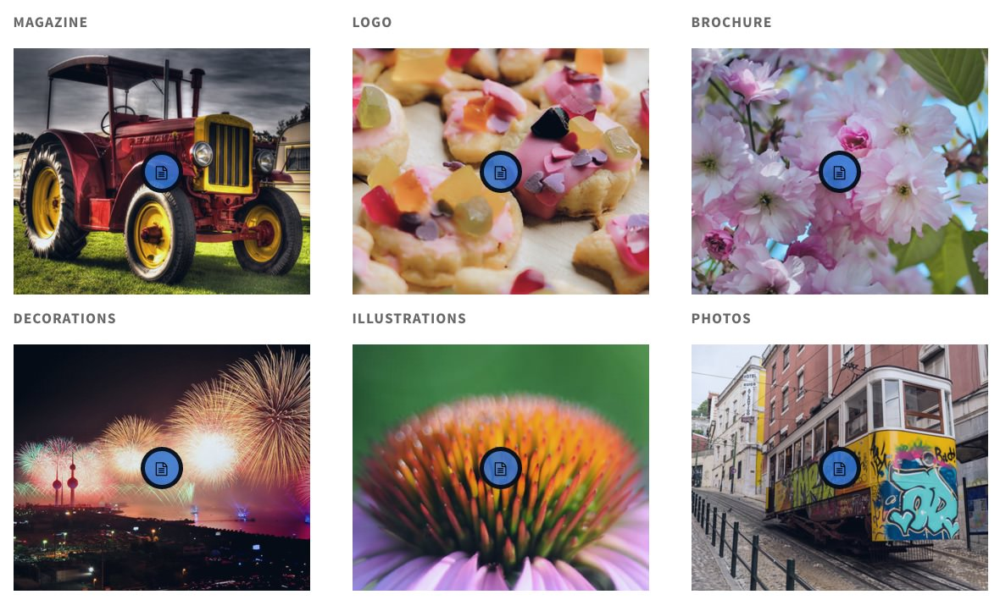

## Introduction

The **Portfolio** example page demonstrates how you can create a beautiful page with the Isotope theme. Here is some information to help you replicate this page as it appears in the demo.

## Widgets and Particles

Below is a brief rundown of the widgets and particles used to make up the demo page.

:   1. **Showcase - Custom HTML (Particle)** [3%, 45%, se]
    2. **Mainbar - Page Content** [10%, 20%, se]
    3. **Feature - Custom HTML (Particle)** [28%, 20%, se]
    4. **Extension - Custom HTML (Particle)** [58%, 20%, se]
    5. **Bottom - Custom HTML (Particle)** [76%, 35%, se]
    6. **Footer - Custom HTML (Particle)** [85%, 20%, se]
    7. **Footer - Custom HTML (Particle)** [85%, 45%, se]
    8. **Footer - Custom HTML (Particle)** [85%, 70%, se]

1. [Showcase](#showcase-section)
2. [Feature](#feature-section)
3. [Mainbar](#mainbar-section)
4. [Extension](#extension-section)
5. [Bottom](#bottom-section)
6. [Footer](#footer-section)

## Showcase Section

This area of the page is a **Custom HTML** particle. You will find the settings used in our demo below.

### Custom HTML (Particle)

### Particle Settings

| Field              | Setting       |
| :-----             | :-----        |
| Particle Name      | `Custom HTML` |
| Process Shortcodes | Unchecked     |

### Custom HTML

~~~ .html

  <h2 class="g-layercontent-title">Portfolio</h2>
  
What We Have Already Done

~~~

### Block Settings

| Option         | Setting          |
| :----------    | :----------      |
| CSS ID         | Blank            |
| CSS Classes    | `flush` `center` |
| Variations     | Blank            |
| Tag Attributes | Blank            |
| Fixed Size     | Unchecked        |
| Block Size     | `100%`           |

## Feature Section

This area of the page is a **Custom HTML** particle. You will find the settings used in our demo below.

### Custom HTML (Particle)

### Particle Settings

| Field              | Setting       |
| :-----             | :-----        |
| Particle Name      | `Custom HTML` |
| Process Shortcodes | Unchecked     |

### Custom HTML

~~~ .html

  

    

      

        

          

            
On Going

          

          

            

              <h3 class="g-contentlist-headline">Isotope Premium Project</h3>
              <h5 class="g-contentlist-subtitle">Website Redesign and Publishing</h5>
              
Collaboratively administrate empowered markets via plug-and-play networks. Dynamically procrastinate B2C users after installed base benefits. Dramatically visualize customer directed convergence without revolutionary ROI.

              <a class="button button-2" href="#">Check Project</a>             
            

          

        

        

          

            

              

                

                  <a href="#">
                  
                  Mr. Great Client
                  </a>
                

                

                  <a href="#">
                  
                  Graphic
                  </a>
                

                

                  <a href="#">
                  
                  01/01/2086
                  </a>
                

                

                  <a href="#">
                  
                  HTML/CSS
                  </a>
                

                

                  <a href="#">
                  
                  design, cover, logo
                  </a>
                

                

                  <a href="#">
                  
                  Gantry
                  </a>
                

              

            

          

        

      

    

  

  

    

      <h2 class="g-title">Responsive Layout</h2>
      

      
Collaboratively administrate empowered markets via plug-and-play networks. Dynamically procrastinate B2C users after installed base benefits.

    

  

~~~

### Block Settings

| Option         | Setting     |
| :----------    | :---------- |
| CSS ID         | Blank       |
| CSS Classes    | Blank       |
| Variations     | Blank       |
| Tag Attributes | Blank       |
| Fixed Size     | Unchecked   |
| Block Size     | `100%`      |

## Mainbar Section

The **Mainbar** section includes the **Portfolio** article, displayed through the **Page Content** particle. Here are the settings found in the **Portfolio** article.

| Option   | Setting        |
| :-----   | :-----         |
| Title    | `Portfolio`     |
| Alias    | `portfolio`     |
| Status   | Published      |
| Featured | No             |
| Category | `Sample Pages` |

**Content Body**

~~~ .html

  

    

      <h2 class="g-title">Magazine</h2>
      

        <figure class="g-promoimage-effect">
          
          
          

            
Magazine

            

            

            
Short project description here

          

        </figure>
      

    

  

  

    

      <h2 class="g-title">Logo</h2>
      

        <figure class="g-promoimage-effect">
          
          
          

            
Logo

            

            

            
Short project description here

          

        </figure>
      

    

  

  

    

      <h2 class="g-title">Brochure</h2>
      

        <figure class="g-promoimage-effect">
          
          
          

            
Brochure

            

            

            
Short project description here

          

        </figure>
      

    

  

  

    

      <h2 class="g-title">Decorations</h2>
      

        <figure class="g-promoimage-effect">
          
          
          

            
Decorations

            

            

            
Short project description here

          

        </figure>
      

    

  

  

    

      <h2 class="g-title">Illustrations</h2>
      

        <figure class="g-promoimage-effect">
          
          
          

            
Illustrations

            

            

            
Short project description here

          

        </figure>
      

    

  

  

    

      <h2 class="g-title">Photos</h2>
      

        <figure class="g-promoimage-effect">
          
          
          

            
Photos

            

            

            
Short project description here

          

        </figure>
      

    

  

~~~

## Extension Section

This area of the page is a **Custom HTML** particle. You will find the settings used in our demo below.

### Custom HTML (Particle)

### Particle Settings

| Field              | Setting       |
| :-----             | :-----        |
| Particle Name      | `Custom HTML` |
| Process Shortcodes | Unchecked     |

### Custom HTML

~~~ .html

  

    

      <h2 class="g-title">Upcoming Projects</h2>
      

        

          

            
<a href="#">404 Pages</a>

            
Collaboratively administrate empowered markets via plug-and-play networks

          

        

        

          

            
<a href="#">Badges</a>

            
Collaboratively administrate empowered markets via plug-and-play networks

          

        

        

          

            
<a href="#">Stickers</a>

            
Collaboratively administrate empowered markets via plug-and-play networks

          

        

      

    

  

  

    

      <h2 class="g-title">&nbsp;More Upcoming Projects</h2>
      

        

          

            
<a href="#">Banners</a>

            
Collaboratively administrate empowered markets via plug-and-play networks

          

        

        

          

            
<a href="#">Sliders</a>

            
Collaboratively administrate empowered markets via plug-and-play networks

          

        

        

          

            
<a href="Tables">New item</a>

            
Collaboratively administrate empowered markets via plug-and-play networks

          

        

      

    

  

  

    

      <h2 class="g-title">&nbsp;More Upcoming Projects</h2>
      

        

          

            
<a href="#">Forms</a>

            
Collaboratively administrate empowered markets via plug-and-play networks

          

        

        

          

            
<a href="#">Newsletter</a>

            
Collaboratively administrate empowered markets via plug-and-play networks

          

        

        

          

            
<a href="#">Interfaces</a>

            
Collaboratively administrate empowered markets via plug-and-play networks

          

        

      

    

  

~~~

### Block Settings

| Option         | Setting     |
| :----------    | :---------- |
| CSS ID         | Blank       |
| CSS Classes    | Blank       |
| Variations     | Blank       |
| Tag Attributes | Blank       |
| Fixed Size     | Unchecked   |
| Block Size     | `100%`      |

## Bottom Section

This area of the page is a **Custom HTML** particle. You will find the settings used in our demo below.

### Custom HTML (Particle)

### Particle Settings

| Field              | Setting       |
| :-----             | :-----        |
| Particle Name      | `Custom HTML` |
| Process Shortcodes | Unchecked     |

### Custom HTML

~~~ .html

  <h2 class="g-layercontent-title">100% Satisfaction Guaranteed</h2>
  
Will You be the Next to Join Our Happy Clients?

  <a href="http://www.rockettheme.com/wordpress/themes/isotope" class="button button-2">Join Now</a>

~~~

### Block Settings

| Option         | Setting          |
| :----------    | :----------      |
| CSS ID         | Blank            |
| CSS Classes    | `flush` `center` |
| Variations     | Blank            |
| Tag Attributes | Blank            |
| Fixed Size     | Unchecked        |
| Block Size     | `100%`           |

## Footer Section

:   1. **Logo (Particle)** [20%, 2%, se]
    2. **Horizontal Menu (Particle)** [20%, 35%, se]
    3. **Social (Particle)** [20%, 67%, se]

This area of the page is made up of three particles.

### Logo (Particle)

### Particle Settings

| Field         | Setting               |
| :-----        | :-----                |
| Particle Name | `Logo`                |
| URL           | Blank                 |
| Rel           | Blank                 |
| Image         | Custom                |
| Alt           | `Isotope`              |
| Text          | `Isotope`              |
| CSS Classes   | `g-loto` `g-logo-alt` |

### Block Settings

| Option         | Setting     |
| :----------    | :---------- |
| CSS ID         | Blank       |
| CSS Classes    | Blank       |
| Variations     | Blank       |
| Tag Attributes | Blank       |
| Fixed Size     | Unchecked   |
| Block Size     | `25%`       |

### Horizontal Menu (Particle)

### Particle Settings

| Field            | Setting               |
| :-----           | :-----                |
| Particle Name    | `Horizontal Menu`     |
| CSS Classes      | Blank                 |
| Target           | New Window            |
| Menu Item 1 Name | `Gantry`              |
| Menu Item 1 Text | `Gantry`              |
| Menu ITem 1 Link | `http://gantry.org`   |

### Block Settings

| Option         | Setting                  |
| :----------    | :----------              |
| CSS ID         | Blank                    |
| CSS Classes    | `g-horizontalmenu-block` |
| Variations     | Center                   |
| Tag Attributes | Blank                    |
| Fixed Size     | Unchecked                |
| Block Size     | `50%`                    |

### Social (Particle)

### Particle Settings

| Field                | Setting                               |
| :-----               | :-----                                |
| Particle Name        | `Social`                              |
| CSS Classes          | `social`                              |
| Title                | Blank                                 |
| Social Item 1 Name   | `Facebook`                            |
| Social Item 1 Text   | Blank                                 |
| Social Item 1 Link   | `http://www.facebook.com/RocketTheme` |
| Social Item 1 Target | New Window                            |

### Block Settings

| Option         | Setting     |
| :----------    | :---------- |
| CSS ID         | Blank       |
| CSS Classes    | Blank       |
| Variations     | Blank       |
| Tag Attributes | Blank       |
| Fixed Size     | Unchecked   |
| Block Size     | `25%`       |