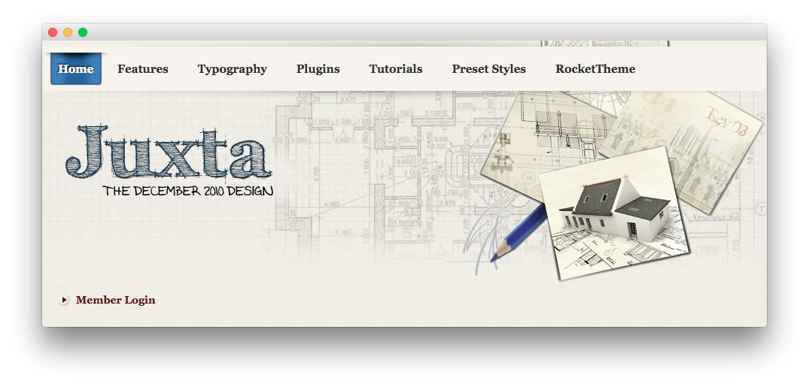
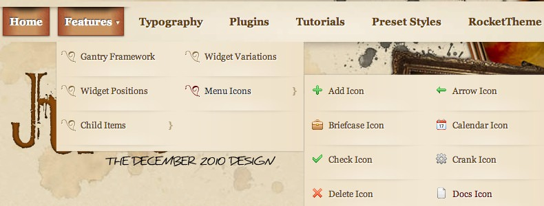

Introduction
------------

Juxta is a design-centric theme, focusing on unique, professional visuals to constitute the fundamental appearance. Style is very important with any theme, and Juxta intends to entice any visitor of your site. A unique selection of content styles are also configurable.

Requirements
------------

* Gantry 4 Framework
* FF, Safari, Chrome, Opera, IE8+
* PHP 5.4+
* WordPress 3.2+, 4.0+

> > NOTE: An updated version of RokCommon is required for Juxta to work properly. For more details on the Gantry Framework, please visit its [Dedicated Website](http://www.gantry.org/).

Key Features
------------

* 960 Fixed Layout
* 6 Preset Styles
* 68 Widget Positions
* 16 Widget Variations
* Fusion-Menu and Split-Menu
* Custom Typography
* iPhone Theme
* iPhone Menu
* Background Level Configuration

### Detail Levels

With each preset, Juxta offers three different detailing levels, for both the background and mainbody styling: High, Medium and Low. This allows you to radically affect the style of the theme to better match your intended purpose, such as low for a conservative site.

### Fusion Menu

The Fusion Menu is effectively an advanced, CSS based menu system, which offers a wide range of per menu options, such as: inline subtext and icons as well as control over how menu items are distributed between columns.
