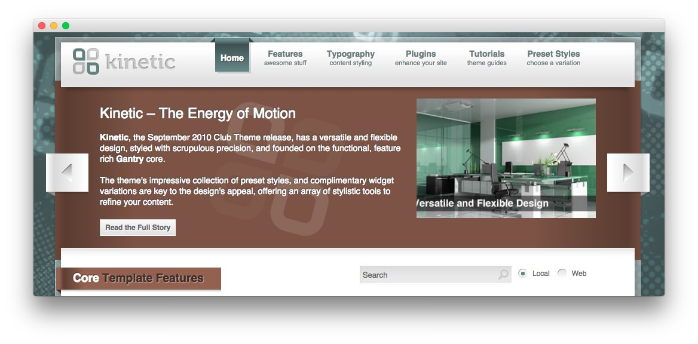
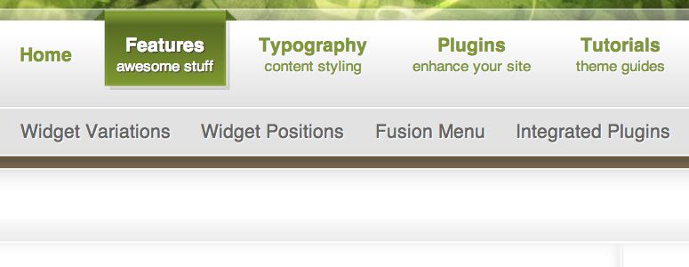

Introduction
------------

Kinetic has a versatile and flexible design, styled with scrupulous precision. The theme's impressive collection of preset styles, and complementary widget variations are key to the design's appeal, offering an array of stylistic tools to refine your content.

Requirements
------------

* Gantry 4 Framework
* FF, Safari, Chrome, Opera, IE8+
* PHP 5.2.17+ (5.3+ recommended)
* WordPress 3.2+, 4.0+

> > NOTE: An updated version of RokCommon is required for Kinetic to work properly. For more details on the Gantry Framework, please visit its [Dedicated Website](http://www.gantry.org/).

Key Features
------------

* 960 Fixed Layout
* 8 Preset Styles
* 60 Widget Positions
* 20 Widget Variations
* Fusion-Menu and Split-Menu
* Custom Typography
* iPhone Theme
* iPhone Menu
* Background Level Configuration

### Fusion/SplitMenu

There are two menu options, SplitMenu and Fusion Menu. The Splitmenu is a static menu system that displays select menu items in a main horizontal menu. The Fusion Menu is an advanced, CSS based menu system, which offers a wide range of per menu options.
