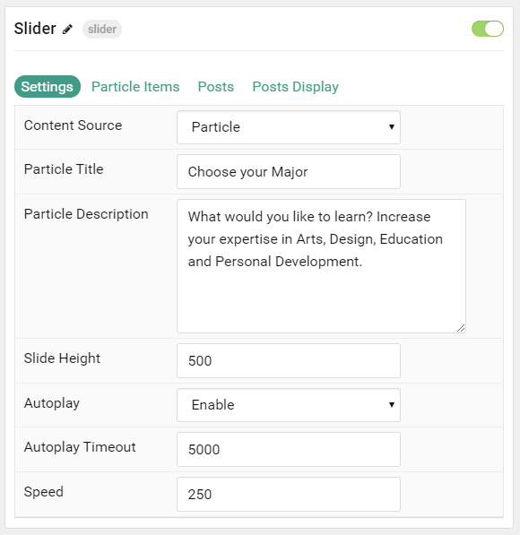
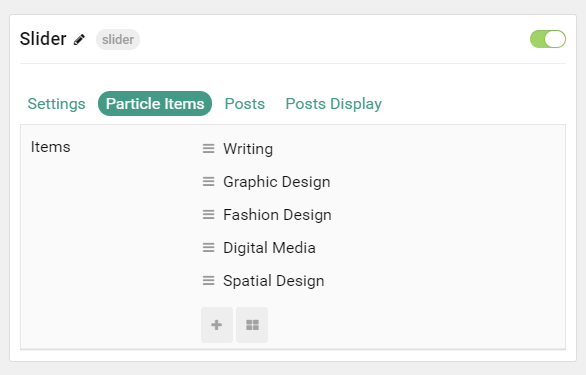
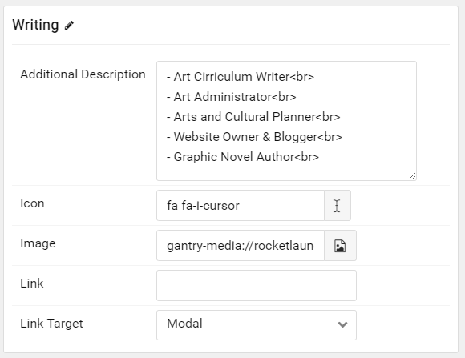
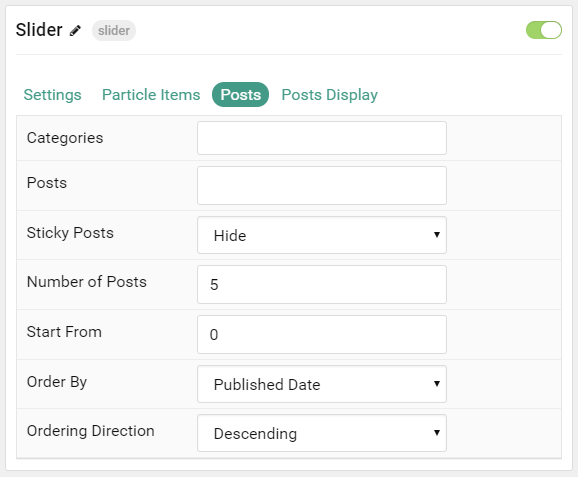
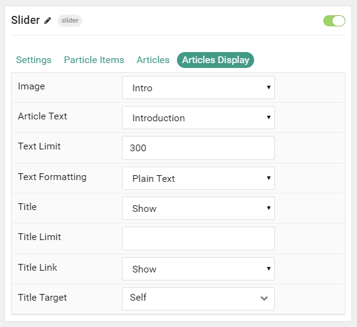

## Introduction

The **Slider** particle is a great way to display images in your website.

Here are the topics covered in this guide:

* [Configuration](#configuration)
    - [Main Options](#settings)
    - [Item Options](#particle-item-options)
    - [Posts](#posts)
    - [Display](#display)

## Configuration

### Settings 

These options affect the main area of the particle, and not the individual items within.

| Option               | Description                                                                                         |
| :-----               | :-----                                                                                              |
| Particle Name        | This is the name of the particle used for back end management. It does not appear on the front end. |
| Content Source       | Choose between **Particle** and **WordPress** as the Content Source.                                   |
| Particle Title       | Enter a text title you wish to have display on the front end.                                       |
| Particle Description | Enter a text description for the particle.                                                          |
| Slide Height         | Enter the height (in pixels) for the slider. Example: `500`                                         |
| Autoplay             | **Enable** or **Disable** autoplay.                                                                 |
| Autoplay Timeout     | Set the timeout (in milliseconds) for the autoplay. Example: `5000`.                                |
| Speed                | Set the speed of the transitions. This is also in milliseconds. Example: `250`                      |

### Particle Item Options

These items make up the individual featured items in the particle. Items in this section will only appear if **Particle** is selected as the **Content Source**.

| Option                 | Description                                                  |
| :-----                 | :-----                                                       |
| Item Name              | This is the name of the item. This appears on the front end. |
| Additional Description | Add an additional description for the item.                  |
| Icon                   | Select a Font Awesome icon for the item.                     |
| Image                  | Set the background image for the slide.                      |
| Link                   | Enter a URL you would like the item to link to.              |
| Target                 | Choose the target tab you would like the URL to open to.     |

### Posts

| Option             | Description                                                                            |
| :-----             | :-----                                                                                 |
| Categories         | Select the categories of posts this particle will display.                             |
| Posts              | Select the number of posts you would like the particle to fetch.                       |
| Sticky Posts       | Choose to **Show** or **Hide** sticky posts.                                           |
| Number of Posts    | Enter the maximum number of posts to display.                                          |
| Start From         | Enter offset specifying the first post to return. The default is '0' (the first post). |
| Order By           | Choose the type of factor to order by.                                                 |
| Ordering Direction | Choose between **Ascending** and **Descending** as the post ordering method.           |

### Display

This section configures how posts are displayed.

| Option             | Description                                                               |
| :-----             | :-----                                                                    |
| Image              | Display the image assigned to the post's **Intro**, **Full** or **None**. |
| Content Type       | Choose to show **Content**, **Exerpt**, or to **Hide** content text.      |
| Content Limit      | Enter the number of characters you wish to limit the text displayed to.   |
| Content Formatting | Choose between plain text and HTML.                                       |
| Title              | **Show** or **Hide** the post's title.                                    |
| Title Limit        | Enter the maximum number of characters in the title to display.           |
| Link               | **Show** or **Hide** the link.                                            |
| Link Target        | Choose whether to have the link open in a new tab or the same tab.        |