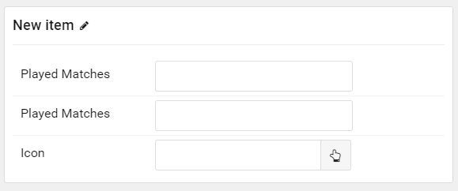

## Introduction

The **Table Tabs** particle is used to quickly create a score table.

Here are the topics covered in this guide:

* [Configuration](#configuration)
    - [Main Options](#main-options)
    - [Item Options](#item-options)

## Configuration

### Main Options 

These options affect the main area of the particle, and not the individual items within.

| Option              | Description                                                                                 |
| :-----              | :-----                                                                                      |
| Particle Name       | Enter the name you would like to assign to the particle. This only appears in the back end. |
| Button Text         | Enter text to appear in the button.                                                         |
| Button Link         | Enter a URL that the button will link to.                                                   |
| Order Label         | Enter a character or word to appear over the order column.                                  |
| Team Name Field     | Enter a label for the Team Name field.                                                      |
| Team Played Matches | Enter a label for the Team Played Matches field.                                            |
| Team Points         | Enter a label for the Team Points field.                                                    |

### Item Options

These items make up the individual featured items in the particle.

This table works as a multi-teared list. Your first level splits the table into tabs, while the second level contains individual teams.

| Option         | Description                                                                                                                          |
| :-----         | :-----                                                                                                                               |
| Item Name      | The name of the item becomes the name displayed in the particle.                                                                     |
| Played Matches | Set a number of played matches for the team.                                                                                         |
| Played Matches | Set a number of points accumulated by the team.                                                                                      |
| Icon           | Select an icon to be displayed next to the team. `fa fa-chevron-up` for a green **up**. Also `fa fa-chevron-down` and `fa fa-minus`. |
