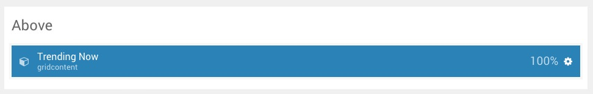
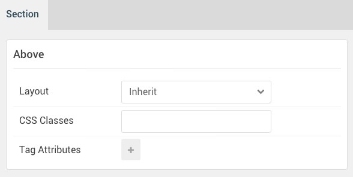

## Introduction

The **Above** section is home to a single **Grid Content** particle.

Here is a breakdown of the widget(s) and particle(s) that appear in this section:

* [Grid Content (particle)](#grid-content-(particle))

## Section Settings

| Option           | Setting     |
| :--------------- | :---------- |
| Layout           | Inherit     |
| CSS Classes      | Blank       |
| Tag Attributes   | Blank       |

## Grid Content (Particle)

### Particle Settings

| Option                          | Setting                           |
| :------------------------------ | :-------------------------------- |
| CSS Classes                     | Blank                             |
| Title                           | `Trending Now`                    |
| Description                     | Blank                             |
| Readmore Text                   | Blank                             |
| Readmore Link                   | Blank                             |
| Readmore Style                  | Button 3                          |
| Grid Column                     | 2 Columns                         |
| Grid Item 1 Name                | `Stylistic`                       |
| Grid Item 1 Icon                | Blank                             |
| Grid Item 1 Image               | Blank                             |
| Grid Item 1 Title Class         | Style 1                           |
| Grid Item 1 SubTitle            | `Stylistic`                       |
| Grid Item 1 Title               | `Exclusive Design with Fashion`   |
| Grid Item 1 Description         | Blank                             |
| Grid Item 1 Link Text           | `Read Story`                      |
| Grid Item 1 Link                | `#`                               |
| Grid Item 1 Link Button Style   | Button 4                          |

## Block Settings

| Option           | Setting      |
| :--------------- | :----------- |
| CSS ID           | Blank        |
| CSS Classes      | Blank        |
| Variations       | Title Promo  |
| Tag Attributes   | Blank        |
| Block Size       | `100%`       |
