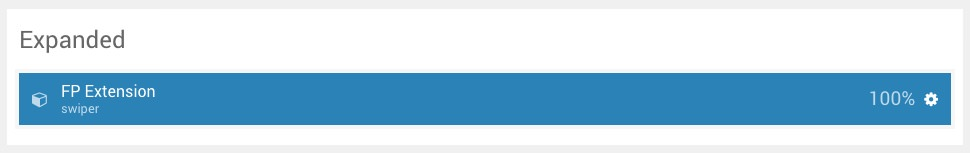
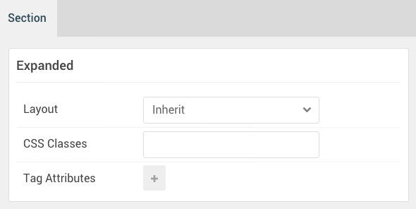
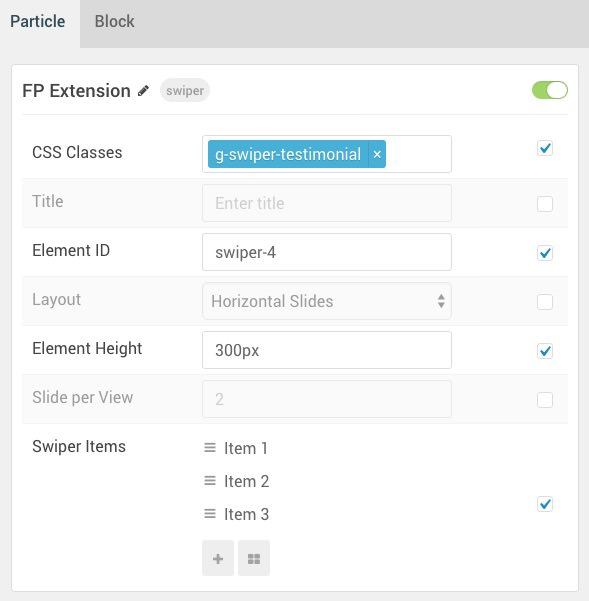
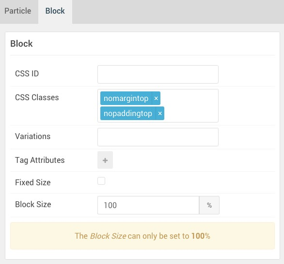

## Introduction

The **Extension** section includes a single **Swiper** particle.

Here is a breakdown of the widget(s) and particle(s) that appear in the front end for this section:

* [Swiper (particle)](#swiper-(particle))

## Section Settings

| Option         | Setting   |
|:---------------|:----------|
| Layout         | Fullwidth |
| CSS Classes    | Blank     |
| Tag Attributes | Blank     |

## Swiper (Particle)

#### Particle Settings

| Option                      | Setting                                                 |
| :-------------------------- | :------------------------------------------------------ |
| Particle Name               | `FP Extension`                                          |
| CSS Classes                 | `g-swiper-testimonial`                                  |
| Title                       | Blank                                                   |
| Element ID                  | `swiper-4`                                              |
| Layout                      | Horizontal Slides                                       |
| Element Height              | 300px                                                   |
| Slide per View              | `2`                                                     |
| Swiper Item 1 Name          | `Item 01`                                               |
| Swiper Item 1 Image         | Blank                                                   |
| Swiper Item 1 SubTitle      | Blank                                                   |
| Swiper Item 1 Title         | `Kraken is worth its weight in gold, just fantastic!`   |
| Swiper Item 1 Link          | Blank                                                   |
| Swiper Item 1 Link Text     | Blank                                                   |
| Swiper Item 1 Description   | `- Alex Simon, Think Kraken Co.`                        |

#### Block Settings

| Option           | Setting                      |
| :--------------- | :-----------                 |
| CSS ID           | Blank                        |
| CSS Classes      | `nomargintop` `nopaddingtop` |
| Variations       | Blank                        |
| Tag Attributes   | Blank                        |
| Block Size       | `100%`                       |

