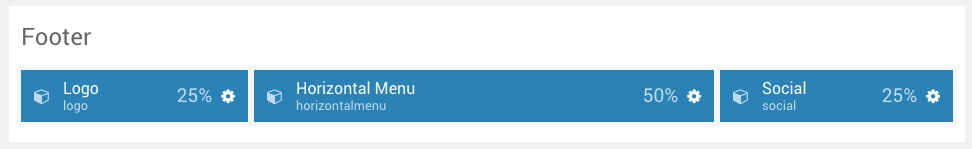
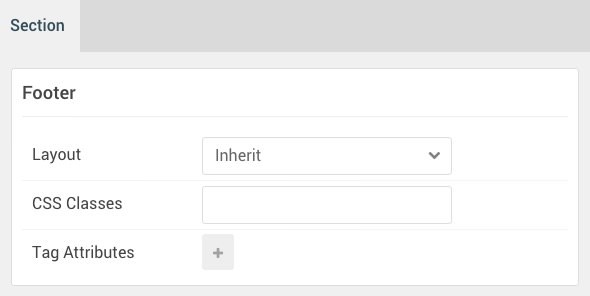

## Introduction

The **Footer** sections include three widget positions, `footer-a`, `footer-b`, and `footer-c`. These widget positions are created using the Layout Manager. There are also three particles present, detailed below.

Here is a breakdown of the widget(s) and particle(s) that appear on the front end from this section:

* [Logo (particle)](#logo-(particle))
* [Horizontal Menu (particle)](#horizontal-menu-(particle))
* [Social (particle)](#social-(particle))

## Section Settings

| Option           | Setting     |
| :--------------- | :---------- |
| Layout           | Inherit     |
| CSS Classes      | Blank       |
| Tag Attributes   | Blank       |

## Logo (particle)

### Particle Settings

| Option          | Setting               |
| :-------------- | :---------            |
| Particle Name   | `Logo`                |
| URL             | Blank                 |
| Rel             | Blank                 |
| Image           | Custom                |
| Alt             | `Kraken`              |
| Text            | `Kraken`              |
| CSS Classes     | `g-logo` `g-logo-alt` |

### Block Settings

| Option         | Setting   |
|:---------------|:----------|
| CSS ID         | Blank     |
| CSS Classes    | Blank     |
| Variations     | Blank     |
| Tag Attributes | Blank     |
| Fixed Size     | Unchecked |
| Block Size     | `25%`     |

## Horizontal Menu (Particle)

### Particle Settings

| Option             | Setting                  |
|:-------------------|:-------------------------|
| Particle Name      | `Horizontal Menu`        |
| CSS Classes        | Blank                    |
| Target Window      | New Window               |
| Social Item 1 Name | `Gantry`                 |
| Menu Item 1 Text   | `Gantry`                 |
| Menu Item 1 Link   | `http://www.gantry.org/` |

### Block Settings

| Option         | Setting                  |
|:---------------|:-------------------------|
| CSS ID         | Blank                    |
| CSS Classes    | `g-horizontalmenu-block` |
| Variations     | Center                   |
| Tag Attributes | Blank                    |
| Fixed Size     | Unchecked                |
| Block Size     | `50%`                    |

## Social (particle)

#### Particle Settings

| Option               | Setting                               |
|:---------------------|:--------------------------------------|
| Particle Name        | `Social`                              |
| CSS Classes          | `social`                              |
| Title                | Blank                                 |
| Social Item 1 Name   | `Facebook`                            |
| Social Item 1 Icon   | `fa fa-facebook fa-fw`                |
| Social Item 1 Text   | Blank                                 |
| Social Item 1 Link   | `http://www.facebook.com/RocketTheme` |
| Social Item 1 Target | New Window                            |

#### Block Settings

| Option         | Setting   |
|:---------------|:----------|
| CSS ID         | Blank     |
| CSS Classes    | `social`  |
| Variations     | Center    |
| Tag Attributes | Blank     |
| Fixed Size     | Unchecked |
| Block Size     | `25%`     |
