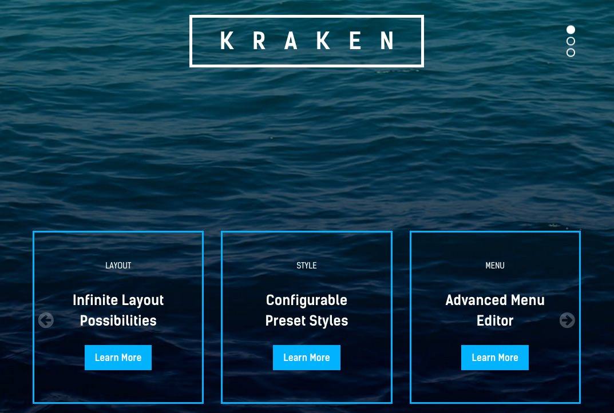
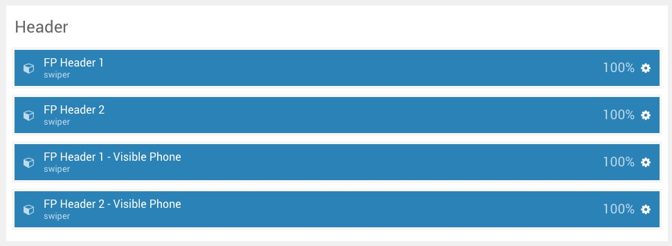
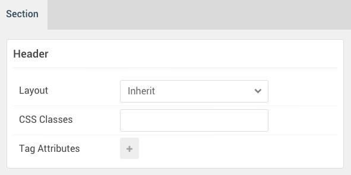

## Introduction

:   1. **Swiper (Particle)** [10%, 20%, se]
    2. **Swiper (Particle)** [60%, 5%, se]

The **Header** section includes four **Swiper** particles. The two particles at the bottom two rows mimic the particles above them, but are designed for mobile users. This quality is set in the Block settings for the particle, with the particles intended for non-phone devices being given a `hidden-phone` CSS class and the ones made for phones a `visible-phone` CSS class.

So, what makes the mobile versions different? For the first Swiper particle, the **Element Height** is set to `600px` for non-mobile and `300px` for mobile. The second Swiper particle has `3` in the **Slide Per View** field while the mobile version only has `1`.

Here is a breakdown of the widget(s) and particle(s) that appear in this section:

* [Swiper (particle)](#swiper-(particle))
* [Swiper (Particle)](#swiper-(particle)-2)

## Section Settings

| Option           | Setting     |
| :--------------- | :---------- |
| Layout           | Inherit     |
| CSS Classes      | Blank       |
| Tag Attributes   | Blank       |

## Swiper (Particle) 

### Particle Settings

| Option                      | Setting                   |
| :-------------------------- | :------------------------ |
| Particle Name               | `Swiper`                  |
| CSS Classes                 | Blank                     |
| Title                       | Blank                     |
| Element ID                  | `swiper-1`                |
| Layout                      | Vertical Sides            |
| Element Height              | `600px`                   |
| Slide Per View              | 2                         |
| Swiper Item 1 Name          | `Kraken`                  |
| Swiper Item 1 Image         | Blank                     |
| Swiper Item 1 Subtitle      | Blank                     |
| Swiper Item 1 Title         | `Kraken`                  |
| Swiper Item 1 Link          | Blank                     |
| Swiper Item 1 Link Text     | Blank                     |
| Swiper Item 1 Description   | Blank                     |

### Block Settings

| Option           | Setting        |
| :--------------- | :-----------   |
| CSS ID           | Blank          |
| CSS Classes      | `hidden-phone` |
| Variations       | Center         |
| Tag Attributes   | Blank          |
| Block Size       | `100%`         |

## Swiper (Particle) 2

### Particle Settings

| Option                      | Setting                                         |
| :-------------------------- | :------------------------                       |
| Particle Name               | `Swiper`                                        |
| CSS Classes                 | Blank                                           |
| Title                       | Blank                                           |
| Element ID                  | `swiper-2`                                      |
| Layout                      | Carousel                                        |
| Element Height              | `200px`                                         |
| Slide Per View              | 3                                               |
| Swiper Item 1 Name          | `Item 1`                                        |
| Swiper Item 1 Image         | Blank                                           |
| Swiper Item 1 Subtitle      | `Layout`                                        |
| Swiper Item 1 Title         | `Infinite Layout Possibilities`                 |
| Swiper Item 1 Link          | `#`                                             |
| Swiper Item 1 Link Text     | `Learn More` |
| Swiper Item 1 Description   | Blank                                           |

### Block Settings

| Option           | Setting        |
| :--------------- | :-----------   |
| CSS ID           | Blank          |
| CSS Classes      | `hidden-phone` |
| Variations       | Blank          |
| Tag Attributes   | Blank          |
| Block Size       | `100%`         |

