## Introduction

The **Mainbar** section includes three widget positions, `mainbar-a`, `mainbar-b`, and `mainbar-c`. In a second row, the **Pagecontent** position has been added, inserting any post content that is assigned to the page. We are only using `mainbar-a` from this section actively, so only it is rendering to the front end.

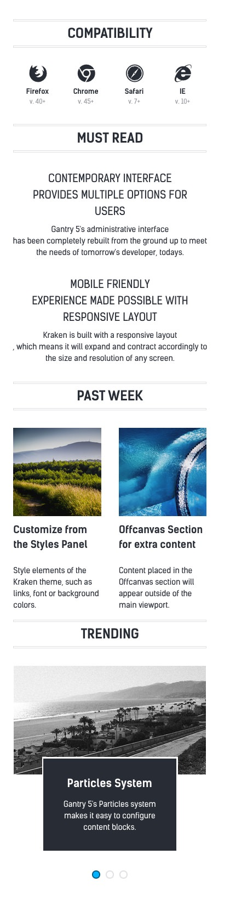

: 1. **Icon Menu (Particle)** [3%, 8%, se]
  2. **Grid Content (Particle)** [15%, 8%, se]
  3. **Block Content (Particle)** [44%, 8%, se]
  4. **Swiper (Particle)** [70%, 8%, se]

The **Aside** section makes up the sidebar to the right of the **Mainbar**. This section contains a single widget position, `aside`.

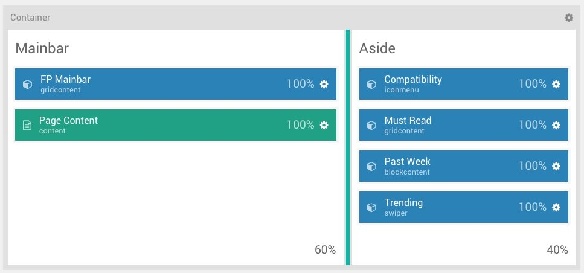

Here is a breakdown of the widget(s) and particle(s) that appear in front end from the **Mainbar** section:

* [Grid Content (particle)](#grid-content-(particle))

Here is a breakdown of the widget(s) and particle(s) that appear in front end from the **Aside** section:

* [Icon Menu (particle)](#icon-menu-(particle))
* [Grid Content (particle)](#grid-content-(particle)-2)
* [Block Content (particle)](#block-content-(particle))
* [Swiper (particle)](#swiper-(particle))

## Section Settings

### Container

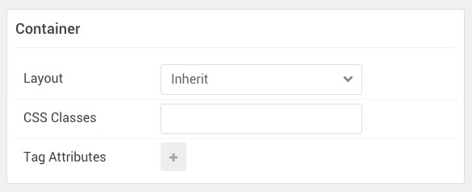

| Option           | Setting     |
| :--------------- | :---------- |
| Layout           | Inherit     |
| CSS Classes      | Blank       |
| Tag Attributes   | Blank       |

### Mainbar

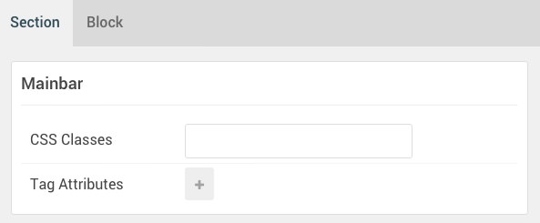

| Option         | Setting |
|:---------------|:--------|
| CSS Classes    | Blank   |
| Tag Attributes | Blank   |

| Option         | Setting |
|:---------------|:--------|
| CSS ID         | Blank   |
| CSS Classes    | Blank   |
| Variations     | Blank   |
| Tag Attributes | Blank   |
| Block Size     | `60%`   |

### Aside

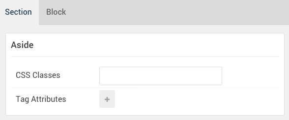

| Option         | Setting |
|:---------------|:--------|
| CSS Classes    | Blank   |
| Tag Attributes | Blank   |

| Option         | Setting |
|:---------------|:--------|
| CSS ID         | Blank   |
| CSS Classes    | Blank   |
| Variations     | Blank   |
| Tag Attributes | Blank   |
| Block Size     | `40%`   |

## Mainbar Particles

### Grid Content (Particle)

#### Particle Settings

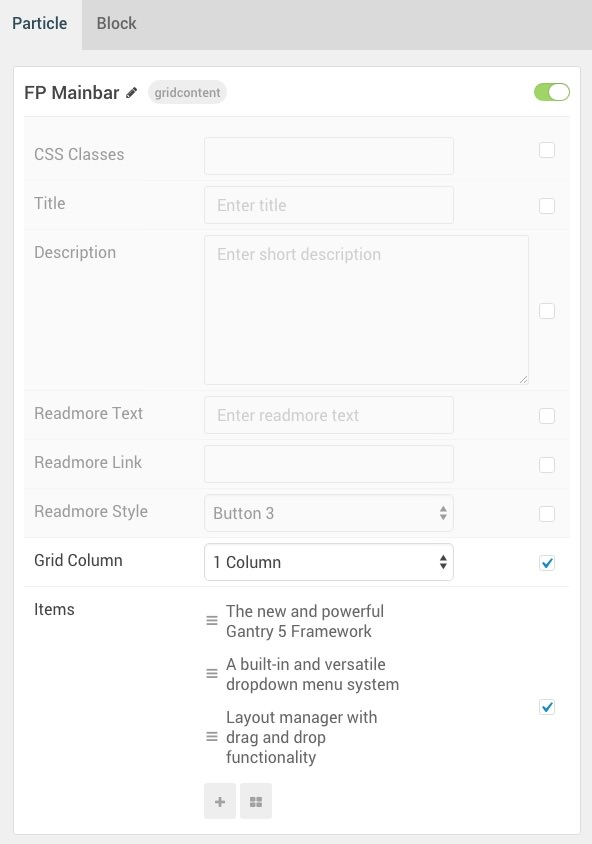

| Option                                  | Setting                                                                                                              |
| :-------------------------------------- | :------------------------------------------------------------------------------------------------------------------- |
| Particle Name                           | `FP Mainbar`                                                                                                         |
| CSS Classes                             | Blank                                                                                                                |
| Title                                   | Blank                                                                                                                |
| Description                             | Blank                                                                                                                |
| Readmore Text                           | Blank                                                                                                                |
| Readmore Link                           | Blank                                                                                                                |
| Readmore Style                          | Button 3                                                                                                             |
| Grid Column                             | 1 Column                                                                                                             |
| Grid Columns Item 1 Name                | Blank                                                                                                                |
| Grid Columns Item 1 Icon                | Blank                                                                                                                |
| Grid Columns Item 1 Image               | Custom                                                                                                               |
| Grid Columns Item 1 Title Class         | Style 3                                                                                                              |
| Grid Columns Item 1 SubTitle            | `Photo`                                                                                                              |
| Grid Columns Item 1 Title               | `The new and powerful Gantry 5`                                                                                      |
| Grid Columns Item 1 Description         | `Gantry 5 is an advanced, versatile and multi-platform theme framework, perfectly designed for the modern web.`      |
| Grid Columns Item 1 Link Text           | Blank                                                                                                                |
| Grid Columns Item 1 Link                | `#`                                                                                                                  |
| Grid Columns Item 1 Link Button Style   | Arrow                                                                                                                |

#### Block Settings 

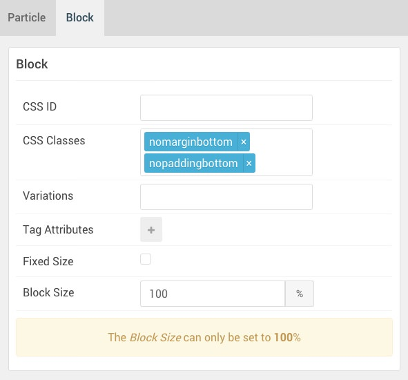

| Option           | Setting                            |
| :--------------- | :--------                          |
| CSS ID           | Blank                              |
| CSS Classes      | `nomarginbottom` `nopaddingbottom` |
| Variations       | Blank                              |
| Tag Attributes   | Blank                              |
| Block Size       | `100%`                             |

## Aside Particles

### Icon Menu (Particle)

#### Particle Settings

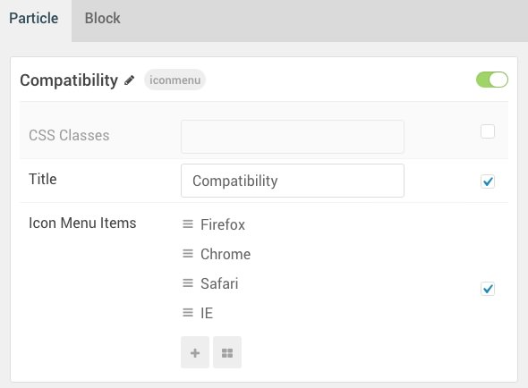

| Option                     | Setting                       |
| :------------------------- | :---------------------------- |
| Particle Name              | `Compatibility`               |
| CSS Classes                | Blank                         |
| Title                      | `Compatibility`               |
| Icon Menu Item 1 Name      | `Firefox`                     |
| Icon Menu Item 1 Icon      | `fa fa-firefox fa-fw fa-2x`   |
| Icon Menu Item 1 Text      | `Firefox`                     |
| Icon Menu Item 1 SubText   | `v. 40+`                      |
| Icon Menu Item 1 Link      | `#`                           |
| Icon Menu Item 1 Target    | New Window                    |

#### Block Settings 

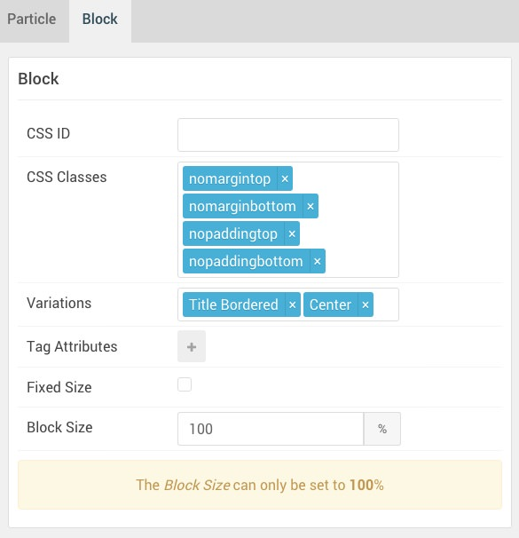

| Option           | Setting                                                         |
| :--------------- | :--------                                                       |
| CSS ID           | Blank                                                           |
| CSS Classes      | `nomarginbottom` `nopaddingbottom` `nopaddingtop` `nomargintop` |
| Variations       | Blank                                                           |
| Tag Attributes   | Blank                                                           |
| Block Size       | `100%`                                                          |

### Grid Content (Particle) 2

#### Particle Settings

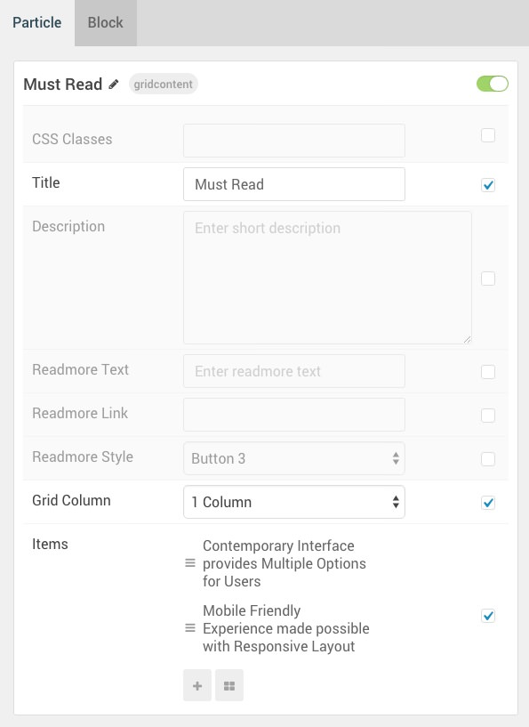

| Option                                  | Setting                                                                                                                                                                                   |
| :-------------------------------------- | :---------------------------------------------------------------------------------------------------------------------------------------------------------------------------------------- |
| Particle Name                           | `Must Read`                                                                                                                                                                               |
| CSS Classes                             | Blank                                                                                                                                                                                     |
| Title                                   | `Must Read`                                                                                                                                                                               |
| Description                             | Blank                                                                                                                                                                                     |
| Readmore Text                           | Blank                                                                                                                                                                                     |
| Readmore Link                           | Blank                                                                                                                                                                                     |
| Readmore Style                          | Button 3                                                                                                                                                                                  |
| Grid Column                             | 1 Column                                                                                                                                                                                  |
| Grid Columns Item 1 Name                | `Contemporary Interface provides Multiple Options for Users `                                                                                                                             |
| Grid Columns Item 1 Icon                | Blank                                                                                                                                                                                     |
| Grid Columns Item 1 Image               | Blank                                                                                                                                                                                     |
| Grid Columns Item 1 Title Class         | Style 4                                                                                                                                                                                   |
| Grid Columns Item 1 SubTitle            | Blank                                                                                                                                                                                     |
| Grid Columns Item 1 Title               | `Contemporary Interface provides Multiple Options for Users`                                                                              |
| Grid Columns Item 1 Description         | `Gantry 5's administrative interface has been completely rebuilt from the ground up to meet the needs of tomorrow's developer, todays.`   |
| Grid Columns Item 1 Link Text           | Blank                                                                                                                                                                                     |
| Grid Columns Item 1 Link                | Blank                                                                                                                                                                                     |
| Grid Columns Item 1 Link Button Style   | Button 3                                                                                                                                                                                  |

#### Block Settings 

| Option           | Setting                                                         |
| :--------------- | :--------                                                       |
| CSS ID           | Blank                                                           |
| CSS Classes      | `nomarginbottom` `nopaddingbottom` `nopaddingtop` `nomargintop` |
| Variations       | Title Bordered, Center                                          |
| Tag Attributes   | Blank                                                           |
| Block Size       | `100%`                                                          |

### Block Content (Particle)

#### Particle Settings

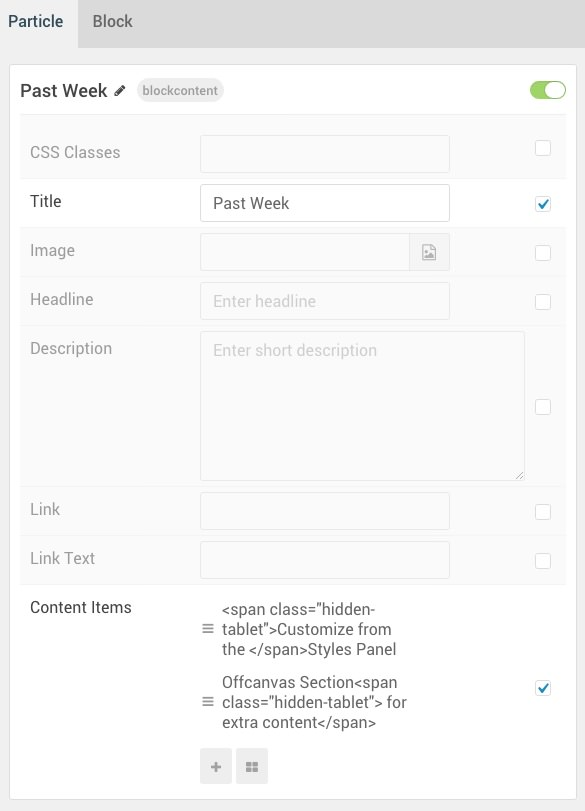

| Option                            | Setting                                                                                                                           |
| :-------------------------------- | :-------------------------------------------------------------------------------------------------------------------------------- |
| Particle Name                     | `Past Week`                                                                                                                       |
| CSS Classes                       | Blank                                                                                                                             |
| Title                             | `Past Week`                                                                                                                       |
| Icon Menu Item 1 Name             | `Customize from the Styles Panel`                                                                                                 |
| Icon Menu Item 1 Title            | `Customize from the Styles Panel`                                                              |
| Icon Menu Item 1 Icon             | Blank                                                                                                                             |
| Icon Menu Item 1 Image            | Custom                                                                                                                            |
| Icon Menu Item 1 RokBox Image     | Custom                                                                                                                            |
| Icon Menu Item 1 Caption          | `Style Panel`                                                                                                                     |
| Icon Menu Item 1 SubTitle         | Blank                                                                                                                             |
| Icon Menu Item 1 Description      | `Style elements of the Kraken theme, such as links, font or background colors.`   |
| Icon Menu Item 1 CSS Classes      | Blank                                                                                                                             |
| Icon Menu Item 1 Button Label     | Blank                                                                                                                             |
| Icon Menu Item 1 Button Link      | Blank                                                                                                                             |
| Icon Menu Item 1 Button Classes   | Blank                                                                                                                             |

#### Block Settings 

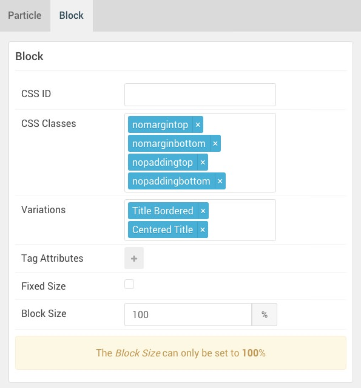

| Option           | Setting                                                         |
| :--------------- | :--------                                                       |
| CSS ID           | Blank                                                           |
| CSS Classes      | `nomarginbottom` `nopaddingbottom` `nopaddingtop` `nomargintop` |
| Variations       | Title Bordered, Centered Title                                  |
| Tag Attributes   | Blank                                                           |
| Block Size       | `100%`                                                          |

### Swiper (Particle)

#### Particle Settings

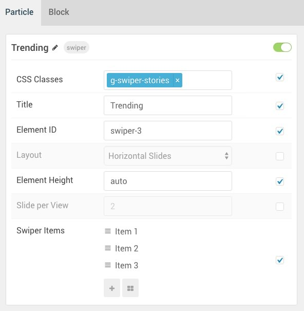

| Option                      | Setting                                                                    |
| :-------------------------- | :------------------------------------------------------------------------- |
| Particle Name               | `Trending`                                                                 |
| CSS Classes                 | `g-swiper-stories`                                                         |
| Title                       | `Trending`                                                                 |
| Element ID                  | `swiper-3`                                                                 |
| Layout                      | Horizontal Slides                                                          |
| Element Height              | Auto                                                                       |
| Slide per View              | `2`                                                                        |
| Swiper Item 1 Name          | `Item 1`                                                                   |
| Swiper Item 1 Image         | Custom                                                                     |
| Swiper Item 1 SubTitle      | Blank                                                                      |
| Swiper Item 1 Title         | `Particles System`                                                         |
| Swiper Item 1 Link          | Blank                                                                      |
| Swiper Item 1 Link Text     | Blank                                                                      |
| Swiper Item 1 Description   | `Gantry 5's Particles system makes it easy to configure content blocks.`   |

#### Block Settings 

| Option           | Setting                                                         |
| :--------------- | :--------                                                       |
| CSS ID           | Blank                                                           |
| CSS Classes      | `nomarginbottom` `nopaddingbottom` `nopaddingtop` `nomargintop` |
| Variations       | Title Bordered, Centered Title                                  |
| Tag Attributes   | Blank                                                           |
| Block Size       | `100%`                                                          |