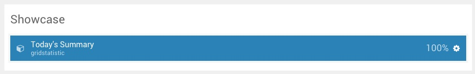
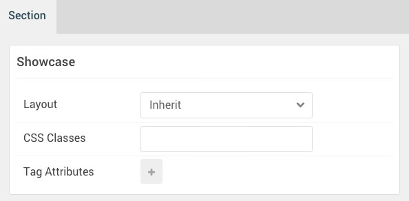

## Introduction

The **Showcase** section is home to a single **Grid Statistic** particle.

Here is a breakdown of the widget(s) and particle(s) that appear on the front end from this section:

* [Grid Statistic (particle)](#grid-statistic-(particle))

## Section Settings

| Option           | Setting     |
| :--------------- | :---------- |
| Layout           | Inherit     |
| CSS Classes      | Blank       |
| Tag Attributes   | Blank       |

## Grid Statistic (Particle)

### Particle

| Option                                   | Setting                        |
| :--------------------------------------- | :----------------------------- |
| CSS Classes                              | Blank                          |
| Title                                    | `Today's Summary`              |
| Description                              | Blank                          |
| Promo Text                               | Blank                          |
| Readmore Text                            | Blank                          |
| Readmore Link                            | Blank                          |
| Readmore Style                           | Button 3                       |
| Grid Column                              | 4 Columns                      |
| Grid Statistic Item 1 Name               | `1000 Discussions`             |
| Grid Statistic Item 1 Icon               | `fa fa-comments fa-fw fa-2x`   |
| Grid Statistic Item 1 Statistic Number   | `1000`                         |
| Grid Statistic Item 1 Statistic Text     | `Discussions`                  |

### Block Settings

| Option           | Setting      |
| :--------------- | :----------- |
| CSS ID           | Blank        |
| CSS Classes      | Blank        |
| Variations       | Title Promo  |
| Tag Attributes   | Blank        |
| Block Size       | `100%`       |
