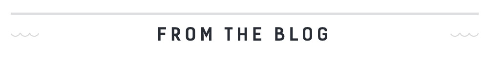
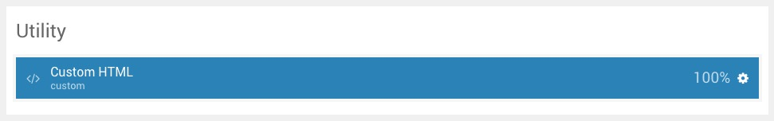
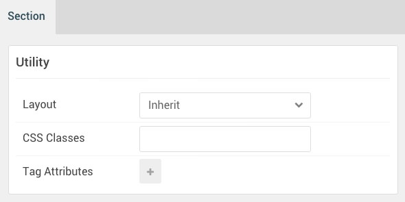
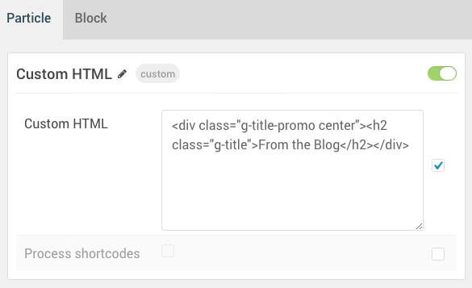
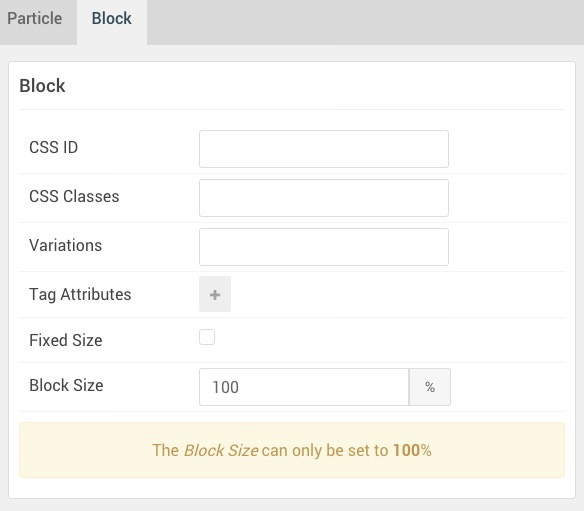

## Introduction

The **Utility** section includes a **Custom HTML** particle.

Here is a breakdown of the widget(s) and particle(s) that appear in this section:

* [Custom HTML (particle)](#custom-html-(particle))

## Section Settings

| Option           | Setting     |
| :--------------- | :---------- |
| Layout           | Inherit     |
| CSS Classes      | Blank       |
| Tag Attributes   | Blank       |

## Custom HTML (Particle)

### Particle Settings

| Option             | Setting                                                                          |
|:-------------------|:---------------------------------------------------------------------------------|
| Particle Name      | `Custom HTML`                                                                    |
| Custom HTML        | `
<h2 class="g-title">From the Blog</h2>
` |
| Process Shortcodes | Unchecked                                                                        |

### Block Settings

| Option           | Setting      |
| :--------------- | :----------- |
| CSS ID           | Blank        |
| CSS Classes      | Blank        |
| Variations       | Blank        |
| Tag Attributes   | Blank        |
| Fixed Size       | Unchecked    |
| Block Size       | `100%`       |
