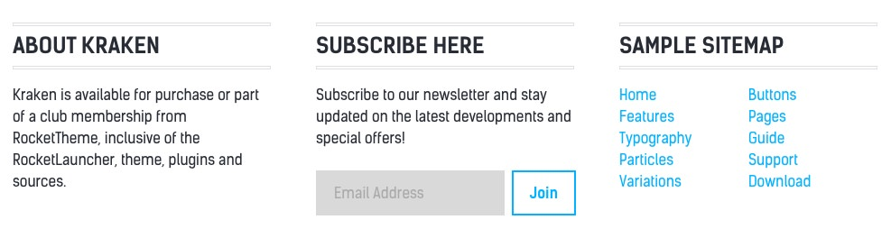

## Introduction

The **Pricing** example page demonstrates how you can create a beautiful page with the Kraken theme. Here is some information to help you replicate this page as it appears in the demo.

## Particles and Particles

Below is a brief rundown of the widgets and particles used to make up the demo page.

:   1. **Showcase - Custom HTML (Particle)** [4%, 40%, se]
    2. **Feature - Custom HTML (Particle)** [12%, 20% se]
    3. **Mainbar - Page Content** [43%, 20%, se]
    4. **Extension - Custom HTML (Particle)** [52%, 20%, se]
    5. **Bottom - Custom HTML (Particle)** [74%, 40%, se]
    5. **Footer - Custom HTML (Particle)** [85%, 20%, se]
    6. **Footer - Custom HTML (Particle)** [85%, 45%, se]
    7. **Footer - Custom HTML (Particle)** [85%, 70%, se]

1. [Showcase](#showcase-section)
2. [Feature](#feature-section)
2. [Mainbar](#mainbar-section)
3. [Extension](#extension-section)
4. [Bottom](#bottom-section)
4. [Footer](#footer-section)

## Showcase Section

This area of the page is a **Custom HTML** particle. You will find the settings used in our demo below.

### Custom HTML (Particle)

### Particle Settings

| Field              | Setting       |
| :-----             | :-----        |
| Particle Name      | `Custom HTML` |
| Process Shortcodes | Unchecked     |

### Custom HTML

~~~ .html

  <h2 class="g-layercontent-title">Awesome Plans</h2>
  
Choose the Plan that Suits Your Needs

~~~

### Block Settings

| Option         | Setting          |
| :----------    | :----------      |
| CSS ID         | Blank            |
| CSS Classes    | `flush` `center` |
| Variations     | Blank            |
| Tag Attributes | Blank            |
| Fixed Size     | Unchecked        |
| Block Size     | `100%`           |

## Feature Section

This area of the page is a **Custom HTML** particle. You will find the settings used in our demo below.

### Custom HTML (Particle)

### Particle Settings

| Field              | Setting       |
| :-----             | :-----        |
| Particle Name      | `Custom HTML` |
| Process Shortcodes | Unchecked     |

### Custom HTML

~~~ .html

  

    

      <ul class="g-pricingtable">
        <li class="g-pricingtable-title">Basic
        </li>
        <li class="g-pricingtable-price">$28
        </li>
        <li class="g-pricingtable-desc">Globally incubate standards compliant channels
        </li>
        <li class="g-pricingtable-item">5GB Storage
        </li>
        <li class="g-pricingtable-item">10 Users
        </li>
        <li class="g-pricingtable-item">20 Emails
        </li>
        <li class="g-pricingtable-item">Online Store
        </li>
        <li class="g-pricingtable-item">Custom Domain
        </li>
        <li class="g-pricingtable-item">Unlimited Departments
        </li>
        <li class="g-pricingtable-cta">
          <a class="button button-3" href="http://www.rockettheme.com/wordpress/themes/kraken">Sign Up</a>
        </li>
      </ul>
    

  

  

    

      <ul class="g-pricingtable">
        <li class="g-pricingtable-title">Standard
        </li>
        <li class="g-pricingtable-price">$58
        </li>
        <li class="g-pricingtable-desc">Globally incubate standards compliant channels
        </li>
        <li class="g-pricingtable-item">5GB Storage
        </li>
        <li class="g-pricingtable-item">10 Users
        </li>
        <li class="g-pricingtable-item">20 Emails
        </li>
        <li class="g-pricingtable-item">Online Store
        </li>
        <li class="g-pricingtable-item">Custom Domain
        </li>
        <li class="g-pricingtable-item">Unlimited Departments
        </li>
        <li class="g-pricingtable-cta">
          <a class="button button-3" href="http://www.rockettheme.com/wordpress/themes/kraken">Sign Up</a>
        </li>
      </ul>
    

  

  

    

      <ul class="g-pricingtable">
        <li class="g-pricingtable-title">Pro
        </li>
        <li class="g-pricingtable-price">$88
        </li>
        <li class="g-pricingtable-desc">Globally incubate standards compliant channels
        </li>
        <li class="g-pricingtable-item">5GB Storage
        </li>
        <li class="g-pricingtable-item">10 Users
        </li>
        <li class="g-pricingtable-item">20 Emails
        </li>
        <li class="g-pricingtable-item">Online Store
        </li>
        <li class="g-pricingtable-item">Custom Domain
        </li>
        <li class="g-pricingtable-item">Unlimited Departments
        </li>
        <li class="g-pricingtable-cta">
          <a class="button button-3" href="http://www.rockettheme.com/wordpress/themes/kraken">Sign Up</a>
        </li>
      </ul>
    

  

~~~

### Block Settings

| Option         | Setting     |
| :----------    | :---------- |
| CSS ID         | Blank       |
| CSS Classes    | Blank       |
| Variations     | Blank       |
| Tag Attributes | Blank       |
| Fixed Size     | Unchecked   |
| Block Size     | `100%`      |

## Mainbar Section

The **Mainbar** section includes the **Pricing** post, displayed through the **Page Content** particle. Here are the settings found in the **Pricing** post.

| Option   | Setting        |
| :-----   | :-----         |
| Title    | `Pricing`      |
| Alias    | `pricing`      |
| Status   | Published      |
| Featured | No             |
| Category | `Sample Pages` |

**Content Body**

~~~ .html

  

    <h2 class="g-title">
      Try it Out for 10 Days Free
    </h2>
    <ul>
      <li>All plans come with awesome support by email and phone. There is no hidden fee!
      </li>
      <li>Free <strong>10 days trial</strong> on all plans. No credit card needed! Need a bigger plan? <a href="http://www.rockettheme.com/wordpress/themes/kraken">View Professional Plan</a>.
      </li>
    </ul>
  

~~~

## Extension Section

This area of the page is a **Custom HTML** particle. You will find the settings used in our demo below.

### Custom HTML (Particle)

### Particle Settings

| Field              | Setting       |
| :-----             | :-----        |
| Particle Name      | `Custom HTML` |
| Process Shortcodes | Unchecked     |

### Custom HTML

~~~ .html

  

    

      <h2 class="g-title">
        Common Queries and Questions
      </h2>
      

        

          

            

              <a href="#">1. What prices are our services?</a>
            

            

              Proactively envisioned multimedia based expertise and cross-media growth strategies. Seamlessly visualize quality intellectual capital without superior collaboration and idea-sharing.
            

          

        

        

          

            

              <a href="#">2. What is our refund policy?</a>
            

            

              Proactively envisioned multimedia based expertise and cross-media growth strategies. Seamlessly visualize quality intellectual capital without superior collaboration and idea-sharing.
            

          

        

        

          

            

              <a href="#">3. What payments methods do we accept?</a>
            

            

              Proactively envisioned multimedia based expertise and cross-media growth strategies. Seamlessly visualize quality intellectual capital without superior collaboration and idea-sharing.
            

          

        

      

    

  

  

    

      <h2 class="g-title">
        &nbsp;More Common Queries and Questions
      </h2>
      

        

          

            

              <a href="#">4. What delivery options do we offer?</a>
            

            

              Proactively envisioned multimedia based expertise and cross-media growth strategies. Seamlessly visualize quality intellectual capital without superior collaboration and idea-sharing.
            

          

        

        

          

            

              <a href="#">5. What support options are available?</a>
            

            

              Proactively envisioned multimedia based expertise and cross-media growth strategies. Seamlessly visualize quality intellectual capital without superior collaboration and idea-sharing.
            

          

        

        

          

            

              <a href="#">6. What additional services are available?</a>
            

            

              Proactively envisioned multimedia based expertise and cross-media growth strategies. Seamlessly visualize quality intellectual capital without superior collaboration and idea-sharing.
            

          

        

      

    

  

~~~

### Block Settings

| Option         | Setting     |
| :----------    | :---------- |
| CSS ID         | Blank       |
| CSS Classes    | Blank       |
| Variations     | Blank       |
| Tag Attributes | Blank       |
| Fixed Size     | Unchecked   |
| Block Size     | `100%`      |

## Bottom Section

This area of the page is a **Custom HTML** particle. You will find the settings used in our demo below.

### Custom HTML (Particle)

### Particle Settings

| Field              | Setting       |
| :-----             | :-----        |
| Particle Name      | `Custom HTML` |
| Process Shortcodes | Unchecked     |

### Custom HTML

~~~ .html

  <h2 class="g-layercontent-title">No Hidden Fees</h2>
  
No Credit Card Required and No Long-Term Contracts

  <a href="http://www.rockettheme.com/wordpress/themes/kraken" class="button button-2">Sign Up</a>

~~~

### Block Settings

| Option         | Setting          |
| :----------    | :----------      |
| CSS ID         | Blank            |
| CSS Classes    | `flush` `center` |
| Variations     | Blank            |
| Tag Attributes | Blank            |
| Fixed Size     | Unchecked        |
| Block Size     | `100%`           |

## Footer Section

:   1. **Logo (Particle)** [20%, 2%, se]
    2. **Horizontal Menu (Particle)** [20%, 35%, se]
    3. **Social (Particle)** [20%, 67%, se]

This area of the page is made up of three particles.

### Logo (Particle)

### Particle Settings

| Field         | Setting               |
| :-----        | :-----                |
| Particle Name | `Logo`                |
| URL           | Blank                 |
| Rel           | Blank                 |
| Image         | Custom                |
| Alt           | `Kraken`              |
| Text          | `Kraken`              |
| CSS Classes   | `g-loto` `g-logo-alt` |

### Block Settings

| Option         | Setting     |
| :----------    | :---------- |
| CSS ID         | Blank       |
| CSS Classes    | Blank       |
| Variations     | Blank       |
| Tag Attributes | Blank       |
| Fixed Size     | Unchecked   |
| Block Size     | `25%`       |

### Horizontal Menu (Particle)

### Particle Settings

| Field            | Setting               |
| :-----           | :-----                |
| Particle Name    | `Horizontal Menu`     |
| CSS Classes      | Blank                 |
| Target           | New Window            |
| Menu Item 1 Name | `Gantry`              |
| Menu Item 1 Text | `Gantry`              |
| Menu ITem 1 Link | `http://gantry.org`   |

### Block Settings

| Option         | Setting                  |
| :----------    | :----------              |
| CSS ID         | Blank                    |
| CSS Classes    | `g-horizontalmenu-block` |
| Variations     | Center                   |
| Tag Attributes | Blank                    |
| Fixed Size     | Unchecked                |
| Block Size     | `50%`                    |

### Social (Particle)

### Particle Settings

| Field                | Setting                               |
| :-----               | :-----                                |
| Particle Name        | `Social`                              |
| CSS Classes          | `social`                              |
| Title                | Blank                                 |
| Social Item 1 Name   | `Facebook`                            |
| Social Item 1 Text   | Blank                                 |
| Social Item 1 Link   | `http://www.facebook.com/RocketTheme` |
| Social Item 1 Target | New Window                            |

### Block Settings

| Option         | Setting     |
| :----------    | :---------- |
| CSS ID         | Blank       |
| CSS Classes    | Blank       |
| Variations     | Blank       |
| Tag Attributes | Blank       |
| Fixed Size     | Unchecked   |
| Block Size     | `25%`       |