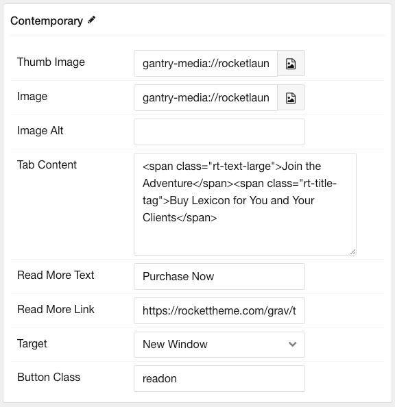

## Introduction

The **Showcase Tabs** particle introduces your brand to new visitors in a bold, revealing content block.

Here are the topics covered in this guide:

* [Configuration](#configuration)
  * [Main Options](#main-options)
  * [Item Options](#item-options)

## Configuration

### Main Options 

These options affect the main area of the particle, and not the individual items within.

| Option          | Setting                                                               |
| :-----          | :-----                                                                |
| Particle Name   | The name of the particle for organizational use in the backend.       |
| CSS Classes     | CSS Class(es) you would like to have apply to the particle's content. |
| Title           | Title of the particle as it will appear on the front end.             |
| Layout     	  | Customize the particle layout.       								  |
| Tabs Items      | Tabs item to display                   								  |

### Item Options

These items make up the individual featured items in the particle.

| Option         | Description                                                              |
| :------------- | :----------------------------------------------------------------------- |
| Name           | Enter a name for your item. This only appears on the back end.           |
| Thumb Image    | Set the thumbnail image that appears in the tab.                         |
| Image          | Set the image to appear in the large section when the tab is chosen.     |
| Image Alt      | Enter alt text for the large image.                                      |
| Tab Content    | Enter the content body (Text and/or HTML) for the tab.                   |
| Read More Text | Enter text to appear in the read more link.                              |
| Read More Link | Enter the URL the read more link will take visitors to.                  |
| Target         | Choose a target window for the link.                                     |
| Button Class   | Enter a CSS class to apply to the button. In our demo, we used `readon`. |
