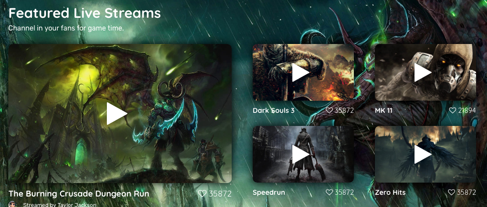
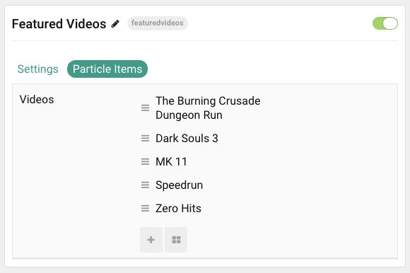

## Introduction

The **Featured Video** particle enables you to quickly and easily add video content to your page attributed to your site's content creators.

Here are the topics covered in this guide:

* Video
    - [Configuration](#configuration)
        - [Main Options](#main-options)
        - [Item Options](#item-options)

## Configuration

### Main Options

These options affect the main area of the particle, and not the individual items within.

| Option               | Description                                                                                 |
|:-------------------- |:------------------------------------------------------------------------------------------- |
| Particle Name        | Enter the name you would like to assign to the particle. This only appears in the back end. |
| CSS Classes          | Sets any CSS class(es) you want to have apply to the particle's content.                    |
| Title                | Enter a title for the particle.                                                             |
| YouTube Likes Counts | Show or Hide the total number of "Likes" on YouTube for each video.                         |
| Google API Key       | Enter the Google API Key.                                                                   |
| Description          | Enter a text description for your featured videos particle.                                 |

>> Enable or disable YouTube likes counts. Please note that you need [Google API Key](https://console.developers.google.com/apis/credentials) with YouTube Data API v3 service enabled for Featured Videos particle counts to work. Obtaining public key is free. After registration, enter your key in field below.

### Item Options

These items make up the individual featured items in the particle.

| Option                 | Description                                                                                                    |
|:---------------------- |:-------------------------------------------------------------------------------------------------------------- |
| Item Name              | Designates a name for the item that appears on the front end.                                                  |
| Author                 | Enter the name of the Author (creator).                                                                        |
| Author URL             | Enter a URL for the author. This is usually the author page in your site or the author's social media/website. |
| Author Avatar          | Add an avatar to be displayed with the author information.                                                     |
| Custom Video Thumbnail | Select a custom thumbnail image for the video.                                                                 |
| Video URL              | Enter the URL of the video.                                                                                    |
