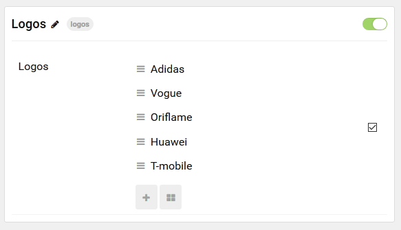

## Introduction

The **Logos** particle displays images in a beautiful grid, complete with URL links.

Here are the topics covered in this guide:

* [Configuration](#configuration)
    - [Main Options](#main-options)
    - [Item Options](#item-options)

## Configuration

### Main Options 

These options affect the main area of the particle, and not the individual items within.

| Option        | Description                                                                                 |
| :-----        | :-----                                                                                      |
| Particle Name | Enter the name you would like to assign to the particle. This only appears in the back end. |

### Item Options

These items make up the individual featured items in the particle.

| Option     | Description                                                         |
| :-----     | :-----                                                              |
| Logo Image | Point the item to the image you wish to have featured in this item. |
| URL        | Enter a link the logo will take the visitor to when clicked.        |
| Target     | Select a target for the link to open in.                            |

