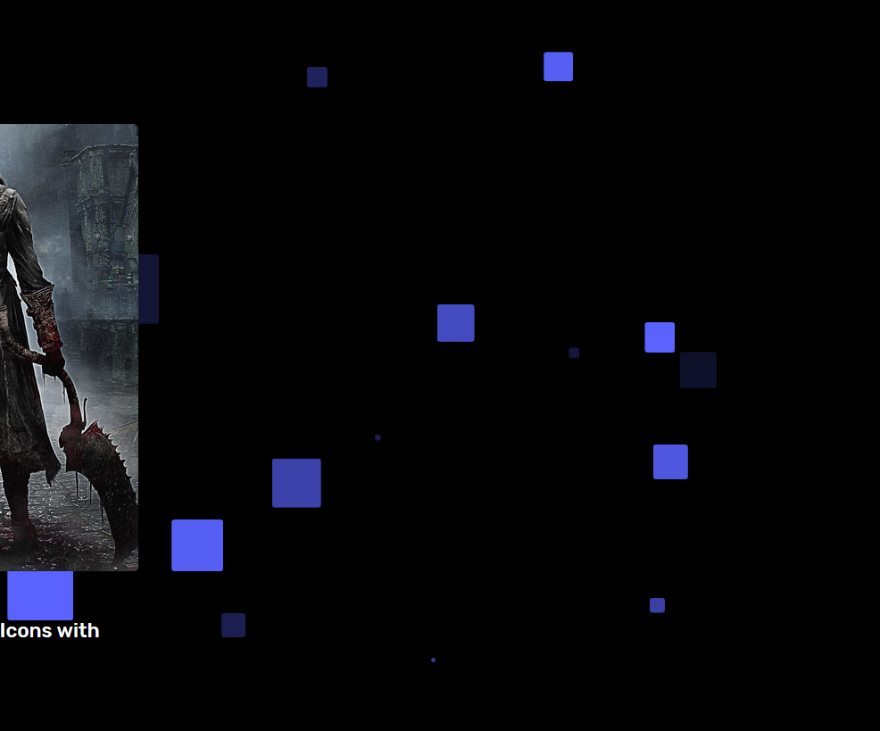
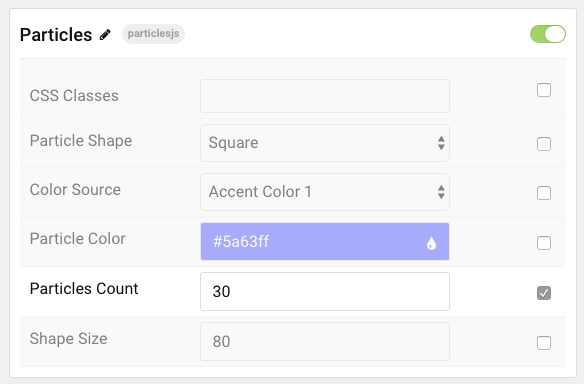

## Introduction

The **Particles** particle displays moving particles that sit in the background of your content.

Here are the topics covered in this guide:

* [Configuration](#configuration)
    - [Main Options](#main-options)

## Configuration

### Main Options

| Option          | Description                                                                                 |
|:--------------- |:------------------------------------------------------------------------------------------- |
| Particle Name   | Enter the name you would like to assign to the particle. This only appears in the back end. |
| CSS Classes     | Enter CSS class(es) to apply to the particles.                                              |
| Particle Shape  | Select the shape the particles will appear in.                                              |
| Color Source    | Choose a source to use to select the color the particles will be presented in.              |
| Particle Color  | In the event you select **custom** as the **color source**, choose the color here.          |
| Particles Count | Enter the number of particles to appear at a given time.                                    |
| Shape Size      | Define a size for each shape. Example: `80`.                                                |
