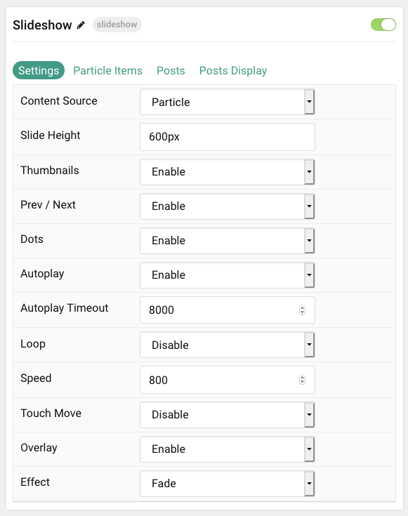
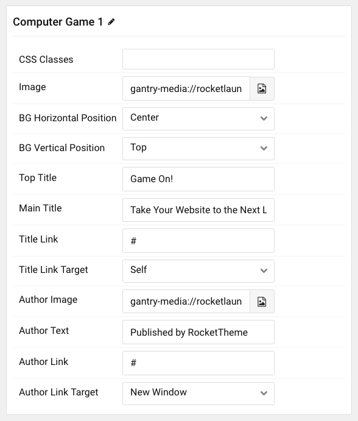
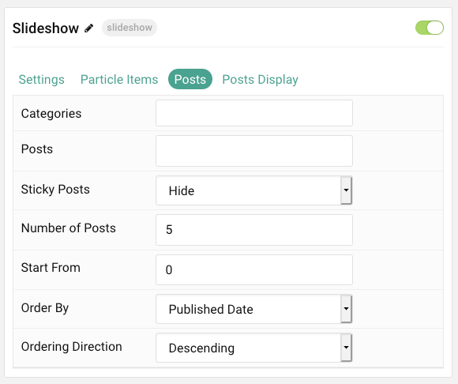
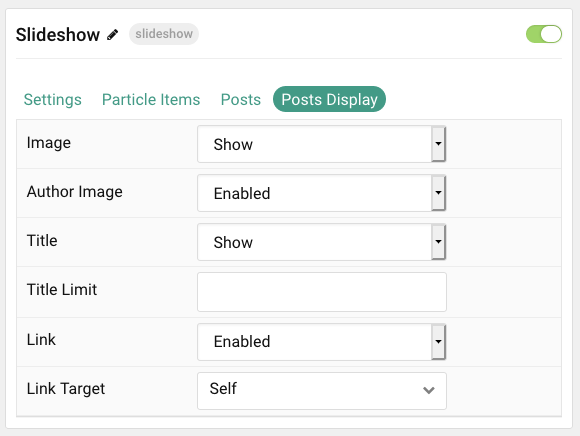

## Introduction

The **Slideshow** particle creates beautiful image slideshows that work perfectly at the top of your page.

Here are the topics covered in this guide:

* [Configuration](#configuration)
    - [Main Options](#settings)
    - [Item Options](#particle-item-options)
    - [Posts](#posts)
    - [Display](#display)

## Configuration

### Settings

These options affect the main area of the particle, and not the individual items within. You can set the title of the particle, as well as give it an introductory paragraph here.

| Option           | Description                                                                                              |
|:---------------- |:-------------------------------------------------------------------------------------------------------- |
| Particle Name    | This is the name of the particle used for back end management. It does not appear on the front end.      |
| Content Source   | Choose between **Particle** and **WordPress** as the content source for the particle.                       |
| Slide Height     | Set the height of each slide (in pixels)                                                                 |
| Thumbnail        | **Enable** or **Disable** the use of thumbnails for slideshow navigation.                                |
| Prev / Next      | Add prev/next navigation to the slideshow.                                                               |
| Dots             | **Enable** or **Disable** dot navigation.                                                                |
| Autoplay         | **Enable** or **Disable** autoplay for the particle.                                                     |
| Autoplay Timeout | Set the time (in milliseconds) between slides in autoplay mode.                                          |
| Loop             | **Enable** or **Disable** looping slides.                                                                |
| Speed            | Set the transition speed (in milliseconds).                                                              |
| Touch Move       | **Enable** or **Disable** touch movements.                                                               |
| Overlay          | **Enable** or **Disable** the overlay.                                                                   |
| Effect           | Choose a slideshow effect. Options include: **Slide**, **Fade**, **Cover Flow**, **Flip**, and **Cube**. |

### Particle Item Options

These items make up the individual featured items in the particle. Items in this section will only appear if **Particle** is selected as the **Content Source**.

| Option                 | Description                                                                            |
|:---------------------- |:-------------------------------------------------------------------------------------- |
| Item Name              | This is the name of the item. This becomes the headline for the item on the front end. |
| CSS Classes            | Enter any CSS class(es) you wish to have apply to the item.                            |
| Image                  | Set an image for the item. This is the main image.                                     |
| BG Horizontal Position | Set the background image position horizontally.                                        |
| BG Vertical Position   | Set the background image position vertically.                                          |
| Top Title              | Enter a small title to appear on the front end.                                        |
| Main Title             | Enter a larger main title to appear on the front end.                                  |
| Title Link             | Enter a URL the button will send users to.                                             |
| Title Link Target      | Enter a target window for the link.                                                    |
| Author Image           | Select an image to display in the author section of the item.                          |
| Author Text            | Enter the name of the author.                                                          |
| Author Link            | Enter the URL the author's name will link to.                                          |
| Author Link Target     | Enter the target window for the author link to open in.                                |

### Posts

| Option             | Description                                                                            |
|:------------------ |:-------------------------------------------------------------------------------------- |
| Categories         | Select the categories of posts this particle will display.                             |
| Posts              | Select the number of posts you would like the particle to fetch.                       |
| Sticky Posts       | Choose how Featured Posts should be filtered. Choose between **Hide** and **Show**.    |
| Number of Posts    | Enter the maximum number of posts to display.                                          |
| Start From         | Enter offset specifying the first post to return. The default is '0' (the first post). |
| Order By           | Choose the type of factor to order by.                                                 |
| Ordering Direction | Choose between **Ascending** and **Descending** as the post ordering method.           |

### Display

This section configures how posts are displayed.

| Option       | Description                                                                |
|:------------ |:-------------------------------------------------------------------------- |
| Image        | Choose to **Show** or **Hide** the featured image for each item.           |
| Author Image | **Enable** or **Disable** the display of the author avatar with each item. |
| Title        | **Show** or **Hide** the post's title.                                     | 
| Title Limit  | Enter the maximum number of characters in the title to display.            |
| Link         | **Show** or **Hide** the Title link.                                       |
| Link Target  | Choose whether to have the link open in a new tab or the same tab.         |
