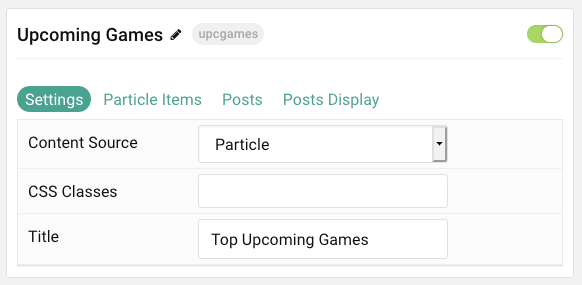
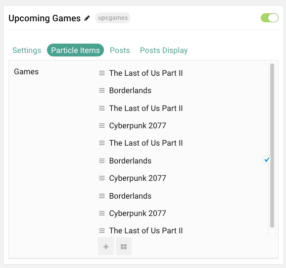
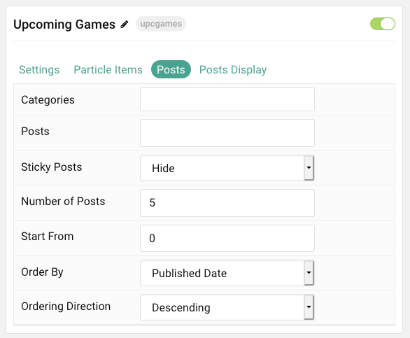
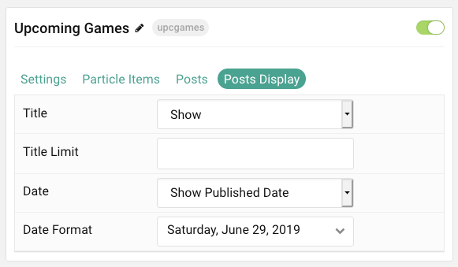

## Introduction

The **Upcoming Games** particle lists important releases and upcoming news items in a clean, easy-to-follow particle.

Here are the topics covered in this guide:

* [Configuration](#configuration)
    - [Main Options](#settings)
    - [Item Options](#particle-item-options)
    - [Posts](#posts)
    - [Display](#display)

## Configuration

### Settings

These options affect the main area of the particle, and not the individual items within. You can set the title of the particle, as well as give it an introductory paragraph here.

| Option         | Description                                                                                         |
|:-------------- |:--------------------------------------------------------------------------------------------------- |
| Particle Name  | This is the name of the particle used for back end management. It does not appear on the front end. |
| Content Source | Choose between **Particle** and **WordPress** as the Content Source.                                |
| CSS Classes    | Enter any CSS class(es) you wish to have apply to the particle.                                     |
| Title          | Set a title for the particle.                                                                       |

### Particle Item Options

These items make up the individual featured items in the particle. Items in this section will only appear if **Particle** is selected as the **Content Source**.

| Option    | Description                                                                      |
|:--------- |:-------------------------------------------------------------------------------- |
| Item Name | This is the name of the item. This appears as the item's title on the front end. |
| Date      | Enter a date for the post.                                                       |
| Link      | Enter a URL you would like the item to link to.                                  |
| Target    | Select a target window for the URL to open through.                              |

### Posts

| Option             | Description                                                                            |
|:------------------ |:-------------------------------------------------------------------------------------- |
| Categories         | Select the categories of posts this particle will display.                             |
| Posts              | Select the number of posts you would like the particle to fetch.                       |
| Sticky Posts       | Choose how Sticky Posts should be filtered. Choose between **Show** and **Hide**.      |
| Number of Posts    | Enter the maximum number of posts to display.                                          |
| Start From         | Enter offset specifying the first post to return. The default is '0' (the first post). |
| Order By           | Choose the type of factor to order by.                                                 |
| Ordering Direction | Choose between **Ascending** and **Descending** as the post ordering method.           |

### Display

This section configures how posts are displayed.

| Option      | Description                                                     |
|:----------- |:--------------------------------------------------------------- |
| Title       | **Show** or **Hide** the post's title.                          |
| Title Limit | Enter the maximum number of characters in the title to display. |
| Date        | **Show** or **Hide** post dates.                                |
| Date Format | Set the format that dates will be displayed in.                 |
